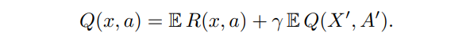
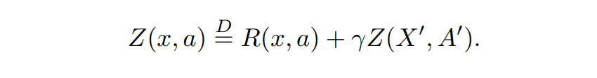

# Distributional RL

Make reward like Dopamine

---

## A Distributional Perspective on Reinforcement Learning

Everything begins here. The paper propose the idea of distributional RL and prove the distributional Bellman Operation can converge to the expectation and variance of the distribution. Based on the theory, they propose a naive algorthm C51 which use catergorical distribution to approximate the true distribution of the reward.

Let's recall the Q function

where ***x*** means the state and ***a*** means the action. The prime means the next state and action.

The distributional RL define the Q function as following

where ***Z*** means the distribution of the Q value condition on state and action. That means the Q value is NOT a scalar but a distribution. The equation means both side are drawn from the same distribution.

Well, why we need to replace the scalar with a more complex distribution? The main reason is that **we can keep as much information as possible.** Thus we can update the model more efficiently(sample efficiency). The second reason is we can **choose the optimal policy according to the distribution rather than expectation.** The third reason is **it is similar the mechanism of Dopamine.(an advantage somewhat)**

However distributional RL has a small pitfall

## A distributional code for value in dopaminebased reinforcement learning

[Blog](https://deepmind.com/blog/article/Dopamine-and-temporal-difference-learning-A-fruitful-relationship-between-neuroscience-and-AI)

Reveal the relation bewteen distributional RL and dopamine.

## Distributional Reinforcement Learning with Quantile Regression

It propose QR-DQN.

## Implicit Quantile Networks for Distributional Reinforcement Learning

It propose IQN.

## Statistics and Samples in Distributional Reinforcement Learning

## Distributional Reinforcement Learning for Efficient Exploration

Distributional RL improve the exploration strategy.

## DSAC: Distributional Soft Actor Critic for Risk-Sensitive Reinforcement Learning

The paper propose DSAC which use a distribution to estimate the Q function with SAC.

## Cautious Reinforcement Learning via Distributional Risk in the Dual Domain

Risk-sensitive RL.

## A Comparative Analysis of Expected and Distributional Reinforcement Learning

# Reference:

- [强化学习（RL）中有哪些重要的理论结果？ 微軟亞洲研究院回答](https://www.zhihu.com/question/312164724)
  
  Give a series of papers and introdution to the recent research results of Distributional RL and the relation between Distributional RL and safe-RL.
- [Distributional RL - Simple Machine Learning](https://mtomassoli.github.io/2017/12/08/distributional_rl/)
  
  A great tutorial for Distributional RL. Gives a great explaination.
- [Distributional Reinforcement Learning — Part 1 (C51 and QR-DQN)](https://medium.com/analytics-vidhya/distributional-reinforcement-learning-part-1-c51-and-qr-dqn-a04c96a258dc)
- [Towards Structural Risk Minimization for RL - Emma Brunskil](https://www.youtube.com/watch?v=V3Op8eIc9H8)
  
  A speech about the intersection of Distributional RL and Safety.

- [Distributional Reinforcement Learning: A Talk by Deepmind](https://physai.sciencesconf.org/data/pages/distributional_RL_Remi_Munos.pdf)
  
  [Video](https://vimeo.com/304849090)

  A talk about Distributional RL

- [Risk-sensitive foraging models](https://en.wikipedia.org/wiki/Risk-sensitive_foraging_models)
- [【强化学习 47】Distributional RL/C51](https://zhuanlan.zhihu.com/p/60632660)
- [IFT 6085 - Lecture 19 Basic results on reinforcement learning](http://mitliagkas.github.io/ift6085-2020/ift-6085-lecture-19-notes.pdf)
  
  Give a detailed proof for the convergence property of distributional RL.

- [[Seminar] Distributional Perspective on RL](https://zhuanlan.zhihu.com/p/57964280)
- [How Does Value-Based Reinforcement Learning Find the Optimal Policy?](https://runzhe-yang.science/2017-10-04-contraction/)

  Give a very detailed proof for the convergence propertied of RL and Distributional RL.
- [Introduction to the Wasserstein distance](https://www.youtube.com/watch?v=CDiol4LG2Ao)
- [【数学】Wasserstein Distance](https://zhuanlan.zhihu.com/p/58506295)
- [Wasserstein metric的通俗解释 冯超](https://zhuanlan.zhihu.com/p/26988777)