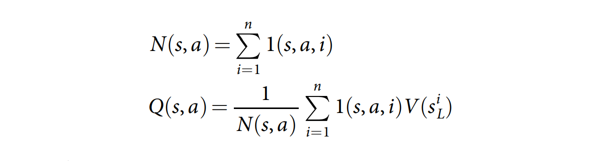
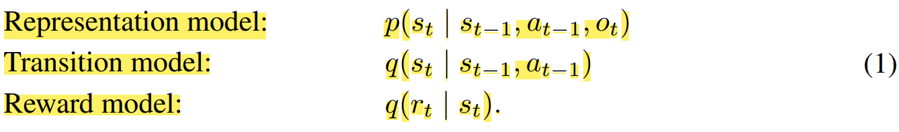

# Model-Based RL

Learning from imagination.

---

## Mastering the game of Go with deep neural networks and tree search

[PDF Highlight](./alphago/Mastering%20the%20game%20of%20Go%20with%20deep%20neural%20networks%20and%20tree%20search.pdf)

It's the paper that proposes **AlphaGo**. It is quite famous when I was a freshman of college. It somehow is the reason that I was addicted to Reinforcement Learning. Thus Our journey of model-based RL will start here. Although it is not the first one that propose model-based RL, I still believe it will give an big picture of model-based RL.

### Introduction

AlphaGo combines 2 kinds of model, including **policy network and value network**. The policy network takes the **board position as input and output the probability of next action of each position.** The value network also take the board position as input and **output the winner of the game.**

We pass in the board position as a **19×19 image and use convolutional layers** to construct a representation of the position. We use these neural networks to reduce the effective depth and breadth of the search tree: evaluating positions using a value network, and sampling actions using a policy network.

We train the model in **2 stage**. In the **first stage, we use supervised learning with KGS dataset to train the policy network to predict the next action of humans.** Then, in the **second stage, we use reinforment learning and self-play to train the model by themself.**

### Stage1: Supervised Learning of Policy Network

A fast rollout policy ***pπ*** and supervised learning (SL) policy network ***pσ*** are trained to predict human expert moves in a data set of positions. The fast rollout policy ***pπ*** is **trained only with some important features such as Stone colour to reduce the complexity of the model(faster but less accurate)** while the SL policy network ***pσ*** is trained with whole position of Go.

We trained a 13-layer policy network, which we call the **SL policy network**, from 30 million positions from the KGS Go Server. Then we update the policy network with the following function to **maximize the probability of predicting the action of human experts**:

### Stage2: Reinforcement learning of policy networks

We use policy gradient reinforcement learning (RL) to update the network. The RL policy network ***pρ*** is **identical in structure to the SL policy network**, its weights ***ρ*** are **initialized to the same values**, ***ρ=σ***. We play games between the current policy network ***pρ*** and a **randomly selected previous iteration of the policy network to prevent overfit and stablize training**. To update the RL policy network, we use **policy gradient** to maximize the expected outcome:

Here we use a reward function ***r(s)*** that t is 0 for all non-terminal time steps ***t<T***. The outcome ***zt=±r(sT)*** is the terminal reward at the end of the game if the current player wins, ***r(sT)=+1***, loses ***r(sT)=−1***.

### Stage2: Reinforcement learning of value networks

estimating a value function ***vp(s)*** that predicts the outcome from position ***s*** of games played by using policy ***p*** for both players

We approximate the value function using a value network ***vθ(s)*** with weights ***θ***, ***vθ(s)≈ vpρ(s) ≈ v*(s)***. We define the loss function of the value network with ***mean squared error(MSE)***:

But how do we search the optimal value through policy network? There are 5 steps as Figure3:

- Step 1: **Selection**

  Each simulation traverses the tree by selecting the edge with maximum action value ***Q***, plus a bonus ***u(P)*** that depends on a stored prior probability ***P(s, a)*** for that edge.

- Step 2: **Expansion**
  
  The leaf node may be expanded. The new node is processed once by the policy network ***pσ*** with output ***P(s, a)=pσ(a|s)***. Each edge ***(s, a)*** of the search tree stores an action value ***Q(s, a)***, visit count ***N(s, a)***, and prior probability ***P(s, a)***. The ***u(s, a)*** is a kind of bonus that is proportional to the prior probability but decays with repeated visits to encourage exploration.

  

- Step 3: **Evaluation**
  
  The leaf node is evaluated in two very different ways: first, by the value network ***vθ(sL)***; and second, by the outcome ***zL*** of a random rollout played out until terminal step ***T*** using the fast rollout policy ***pπ***; these evaluations are combined, using a mixing parameter ***λ***, into a leaf evaluation ***V(sL)***

  

- Step 4: **Backup**
  
  At the end of simulation, the action values and visit counts of all traversed edges are **updated**. **Each edge accumulates the visit count and mean evaluation of all simulations passing through that edge as following:**

  

  The notation ***sLi*** is the leaf node from the ith simulation; ***1(s, a, i)*** indicates whether an edge ***(s, a)*** was traversed during the ith simulation.
## Mastering the game of Go without human knowledge

The paper propose **AlphaGo Zero** which is known as self-playing without human knowledge.
### Reinforcement learning in AlphaGo Zero

## Mastering Chess and Shogi by Self-Play with a General Reinforcement Learning Algorithm

The paper propose **AlphaZero** which is known as self-playing to compete any kinds of board game.

## Mastering Atari, Go, Chess and Shogi by Planning with a Learned Model

[[PDF Highlight](muzero/Mastering%20Atari,%20Go,%20Chess%20and%20Shogi%20by%20Planning%20with%20a.pdf)

It propose **MuZero**. It is quite famous when I write this note(Jan 2021). Lots of people tried to reproduce the incredible performance of this paper. Some of well-known implementations like [muzero-general](https://github.com/werner-duvaud/muzero-general) give a clear code and modular structure of MuZero. 

### Introdution

The main idea is to predict the future that are directly relevant for planning. The **model receives the observation (e.g. an image of the Go board or the Atari screen)** as an input and transforms it into a hidden state. The **hidden state** is then **updated iteratively by a recurrent process** that receives the previous hidden state and a hypothetical next action. At every one of these steps the model predicts the **policy** (e.g. the move to play), **value function** (e.g. the predicted winner), and **immediate reward** (e.g. the points scored by playing a move).

### Algorithm

The MuZero consist of 3 components: dynamic function, prediction function, representation function:

- Dynamic Function ***g(st, at+1)=rt+1, st+1***
- Prediction Function ***f(st)=pt, vt***
- Representation Function ***h(o0)=s0***

We denote ***o0*** as the initial observation, ***s0*** as the initial hidden state, ***pt*** as the policy function, ***vt*** as value function, and ***rt*** as reward function at time step ***t***. These 3 components compose the **deterministic** latent dynamic model for MuZero. (The authors say stochastic transitions is left for future works)

The MuZero plan like part A of Figure1. Given a previous
hidden state ***sk−1*** and a candidate action ***ak***, the dynamics function ***g*** produces an immediate reward ***rk*** and a new hidden state ***sk***. The policy ***pk*** and value function ***vk*** are computed from the hidden state ***sk*** by a prediction function ***f***.

The MuZero act in the environment like part B of Figure1.  A Monte-Carlo Tree Search is performed at each timestep ***t***, as described in A. An action ***at+1*** is sampled from the search policy ***πt***. At the end of the episode the trajectory data is stored into a replay buffer. 

For more detail, MuZero model ***µθ*** with parameters ***θ***, conditioned on past observations ***o1, ..., ot*** and future actions ***at+1, ..., at+k***. The model predicts three future quantities as following:

- policy
  
  

  where ***π*** is the policy used to select real actions
- value function
  
  

- immediate reward
  
  

  where ***u*** is the true, observation reward. ***γ*** is the discount function of the environment.

The MuZero train in the environment like part C of Figure1.   
All parameters of the model are **trained jointly to accurately match the policy, value, and reward, for every hypothetical step ***k***, to corresponding target values observed after ***k*** actual time-steps ***t*** have elapsed.(That is predict the policy, value, and reward after ***k*** steps from current time-step ***t***.)** The training objective is to **minimise the error between predicted policy pkt and MCTS search policy ***πt+k*****

For trade-off between accuracy and stability, we allow for long episodes with discounting and intermediate rewards by bootstrapping ***n*** steps into the future from the search value. Final outcomes {lose, draw, win} in board games are treated as rewards ***ut ∈ {−1, 0, +1}*** occurring at the final step of the episode.

Thus, MuZero define ***u*** as folowing:

Then, the loss function of MuZero is 

where ***lp***, ***lv*** and ***lr*** are loss functions for policy, value and reward, respectively. ***c*** is a L2 regularization constant.

### Experiments & Results

**Board Game**

**Atari 57**

## World Model

[PDF Highlight](World%20Models.pdf)

In model-free RL, the agent learn from the experience that interacting with the environment. However, it is very slow that we need to collect lots of experience and let agent use the real environment. 

But humans don't learn as that! Humans can imagine the outcome of actions and follow the prediction to make decisions. Humans(or other animals, whatever) have a world model that built inside their brain and they know some basic knowledge about the gravity, velocity and, balance etc... We can use these basic knowledge and adapt the new environment rapidly. 

That is the key concept of this paper. Build a world model for the agent.

### Agent model

The ***V*** represent the variational autoencoder(VAE) that encode the input/observation into code/state z. Then, take z as input and put them into an RNN model ***M***. The ***M*** output an hidden state ***h*** as the input of next time step. The controller ***C*** takes the hidden state ***h*** and the code ***z*** as input and output an action ***a***.

## Learning Latent Dynamics for Planning from Pixels

[PDF Highlight](Learning%20Latent%20Dynamics%20for%20Planning%20from%20Pixels.pdf)

It is also known as PlaNet.

### Introdution

They propose the **Deep Planning Network (PlaNet)**, a purely model-based agent that **learns the environment dynamics from images** and chooses actions through **fast online planning in latent space**.

### Latent Space Planning

### Recurrent State Space Model(RSSM)

consider sequences ***{ot, at, rt}T | t=1*** with discrete time step ***t***, image observations ***ot***, continuous action vectors ***at***, and scalar rewards ***rt***.

A typical latent state-space model is shown in Figure 2b and resembles the structure of a **partially observable Markov decision process which is stochastic**. It defines the **generative process of the images and rewards using a hidden state sequence** ***{st}T | t=1*** as following:

We assume all of them follow Gaussian ditribution. We also use **variational autoencoder(VAE) to approximate the latent state-space model**. As a result, our goal is reconstruting the observation from state as much as possible. We assume that we want to reconstruct from initial state ***s0*** and ignore the state ***st*** at each time-step ***t*** since **we've consider all actions of the trajectory**. The loss function can written as:

We can understand the loss function intuitively with the loss function of VAE. For more detail of proving, we need to consider **variational lower bound(ELBO)**. Please refer to [my note](/RL/statistics/readme.md) and this [supplement](/RL/statistics/understanding-variational-lower.pdf) for more detail.

We directly take the result of proving of the variational lower bound

As the figure shows, we can diretly take the output of the model and apply them to the loss function and get the loss.

where we denote ***L*** as the ELBO, ***Z*** is the hiddden/latent state, ***X*** is the observation. We can simply apply this result into the following proof.

However, the purely stochastic transitions make it **difficult for the transition model to reliably remember information for multiple time steps.** In theory, this model could **learn to set the variance to zero for some state components**, but the optimization procedure **may not find this solution.**

As a reult, we introduce an deterministic transition function ***f*** into the model and propose **recurrent state-space model(RSSM)** as figure2C.

where ***f(ht−1, st−1, at−1)*** is implemented as a **RNN**. Intuitively, we can understand this model as **splitting the state into a stochastic part st and a deterministic part** ***ht***, which depend on the stochastic and deterministic parts at the previous time step through the RNN.

We use the encoder as following

to parameterize the approximate state posteriors. Importantly, **all information about the observations must pass through the sampling step of the encoder** to avoid a **deterministic shortcut** from inputs to reconstructions.

### Latent Overshooting

## DREAM TOCONTROL: LEARNING BEHAVIORS BY LATENT IMAGINATION

[PDF Highlight](DREAM%20TO%20CONTROL%20LEARNING%20BEHAVIORS%20BY%20LATENT%20IMAGINATION.pdf)

### Introduction

It is also known as Dreamer which is an improvement of PlaNet. Propose an agent that learns **long-horizon behaviors from images purely by latent imagination**. A **novel actor critic algorithm accounts for rewards beyond the imagination horizon** while making efficient use of the neural network dynamics. To improve the accurate of the model, Dreamer **predict both state values and actions** in the learned latent space.

### Overview of Dreamer

The classical 3 steps of agents that learn in imagination are 
- **Dynamics Learning**: 
  
  **Learning the latent dynamics model from the dataset of past experience** to predict future rewards from actions and past observation.

- **Behavior Learning**: 
  
  **Learning action and value models from predicted latent trajectories.** The value model optimizes Bellman consistency for imagined rewards and the action model is updated by propagating gradients of value estimates back through the neural network dynamics.

- **Environment Interaction**
  
   **Executing the learned action model in the world to collect new experience** for growing the dataset

We visualize the 3 components as the folowing figure

Dreamer use a latent dynamic model as world model which consists of 3 components as the following

We denote the state at time step ***t*** as  ***st*** , action as ***at***, reward as ***rt***. The observation ***ot*** means the image input from the environment at time step ***t***. We also use ***p*** for distributions that generate samples in the real environment and ***q*** for their approximations that enable latent imagination.

The algorithm of Dreamer is as following figure

We denote **imagined quantities with ***τ*** as the time index**. Imagined trajectories start at the true model states ***st*** of observation sequences drawn from the agent’s past experience. They follow predictions of the transition model ***sτ ∼ q(sτ | sτ−1, aτ−1)***, reward model ***rτ ∼ q(rτ | sτ )***, and a policy ***aτ ∼ q(aτ | sτ )***. The
objective is to maximize expected imagined rewards with respect to the policy.

### Learning Behavior By Latent Imagination

***Model Architecture***

Consider imagined trajectories with a finite horizon ***H***. Dreamer uses
an actor critic approach to learn behaviors that consider rewards beyond the horizon. 

We use dense neural networks for the action and value models with parameters ***φ*** and ***ψ***, respectively. The action model outputs a **tanh-transformed Gaussia distribution** which is **allowed for reparamatrization**.

***Accumulated Reward Function***

To estimate the state value of imagined trajectory ***{sτ , aτ , rτ } t+H | τ=t***. We define the following values:

The equation(4) is the sum of reward from time ***t*** to horizon ***t+H***. The equation(5) estimates rewards beyond ***k*** steps
with the learned value model.

Dreamer uses ***Vλ*** as equation(5), an **exponentially-weighted average of the estimates for different ***k*** to balance bias and variance.**

***Learning Objective***

The objective for the **action model qφ(aτ | sτ ) is to predict actions that with high value estimates.** 

The objective for the **value model vψ(sτ) is to regress the value estimates**

### Learning Latent Dynamics

The authors propose 3 different kinds of approaches for learning the representation with Dreamer. The experiment result is the reconstruction method is the best. Thus, I only show the reconstruction method here.

The reconstruction method is improved from PlaNet while **PlaNet only consider how to reconstruct the observation ***ot*** from state ***st*** as much as possible**. Dreamer consider the **information bottleneck** which is aim to **reconstructing from state ***st*** to observation ***ot*** and predicting the reward ***rt*** with as less information as possible**. The adavantage of it is anti-noise of the model since the model will discard the useless information for predicting current reward. The model would get more robust.

The following are the components of reconstruction models. The model is implemented with RSSM model(proposed by PlaNet) , CNN, and RNN.

The reconstruction loss is baseed on the theory of variational lower bound(ELBO) and information bottleneck. 

To dive into the information bottleneck, please refer to original paper [The information bottleneck method](https://arxiv.org/abs/physics/0004057), [Deep Variational Information Bottleneck](https://arxiv.org/abs/1612.00410), and [my notes](../statistics/readme.md).

To understand it intuitively, ***JO*** is just like the **loss of autoencoder that we want to reconstruct the original observation from state with more detail as possible.** ***JR*** is to **predict the current value from state as more accurately as possible.** ***JD*** is a **regularize term that contraint the model focus on the features that are related to state transition.**

### Experiments

**Permformance**

With an average score of 823 across tasks **after 5 × 10^6 environment steps, Dreamer exceeds the performance of the strong model-free D4PG agent that achieves an average of 786 within 10^8 environment steps**. At the same time, Dreamer inherits the **data-efficiency** of PlaNet, confirming that the learned world model can help to generalize from small amounts of experience.

## MASTERING ATARI WITH DISCRETE WORLD MODELS

It's also known as **DreamerV2**, an evolution of Dreamer agent.

## Deep Reinforcement Learning in a Handful of Trials using Probabilistic Dynamics Models

## Data-Efficient Reinforcement Learning with Probabilistic Model Predictive Control

## Gaussian Process Dynamical Models

## Reference
- [[阅读笔记]Background and Decision-time Planning](https://zhuanlan.zhihu.com/p/163834661)
- [读书笔记汇总 - 强化学习](https://zhuanlan.zhihu.com/p/48320594)
- [Tutorial on Model-Based Methods in Reinforcement Learning](https://sites.google.com/view/mbrl-tutorial)
- [Wikipedia Cross-entropy method](https://en.wikipedia.org/wiki/Cross-entropy_method)
- [A Tutorial on the Cross-Entropy Method By MIT](http://web.mit.edu/6.454/www/www_fall_2003/gew/CEtutorial.pdf)