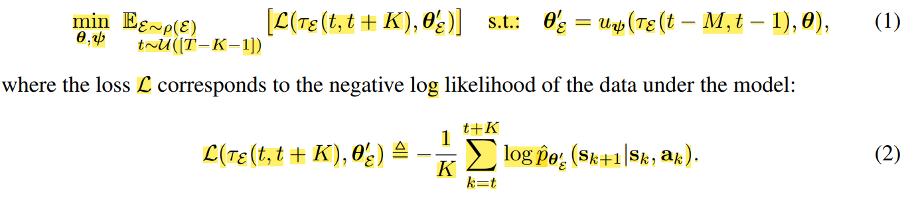
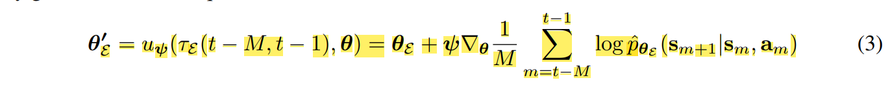
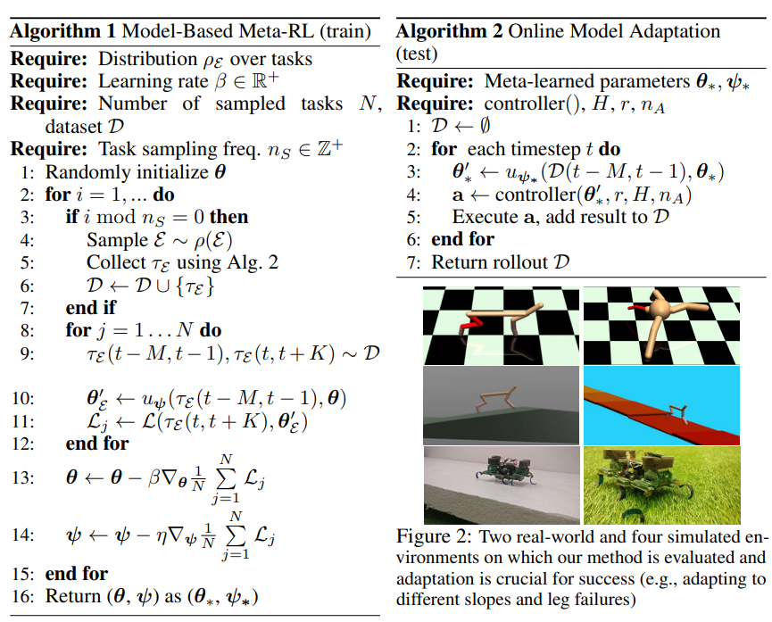

# Real-world Challenge for Reinforcement Learning

## Learning to Adapt in Dynamic, Real-WorldEnvironments via Meta-Reinforcement Learning

### Introduciton
Propose  efficient method for online adaptation, and to the best of our knowledge. The algorithm **efficiently trains a global model that is capable of using its recent experiences to quickly adapt, achieving fast online adaptation in dynamic environments**.

They evaluate 2 version of approaches on stochastic
continuous control tasks: 

(1) **Recurrence-Based Adaptive Learner (ReBAL)**

(2) **Gradient-Based Adaptive Learner (GrBAL)**

### Objective Setting-Up

To adapt the dynamic environment, we require a **learned model pθ∗ to adapt, using an update rule uψ∗**
after **seeing M data points from some new “task.”** In other words, we aim to train a global (world) model which is trained on to simulate the original environment to adapt a new environment rapidly.

Also, We assume a **distribution of environments ρ(Ɛ) that share some common structure between original enironment and the new environment**, such as
the same observation and action space, but may differ in their dynamics pƐ (s'|s, a). 

A sequence of states and actions is denoted by τE (i, j) = (si, ai, ..., sj , aj , sj+1). 

The  likelihood of the data under a predictive model pˆθ' (s'|s, a) with parameters θ', where θ' = uψ(τE (t − M, t − 1), θ) corresponds to model parameters that were updated using the past M data points(uψ is the update rule of the predictive model).

Then we formulate the optimization problem as the following

Note that the past M points are used to adapt θ into θ', and the loss of this θ' is evaluated on the future K points. **Thus, we use the past M timesteps to provide insight into how to adapt our model to perform well for nearby future timesteps**

Then we can define 2 kinds of algorithm to update the model

(1) **Gradient-Based Adaptive Learner (GrBAL)**

GrBAL uses a gradient-based meta-learning to
perform online adaptation; in particular, we use MAML.

(2) **Recurrence-Based Adaptive Learner (ReBAL)**

ReBAL, instead, utilizes a recurrent model,
which learns its own update rule (i.e., through its internal gating structure. In this case, ψ and uψ
corresponds to the weights of the recurrent model that update its hidden state.

### Algorithm

The model adaptation approach is agnostic to the model predictive control (MPC) method used. For more detail of MPC, refer to [this](https://en.wikipedia.org/wiki/Model_predictive_control#:~:text=Model%20predictive%20control%20(MPC)%20is,oil%20refineries%20since%20the%201980s.).

Here we denote the reward function as r and a planning horizon as H.

### Experiments

