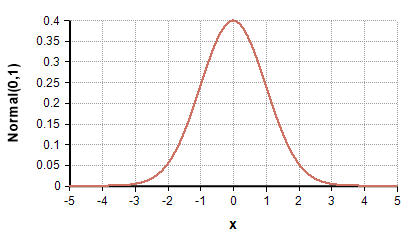
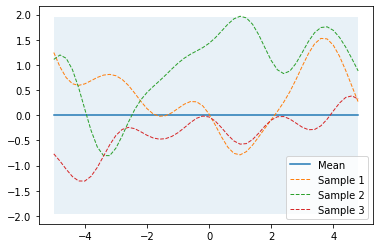
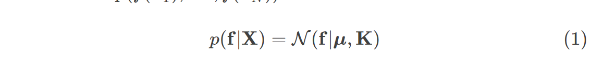
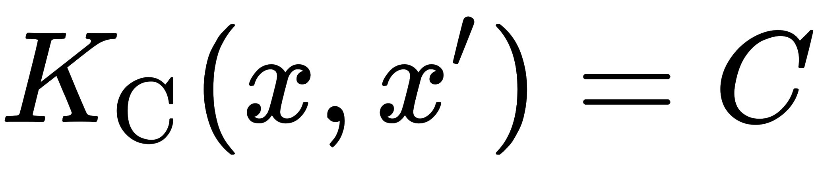
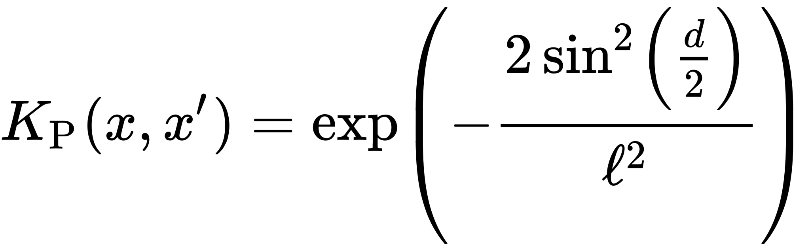
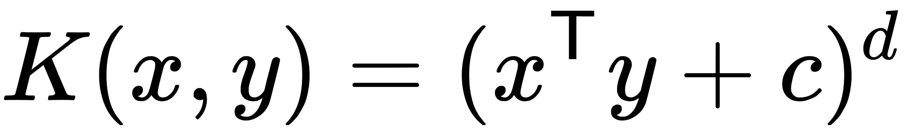
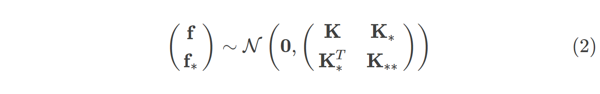

# Gaussian Process

## Big Picture and Background

Intuitively, Gaussian distribution define the **state space**, while Gaussian Process define the **function space**


Before we introduce Gaussian process, we should understand Gaussian distriution at first. For a RV(random variable) ***X*** that follow Gaussian Distribution ***N(0, 1)*** should be following image:



The P.D.F should be

As for Multivariate Gaussian Distribution, given 2 RV ***X***, ***Y***, both 2 RV follow Gaussian Distribution ***N(0, 1)***, we can illustrate it as


The P.D.F should be

The Gaussian process can be regarded as a **function space**, for example, given a function ***f(X)*** The Gaussian process can be illustrated as following:



The blue solid line represent the mean of the Gaussian process and the shaded blue area represent the standard deviation(which means the uncertainty of the RV) for the corresponding RV. For example, while ***X=-4***, the function ***f(4) = N(0, 2)***. That means the Gaussian process gives a Gaussian distribution ***N(0, 2)*** to describe the possible value of ***f(-4)***. The most likely value of ***f(-4)*** is ***0***(which is the mean of the distribution). As the figure shows, the Gaussian process is quite simple that the mean function is a constant ***0*** and the standard deviation is 2.

The dotted line are the functions sampled from the Gaussian process. Each line gives a mapping function from ***X*** to ***f(X)***.

Note that the explaination above is from the point of view of function approximation. From the perspective of random process, the Gaussian process can be regarded as a time-variant system that the distribution is changing along the time.


## Definition

A Gaussian process is a time continuous stochastic process ***{Xt;t∈T}*** is Gaussian if and only if for every finite set of indices ***t1, ..., tk*** in the index set ***T*** ***Xt1,...Xtk = (Xt1, ..., Xtk)*** is a multivariate Gaussian random variable.

For example, any point ***x∈X, x∈Rd***(Real Number with dimension ***d***) is assigned a random variable ***f(x)*** and where the joint distribution of a finite number of these variables ***p(f(x1),…,f(xN))*** is itself Gaussian:



where ***μ*** is a vector which consists of **mean function** and ***K*** is a covariance matrix which consists of **covariance function** or **kernel function**. The set of mean function ***μ=(m(x1),…,m(xN))*** give the mean value over ***X***. The set of kernel function is ***K=(Kij=κ(xi,xj)), xi, xj∈X*** which define the correlaton between 2 values ***xi*** and ***xj***. Note that a data point ***xi*** or ***xj*** might be multi-dimensions. The kernel functions may defined on the vectors as well. 

## Kernel

To understand the kernel function intuitively, the kernel function can be regarded as a kind of **distance metric** which give the distance in another space. For example, the kernel ***k(xi, xj)=xi^2+xj^2*** map the Cartesian coordinate to polar coordinate and convert the Euclidean distance into radius. 

Some common kernels are:
- Constant Kernel:
  
  

- RBF Kernel:
  
  

- Periodic Kernel
  
  

- Polynomial Kernel

  

For more detail, please refer to [A Visual Exploration of Gaussian Processes](https://distill.pub/2019/visual-exploration-gaussian-processes/). You can play with interactive widgets on the website.

## Inference

Given a training dataset with noise-free function values ***f*** at inputs ***X***, a GP prior can be converted into a GP posterior ***p(f∗|X∗,X,f)*** which can then be used to make predictions ***f∗*** at new inputs ***X∗***. By definition of a GP, the joint distribution of observed values ***f*** and predictions ***f∗*** is again a Gaussian which can be partitioned into



where ***K∗=κ(X,X∗)*** and ***K∗∗=κ(X∗,X∗)***. With ***N*** training data and ***N∗*** new input data ***K*** is a ***N×N*** matrix , ***K∗*** a ***N×N∗*** matrix and ***K∗∗*** a ***N∗×N∗*** matrix. 


# Bayesian Optimization

In many machine learning or optimization problem, we need to optimize an unkown object function ***f***. One of the solutions to optimize function ***f*** is **Bayesian Optimization**. Bayesian Optimization assume the object function **f** follows a distribution or prior model. This prior model is called **surrogate model**. We sample from the object function ***f*** and approximate the function ***f*** with surrogate model. The extra information like uncertainty provided from surrogate model contribute to the sample-efficiency of Bayesian optimization. In the mean time, we also use the **acquisition function** to choose the next sampling point.

## Surrogate Model
A popular model is Gaussian Process. Gaussian process defines a prior over functions and provides a flexiable, powerful and, smooth model which is especially suitable for dynamic models.

## Acquisition Function

## Algorithm
The Bayesian optimization procedure is as follows. 

---

For t=1,2,… 

repeat:
- Find the next sampling point xt by optimizing the acquisition function over the surrogate model: xt=argmax xu(x|D1:t−1)
- Obtain a possibly noisy sample yt=f(xt)+ϵt from the objective function f.
- Add the sample to previous samples D1:t=D1:t−1,(xt,yt) and update the surrogate model.

---

## Probability improvement(PI) Method

## Expected improvement(EI) Method
EI method is a kind of acquisition functions. 

## Bayesian Upper Confident Bound(UCB) Method
Before diving to UCB method, 

```math
SE = \frac{\sigma}{\sqrt{n}}
```

## Thompson Sampling Method

# Reference 

- [Bayesian Optimization & Algorithm Configuration](https://www.youtube.com/watch?v=6D9Rqda0dpg&feature=youtu.be)

  Bayesian optimization of CS159

- [Machine Learning by mathematicalmonk](https://www.youtube.com/playlist?list=PLD0F06AA0D2E8FFBA)
  
  Give an intuitive explaination of the math often used in ML.

- [(ML 19.1) Gaussian processes - definition and first examples](https://www.youtube.com/watch?v=vU6AiEYED9E&list=PLD0F06AA0D2E8FFBA&index=150)

  By mathematicalmonk.

- [UAI 2018 2. Bayesian Optimization](https://www.youtube.com/watch?v=C5nqEHpdyoE)
  

- [Gaussian processes by Martin Krasser](http://krasserm.github.io/2018/03/19/gaussian-processes/#References)
  
  The blog provide an excellent and intuitive explanation of Gaussian Process with Python example code.

- [Bayesian optimization by Martin Krasser](http://krasserm.github.io/2018/03/21/bayesian-optimization/)
  
  The blog provide an excellent and intuitive explanation of Bayesian Optimization with Python example code.

- [Coursera: Bayesian optimization](https://www.coursera.org/lecture/bayesian-methods-in-machine-learning/bayesian-optimization-iRLaF)
  
  The short video provide a very high-level explaination of Bayesian Optimization. Recommend for beginner.

- [Gaussian Processes - Part 1](https://www.youtube.com/watch?v=OdCXdUzLfao)

  The video provide a detailed explaination of Gaussian Process.

- [A Visual Exploration of Gaussian Processes](https://distill.pub/2019/visual-exploration-gaussian-processes/?fbclid=IwAR3XSg_gQ9KvIG9qPOXCWjGGEhl7b3qSZCLxXeee-uDbuQtktLCf-2lVeno#DimensionSwap)

   Provide a lot of interactive widgets to play around with Gausssian Process but fewer math.

- [StackExchange: Intuitive Understanding of Expected Improvement for Gaussian Process](https://stats.stackexchange.com/questions/426782/intuitive-understanding-of-expected-improvement-for-gaussian-process)
- [ML Tutorial: Gaussian Processes (Richard Turner)](https://www.youtube.com/watch?v=92-98SYOd)
- [10 Gaussian Processes, pt 1/3 Basics](https://www.youtube.com/watch?v=AEf_ta4vyKU)


- [Bzarg: How a Kalman filter works, in pictures](http://www.bzarg.com/p/how-a-kalman-filter-works-in-pictures/)
  
  Intuitively explain Kalman Filter with picture & examples.
  
- [图说卡尔曼滤波，一份通俗易懂的教程](https://zhuanlan.zhihu.com/p/39912633)

  Intuitively explain Kalman Filter with picture & examples. The article is translated from Bzarg: How a Kalman filter works, in pictures.

- [The Kalman Filter [Control Bootcamp]](https://www.youtube.com/watch?v=s_9InuQAx-g)

   The video provide the mathmatical proof for Kalman Filter.