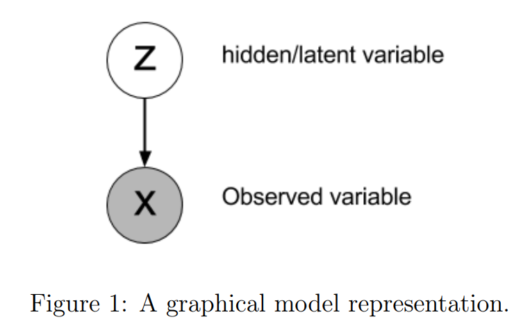
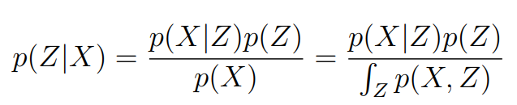
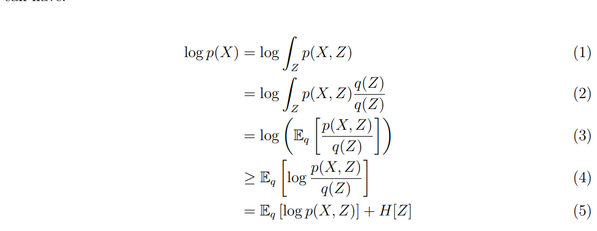
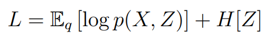
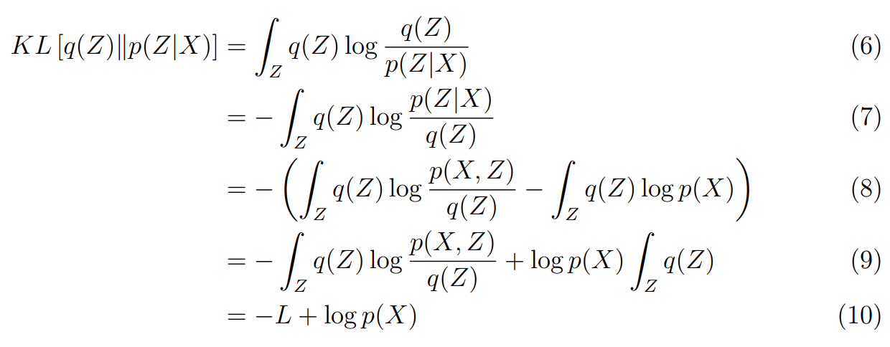
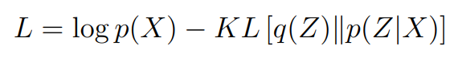

# Statistics

Everything horrible about mathmatical satistics that is required to understand DRL.

---

## Information Entropy

### Shannon Entropy

For discrete random variable X and probability mass function P(X), we defien the Shannon Entropy **H(X)** as 

**H(X) = E[I(X)] = E[-log(P(X))]**

### Conditional Entropy

The conditional entropy of Y given X is defined as

### Joint Entropy

The joint Shannon entropy (in bits) of two discrete random variables X and Y is defined as

### Mutual Information(MI)

In general, MI is the intersection or say the common information for both random variables X and Y.

Let (X,Y) be a pair of random variables with values over the space X x Y. If their joint distribution is P(X,Y) and the marginal distributions are PX and PY, the mutual information is defined as

In terms of summation, for discrete random variables X and Y

In terms of integration, for continuous random variables X and Y

The relation between mutual information and conditional entropy and joint entropy

With Venn diagram

For more detail, please refer to [this](https://en.wikipedia.org/wiki/Mutual_information)

## Jensen's Inequality

It states that for the convex transformation f(), the mean f(w * x + (1 - w) * y) of x, y on convex transform f is less than or equal to the mean applied after convex transformation w * f(x) + (1 - w) * f(y).

Formaly, corresponding to the notation of the above figure, the Jensen's inequality can be defined as

In probability theory, for a random variable X and a convex function φ, we can state the inequality as 

## Variational Lower Bound

### Problem Setup

It is also knowd as **Evidence Lower Bound(ELBO)** or **VLB**. We can  assume that X are observations (data) and Z are hidden/latent variables. In general, we can also imagine Z as a parameter and the relationship between Z and X are represented as the following

In the mean time, by the definition of Bayes' Theorem and conditional probability, we can get

### Proof

By the above statement, we can derive

The equation(5) is the ELBO.

Where q(Z) in equation(2) is the approximattion the true posterior distribution p(Z|X), since we don't know the distribution of the p(Z|X) of hidden state Z. We also apply Jensen's inequality in equation(4).

Then, we denote L as ELBO as following

Since q(Z) is an qpproximation of p(Z|X), the KL-Divergence between q(Z) and p(Z|X) is >= 0. We can further derive:

Then we rearrange the equation

### The application of ELBO

We can maximize the ELBO and minimize the KL-Divergence to maximize the logp(X). With KKT, we can rewrite the ***max(logp(X))*** to ***max(logp(X) - β KL[q(Z)||p(Z|X)])***

## Information Bottleneck

[PDF Highlight](./The%20information%20bottleneck%20method.pdf)
## Deep Variational Information Bottleneck

[PDF Highlight](./img/deep_variational_information_bottleneck.pdf)