# Lottery Hypothesis & Model Compression

## Can we get a better and compact model?

---

## Proving the Lottery Ticket Hypothesis Pruning is All You Need

[PDF Highlight](./Proving_the_Lottery_Ticket_Hypothesis_Pruning_is_All_You_Need.pdf)
  
Try to prove Lottery Hypothesis with math

---

## The Lottery Ticket Hypothesis Finding Sparse Trainable Neural Networks

[PDF Highlight](./THE_LOTTERY_TICKET_HYPOTHESIS_FINDING_SPARSE_TRAINABLE_NEURAL_NETWORKS.pdf)

### Introduction

提出Lottery Hypothesis，在一個神經網路中，存在一個較小的網路(called Lottery Ticket or Winning Ticket, 10-20% or less of the original network size)，且以原網路的方式Initialize後並Retrain可以得到比原網路同等或是更好的Test Accuracy。然而，若用Random Initialize的並訓練，則學習速度和Test Accuracy都會下降。

### Theorem: Lottery Hypothesis

The lottery ticket hypothesis predicts that ∃ m for which j
0 ≤ j (commensurate training time), a 0 ≥ a (commensurate accuracy), and kmk0  |θ| (fewer parameters)

給定任一神經網路θ，Exist 一個神經網路θ'，及Mask m = {0, 1}，使 = m * θ，θ >> θ'，分別訓練神經網路θ' j' iteration、θ j iteration，在同量的(commensurate)且訓練量下j' <= j，神經網路θ, θ'可以達到Test Accuracy a, a'，且a' >= a

> commensurate: 同量的，相稱的

### Identifying winning tickets

**Steps:**

1. Randomly initialize a neural network f(x; θ_0) (where θ_0 ∼ D_θ).
   
2. Train the network for j iterations, arriving at parameters θ_j .
   
3. Prune p% of the parameters in θ_j , creating a mask m.
   
4. Reset the remaining parameters to their values in θ0, creating the winning ticket f(x; m * θ_0).

> 每次Train神經網路j個iteration後，prune p%的神經元，如此反覆訓練、修剪(Iterative Pruning)for n round，就可以得到Lottery Tickets

### Winning Tickets in Fully-Connected Networks

**Iterative Pruning**

### Winning Tickets in Convolutional Networks

### VGG and ResNet for CIFAR10

**High Learning Rate Failure**
At the higher learning rate, iterative pruning does not find winning tickets, and performance is no better than when the pruned networks are randomly reinitialized. However, at the lower learning rate, the usual pattern reemerges, with subnetworks that remain within 1 percentage point of the original accuracy while Pm ≥ 3.5%.

To bridge the gap between the lottery ticket behavior of the lower learning rate and the accuracy advantage of the higher learning rate, we explore the effect of linear learning rate warmup from 0 to the initial learning rate over k iterations. Training VGG-19 with warmup (k = 10000, green line) at learning rate 0.1 improves the test accuracy of the unpruned network by about one percentage point.

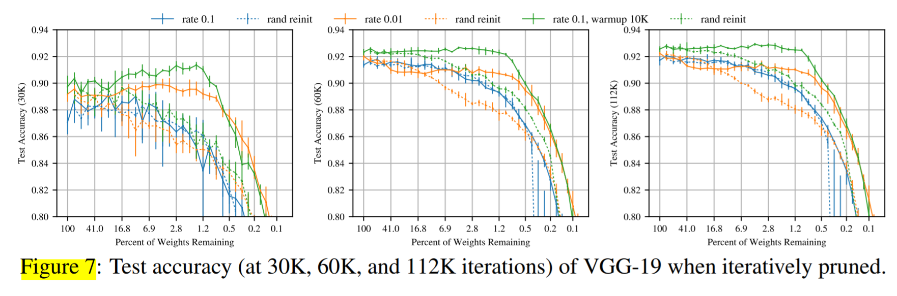

### appendix E

1. Networks found via iterative pruning with the original initializations (blue in Figure 14).
   
2. Networks found via iterative pruning that are randomly reinitialized (orange in Figure 14).
   
3. Random sparse subnetworks with the same number of parameters as those found via iterative pruning (green in Figure 14).

we find that the randomly reinitialized networks outperform random sparsity. However, for all of the other, convolutional networks studied in this paper, there is no significant difference in performance between the two. We hypothesize that the fully-connected
network for MNIST sees these benefits because only certain parts of the MNIST images contain useful information for classification, meaning connections in some parts of the network will be more valuable than others.

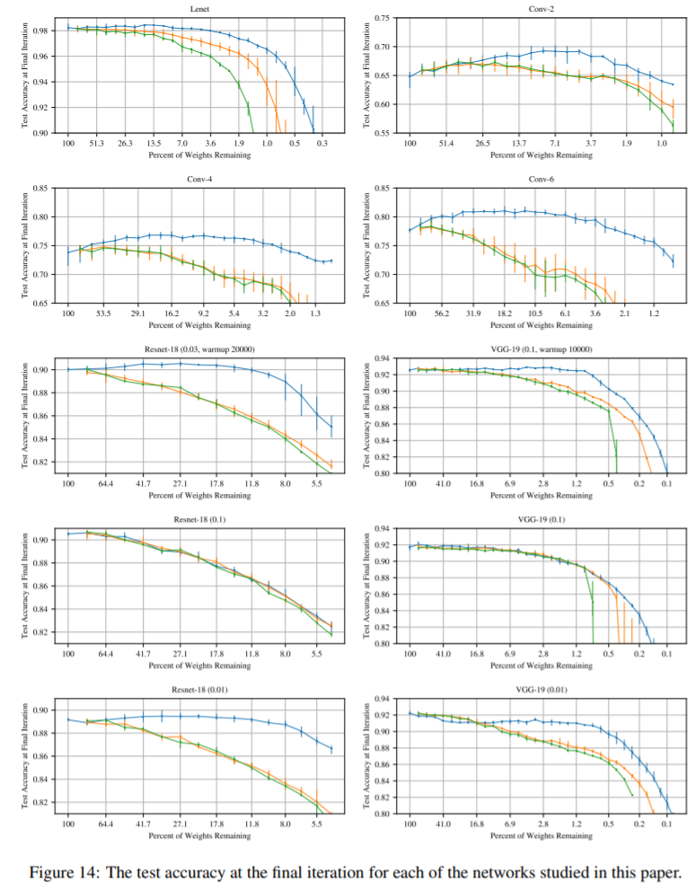

### Appendix F.3

Figure 17 shows the performance of winning tickets whose initializations
are randomly sampled from the distribution of initializations contained in the winning tickets for adam. More concretely, let Dm = {θ(i)0|m(i) = 1} be the set of initializations found in the winning
ticket with mask m. We sample a new set of parameters θ00 ∼ Dm and train the network f(x; mθ00). We perform this sampling on a per-layer basis. The results of this experiment are in Figure 17. Winning tickets reinitialized from Dm perform little better than when randomly reinitialized from D

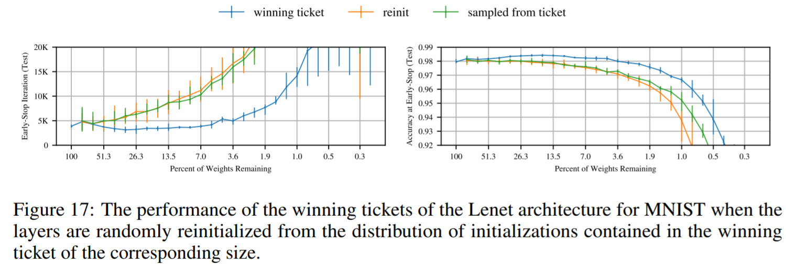

### Appendix G.2

According to the graph on the right of Figure 26, several learning rates(SGD) **between 0.0002 and 0.002 achieve similar levels of validation accuracy on the original network and maintain that performance to similar levels as the network is pruned**. Of those learning rates, 0.0012 and 0.002 produce the fastest early-stopping times and maintain them to the smallest network sizes

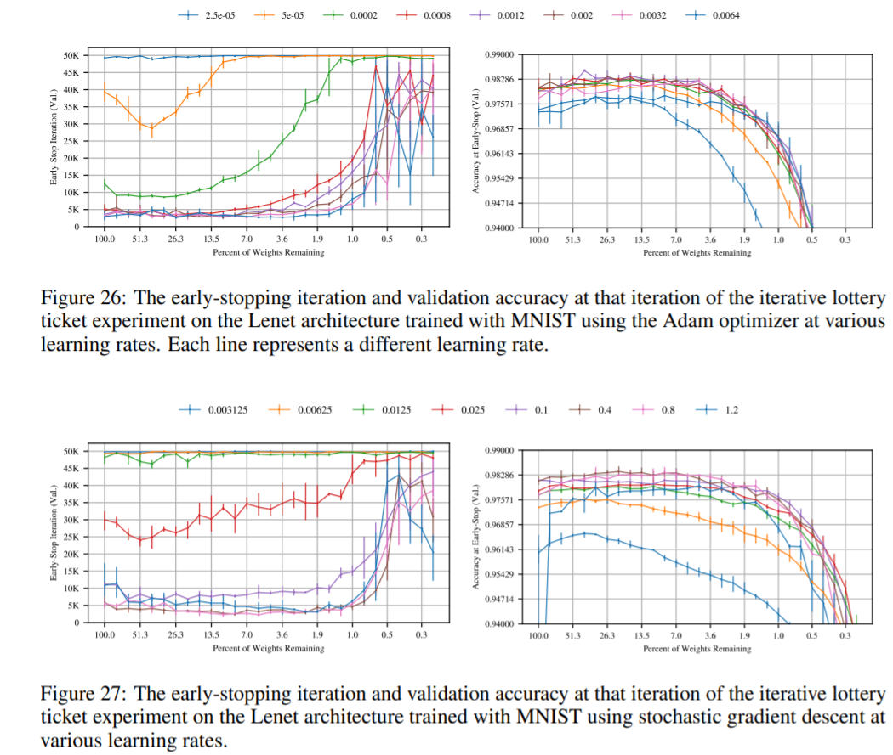

### Result

1. When randomly reinitialized, a winning ticket
learns more slowly and achieves lower test accuracy, suggesting that initialization is important to
its success

> Random Init會使的Winning Ticket學習速度較慢且得到較差的Test Accuracy，因此Initialization是相當重要的

2. Usually, the winning tickets we find are 10-20% (or less) of the size of the original network
 
---

## Rethinking The Value of Network Pruning

[PDF Highlight](./RETHINKING_THE_VALUE_OF_NETWORK_PRUNING.pdf)

### Introduction

**針對Pruning 提出三個結論**

1. training a large, over-parameterized
model is often not necessary to obtain an efficient final model

> (針對3-Stage Network Pruning Pipeline)訓練一個過參數化(Over-parameterized)的模型，對於找到最終小而有效的模型並不必要

2. learned “important” weights of the large model are typically not useful for the small pruned model

> 對於小模型來說，學習大模型訓練出來重要的Weight並沒有幫助，也就是說，傳統Pruning繼承大Model再Prune最後Fine-Tune的做法沒有必要

3. the pruned architecture itself, rather than a set of inherited “important”
weights, is more crucial to the efficiency in the final model

> Pruned的Architecture比Weight重要

**兩個出人預料的觀察**

1. For structured pruning methods with predefined target network architectures, directly training the small target model from random initialization can achieve the same

> 使用Structured Pruning(Predefine 好Pruning Rate)後得到的Model，Random Initialize後訓練可以達到和原本大Model一樣(甚至更好)的Performance

2. For structured pruning methods with autodiscovered target networks, training the pruned model from scratch can also achieve comparable or even better performance than fine-tuning. This observation shows that for these pruning methods, what matters more may be the obtained architecture, instead of the preserved weights

> Pruning後得到真正重要的資訊是Architecture，而非Weights

**小結**

Pruning算法最後得到的小模型其實重點在於Pruning完後的"Network Architecture"，大模型訓練出的Weight其實並不重要，在得到小模型後直接Random Init在訓練也可以得到相同甚至更好的Test Accuracy。

### Sructured Pruning & Unstructured Pruning

- Sructured Pruning:
  Predefine p% pruning rate(pruned nodes / all nodes) for each layers

- Unstructured Pruning:
  Prune with different pruning rate(pruned nodes / all nodes) for each layers automatically

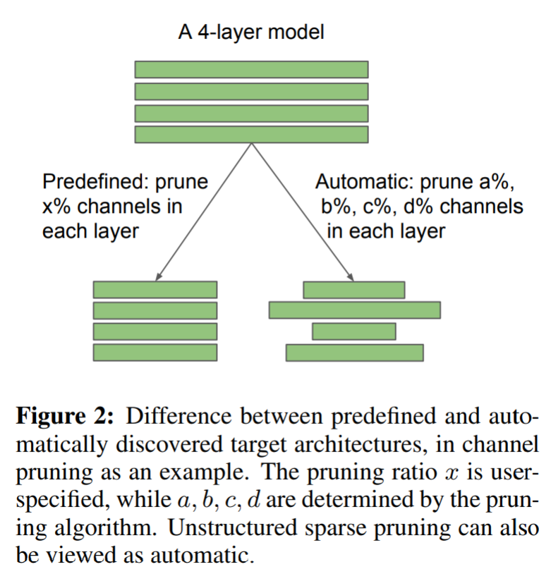
*Sructured Pruning & Unstructured Pruning*

### EXPERIMENTS ON THE LOTTERY TICKET HYPOTHESIS 

In this section, the authors do some experiments and get different results that "random initialization is enough for the pruned model to achieve competitive performance".

幾個重要的且和原Lottery Hypothesis原作不一樣的evaluation settings:

1. 比較了Strucred Pruning的結果，而在Lottery Hypothesis的Paper中，作者只有比較Unstrucred Pruning的結果

2. 使用較Modern且較大的NN，Lottery Hypothesis的原作者使用較淺的NN(Layer數 < 6)
   
3. 使用Momentum SGD和較大的Initial LR(Learning Rate = 0.1, 常用在Image Classification)
   
4. 使用較大的Dataset(ImageNet Dataset)，Lottery Hypothesis原作只用MNIST和CIFAR

**Result:**

1. 在非結構化剪枝(Unstructured Pruning)中，LR(Learning Rate)較大的時候(0.1)，Lottery Ticket相比於Random Init沒有太多優勢。如果LR(Learning Rate)較小(0.1)，結果誠如Lottery Hypothesis所言，Lottery Ticket 確實比Random Init好。但是在小LR的狀況下，無論是Lottery Ticket和Random Init結果都比大LR的結果差

*LR(Learning Rate)較大的時候(0.1)，Lottery Ticket相比於Random Init沒有太多優勢；反之如果LR(Learning Rate)較小(0.1)，Lottery Ticket 確實比Random Init好*

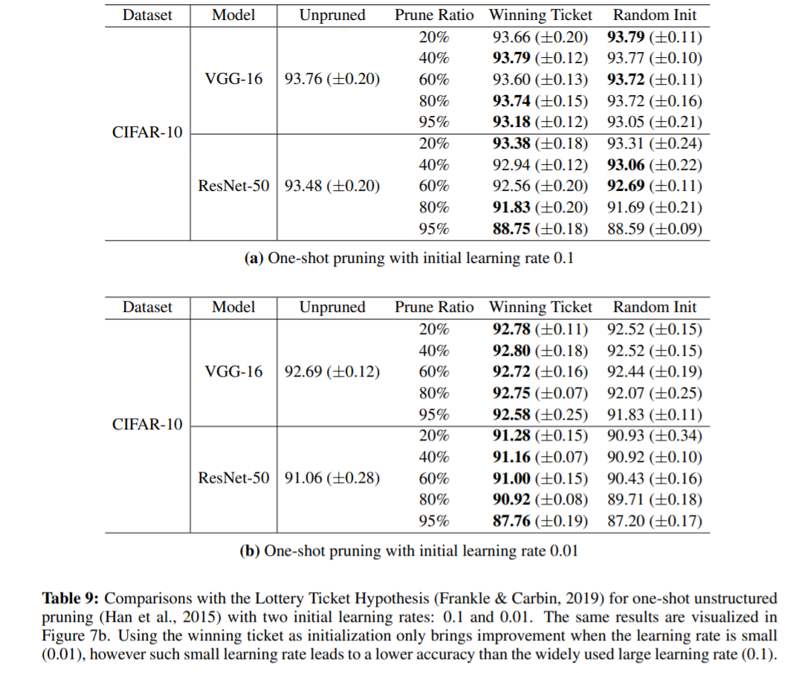
*小LR使Lottery Ticket比大LR的兩者(Lottery Ticket, Random Init)都更差*
   
2. 而在結構化剪枝(Structured Pruning)中，Lottery Ticket並不會帶來比Random Init更好的Test Accuracy

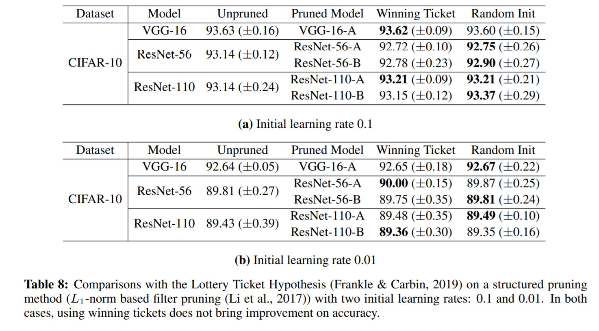

引述Paper結論

To summarize, in our evaluated settings, the winning ticket only brings improvement in the case of unstructured pruning, with small initial learning rate, but this small learning rate yields inferior accuracy compared with the widely-used large learning rate.

---

## Dawing Early-Bird Tickets More Efficient Training of Deep Networks

[PDF Highlight](./DRAWING_EARLY-BIRD_TICKETS_TOWARDS_MORE_EFFICIENT_TRAINING_OF_DEEP_NETWORKS.pdf)

### Introduction

Discover the Early-Bird (EB) tickets phenomenon: the winning tickets can be drawn very early in training(6.25%, 12.5% in experiments), and with aggressively low-cost training algorithms(5.8 ~ 10.7* energy saving)

### Early-Bird (EB) Tickets Hyppothesis

Consider a dense, randomly-initialized network f(x; θ), f reaches a minimum validation loss floss at the i-th iteration with a test accuracy facc, when optimized with SGD on a training set. 

In addition, consider subnetworks f(x; m ⊙ θ) with a mask m ∈ {0, 1} indicates the pruned and unpruned connections in f(x; θ). When being optimized with SGD on the same training set, f(x; m ⊙ θ) reach a minimum validation loss f′ loss at the i′-th iteration with a test accuracy f′acc. 

The EB tickets hypothesis articulates that there **exists m
such that f′acc ≈ facc (even ≥), i.e., same or better generalization, with i′ ≪ i (e.g., early stopping)
and sparse m (i.e., much reduced parameters).**

> 存在一個sparse的mask m = {0, 1}，使得EB Ticket subnetwork m' = m ⊙ θ，可以在訓練到第i'-th iteration時，就達到f' accuracy，而i' << i 且 f' >= f，當原network θ 在第i-th iteration達到f accuracy

### Hypothesis Validation

1. Do EB Ticket Always Exist?
   
   p is pruning rate. Sometime over pruning(70% on PreNet101) will make drawing ticket harder

   - EB tickets always emerge at very early stage

   - Some EB tickets are outperform than unpruned full-trained model

   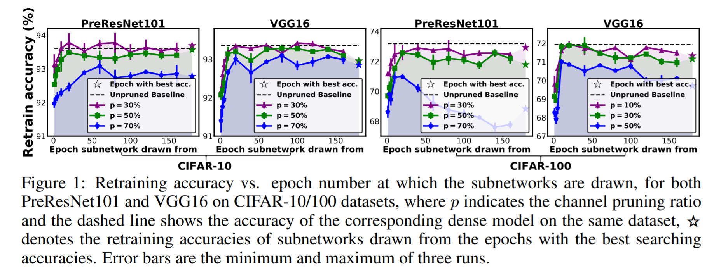
   *EB Ticket training epochs & Retrain Accuracy*

2. Do EB Tickets Still Emerge under Low-Cost Training?
   
   The meaning of [80, 120] is starting from 0.1, decay to 0.01 at 80-th epoch and further decay to 0.001 at 120 epoch
   
   - Appropriate **Large Learning Rate** is important for emerging EB tickets. The EB tickets always emerge at larger learning rate whose retrain accuray is also better

    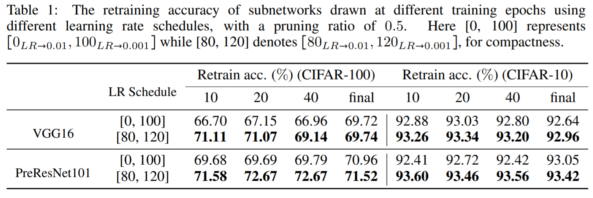
    *Learning Rate Schedule & Retrain Accuracy*
  
   - **Low-Precision Training** Dost Not Destroy EB Tickets
     Train & prune the original model with only 8 bits floating point(for all modle weights, activations, gradients and errors). The EB ticket still emerge at very early stage. Then they retrain the EB ticket with full precision(32 bits floating point). It aggressively save energy.

    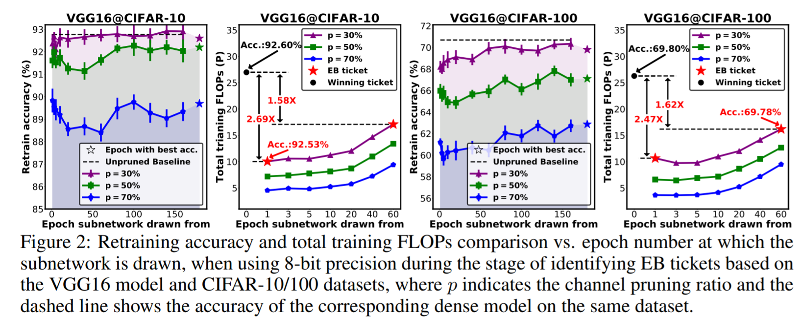
    *Low-Precision Pruning & Retrain Accuracy*
   
### Implement EB Ticket Algorithm

The difference between EB tickets algo and progressie training is only pruned once with pruning ratio *p%* in very early stage(early stopping) and then the EB ticket model will be retrained. The progressive training will train, prune, and retrain the model iterative until the model size reach the target pruning ratio *p%*. What's more? The EB ticket search is much shorter than one progressive training iteration.

NEB ≪ N (e.g., NEB/N = 12.5% in the experiments
summarized in Figure1 and NEB/N = 6.25% in the experiment summarized in Table 1)

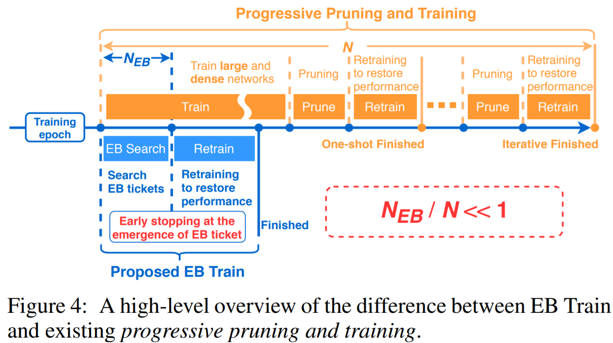
*EB Ticket Algorithm Flow Chart*

Here is the pseudo code. The **"mask distance"** will be explained later. Simply to say, the algorithm will train the original network with SGD and **prune the channels in *p%* virtually** to get the mask until **the mask distance < *Ɛ* which means the mask become stable.**

> The prune ratio *p* is given. 

> The author set the threshold *Ɛ* as 0.1 (with normalized mask distance of [0, 1]) and the length of queue *l* as 5

> The author doesn't explain scaling factor *r* very clearly. The scaling factor *r* in batch normalization(BN) is a coefficient that mutiply with the weights of the network and it would be trained with SGD. The scaling factor *r* can increase the magnitude of weight and make it easier to identify the neurons should be pruned. It also be uesd in the paper [*Learning Efficient Convolutional Networks through Network Slimming (Liu et al. 2017)*](https://arxiv.org/abs/1708.06519)

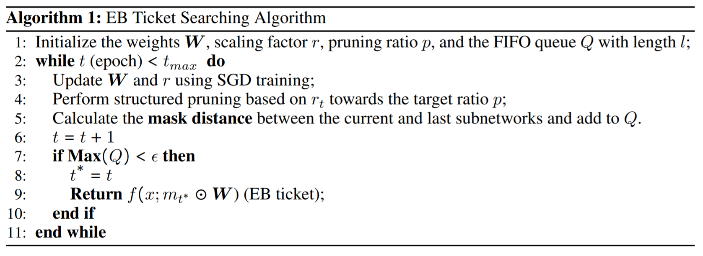
*EB Ticket Algorithm Pseudo Code*

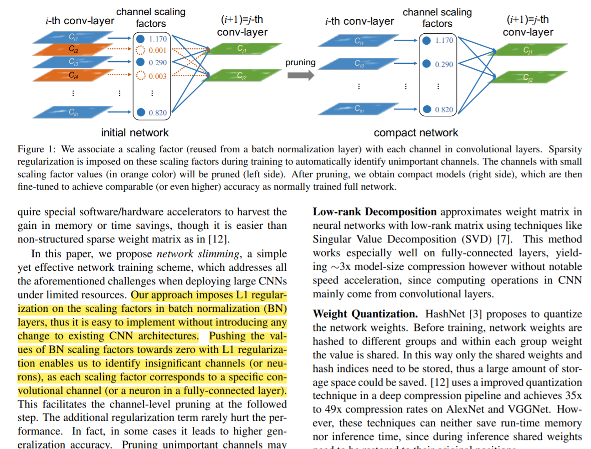
*The paragraph that mention about the scalling factor r in "Learning Efficient Convolutional Networks through Network Slimming"(Liu et al. 2017)*

The mask is a matrix that determine whether the channel should be pruned or not. The mask is binary that will denote the pruned channels as 0 while keep ones as 1. The **mask distance** represent the **difference** between 2 ticket masks in [**Hamming distance**](https://en.wikipedia.org/wiki/Hamming_distance).

For the following figure, it shows the mask distance drawn from different epoch where **(i, j)-th element in the matrix denotes the mask distance in normalized(by the size of original network) between subnetwork drawn from i-th and j-th epochs.** The warmer, the closer. The red lines denote 0.1 in mask distance. It shows the masks of EB tickets are determined in a very early stage.

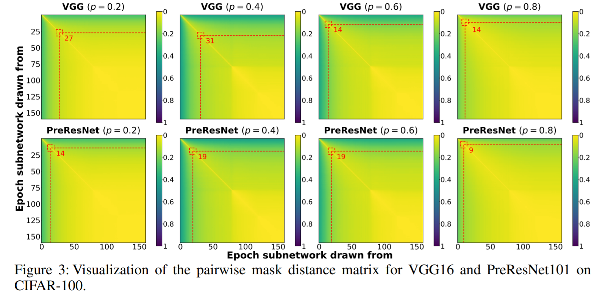
*Pairwise Mask Distance in Hamming Distance*

### Experiments

### Conclusion

## Learning Efficient Convolutional Networks through Network Slimming

[PDF Highlight](./Learning_Efficient_Convolutional_Networks_through_Network_Slimming.pdf)

## Weight Agnostic Neural Networks

[PDF Highlight](./Weight_Agnostic_Neural_Networks.pdf)

### Initialization and Regularization of Factorized Neural Layers
[PDF Highlight](./Initialization%20and%20Regularization%20of%20Factorized%20Neural%20Layers.pdf)