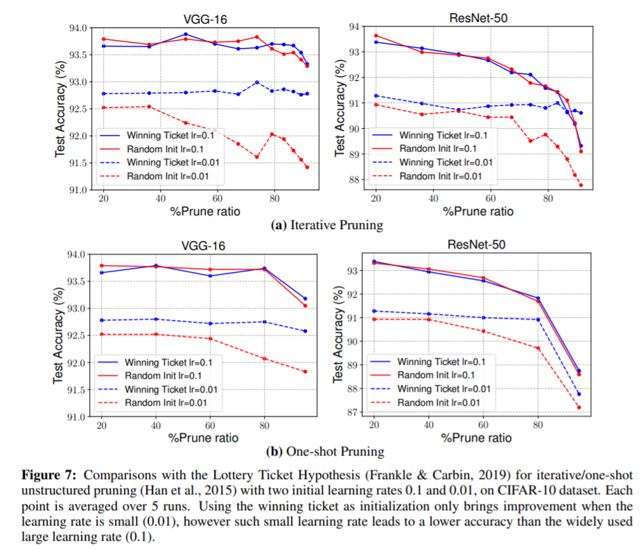
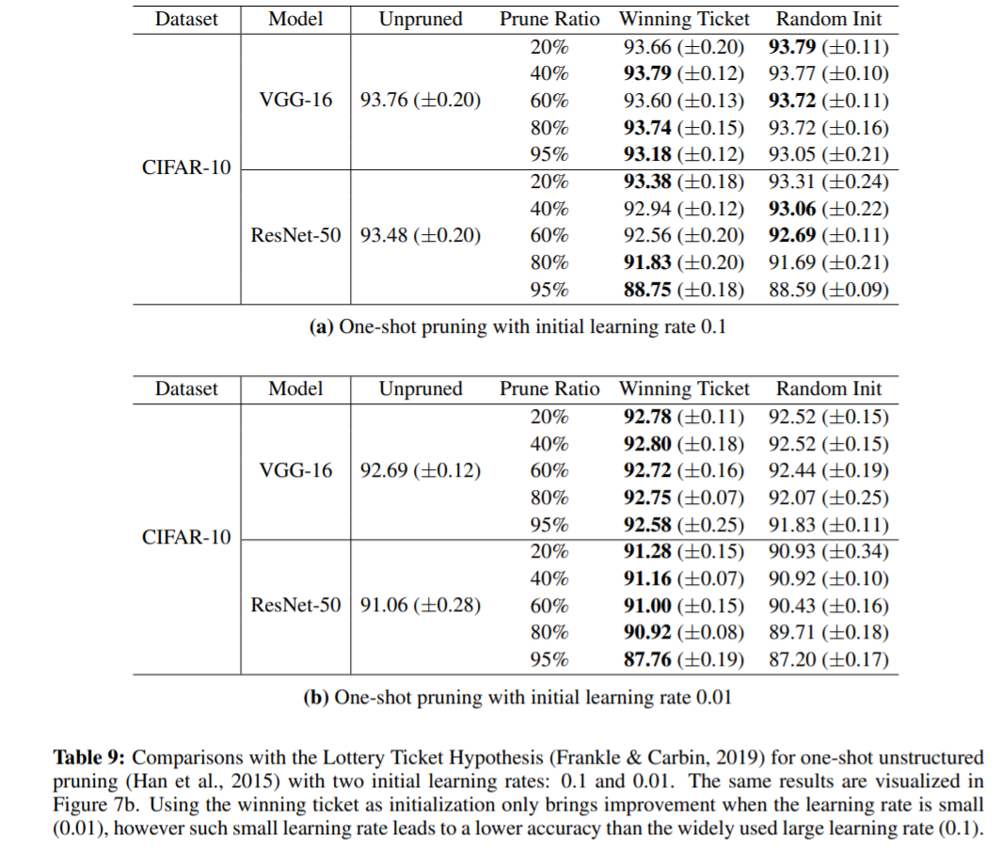
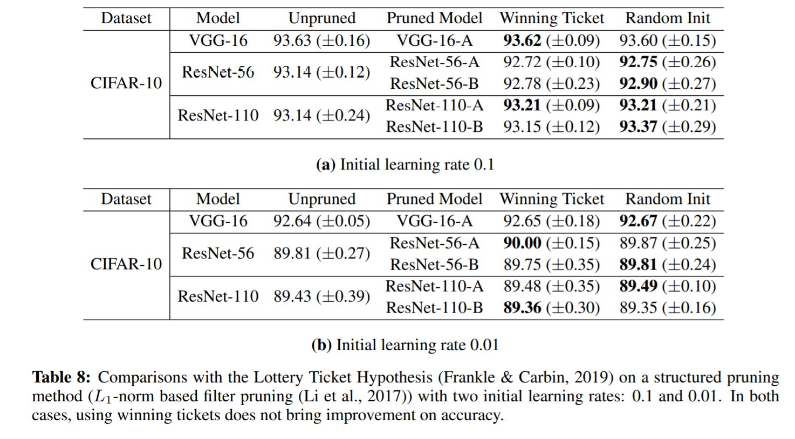

# Lottery Hypothesis & Model Compression
### Can we get a better and compact model?

### Proving the Lottery Ticket Hypothesis Pruning is All You Need

[Notes](./Proving%20the%20Lottery%20Ticket%20Hypothesis%20Pruning%20is%20All%20You%20Need.pdf)
  
Try to prove Lottery Hypothesis with math

### The Lottery Ticket Hypothesis Finding Sparse Trainable Neural Networks

[Notes](./THE_LOTTERY_TICKET_HYPOTHESIS_FINDING_SPARSE_TRAINABLE_NEURAL_NETWORKS.pdf)

#### Introduction

提出Lottery Hypothesis的原論文

#### Theorem: Lottery Hypothesis

The lottery ticket hypothesis predicts that ∃ m for which j
0 ≤ j (commensurate
training time), a
0 ≥ a (commensurate accuracy), and kmk0  |θ| (fewer parameters

給定任一神經網路θ，Exist 一個神經網路θ'，及Mask m = {0, 1}，使 = m * θ，θ >> θ'，分別訓練神經網路θ' j' iteration、θ j iteration，在同量的(commensurate)且訓練量下j' <= j，神經網路θ, θ'可以達到Test Accuracy a, a'，且a' >= a

commensurate: 同量的，相稱的

#### Identifying winning tickets

Steps:

1. Randomly initialize a neural network f(x; θ_0) (where θ_0 ∼ D_θ).
2. Train the network for j iterations, arriving at parameters θ_j .
3. Prune p% of the parameters in θ_j , creating a mask m.
4. Reset the remaining parameters to their values in θ0, creating the winning ticket f(x; m * θ_0).

每次Train神經網路j個iteration後，prune p%的神經元，如此反覆訓練、修剪(Iterative Pruning)for n round，就可以得到Lottery Tickets

#### Result

1. When randomly reinitialized, a winning ticket
learns more slowly and achieves lower test accuracy, suggesting that initialization is important to
its success

> Random Init會使的Winning Ticket學習速度較慢且得到較差的Test Accuracy，因此Initialization是相當重要的

- Usually, the winning tickets we find are 10-20% (or less) of the size of the original network
 
---

### Rethinking The Value of Network Pruning

[Note](./RETHINKING%20THE%20VALUE%20OF%20NETWORK%20PRUNING.pdf)

#### Introduction

針對Pruning 提出三個結論

1. training a large, over-parameterized
model is often not necessary to obtain an efficient final model

> (針對3-Stage Network Pruning Pipeline)訓練一個過參數化(Over-parameterized)的模型，對於找到最終小而有效的模型並不必要

2. learned “important” weights of the large model are typically not useful for the small pruned
model

> 對於小模型來說，學習大模型訓練出來重要的Weight並沒有幫助，也就是說，傳統Pruning繼承大Model再Prune最後Fine-Tune的做法沒有必要

3. the pruned architecture itself, rather than a set of inherited “important”
weights, is more crucial to the efficiency in the final model

> Pruned的Architecture比Weight重要

> 總結而言，Pruning算法最後得到的小模型其實重點在於Pruning完後的"Network Architecture"，大模型訓練出的Weight其實並不重要，在得到小模型後直接Random Init在訓練也可以得到相同甚至更好的Test Accuracy。

#### EXPERIMENTS ON THE LOTTERY TICKET HYPOTHESIS 

In this section, the authors do some experiments and get different results that "random initialization is enough for the pruned model to achieve competitive performance".

幾個重要的且和原Lottery Hypothesis原作不一樣的evaluation settings:

1. 比較了Strucred Pruning的結果，而在Lottery Hypothesis的Paper中，作者只有比較Unstrucred Pruning的結果

2. 使用較Modern且較大的NN，Lottery Hypothesis的原作者使用較淺的NN(Layer數 < 6)
   
3. 使用Momentum SGD和較大的Initial LR(Learning Rate = 0.1, 常用在Image Classification)
   
4. 使用較大的Dataset(ImageNet Dataset)，Lottery Hypothesis原作只用MNIST和CIFAR

**Result:**

1. 在非結構化剪枝(Unstructured Pruning)中，LR(Learning Rate)較大的時候(0.1)，Lottery Ticket相比於Random Init沒有太多優勢。如果LR(Learning Rate)較小(0.1)，結果誠如Lottery Hypothesis所言，Lottery Ticket 確實比Random Init好。但是在小LR的狀況下，無論是Lottery Ticket和Random Init結果都比大LR的結果差

LR(Learning Rate)較大的時候(0.1)，Lottery Ticket相比於Random Init沒有太多優勢；反之如果LR(Learning Rate)較小(0.1)，Lottery Ticket 確實比Random Init好

小LR使Lottery Ticket比大LR的兩者(Lottery Ticket, Random Init)都更差
   
2. 而在結構化剪枝(Structured Pruning)中，Lottery Ticket並不會帶來比Random Init更好的Test Accuracy

Compare to lottery ticket in structured pruning

引述Paper結論

>  To summarize, in our evaluated settings, the winning ticket only brings improvement in the case of unstructured pruning, with small initial learning rate, but this small learning rate yields inferior accuracy compared with the widely-used large learning rate.

---

### Dawing Early-Bird Tickets More Efficient Training of Deep Networks

[Note](./DRAWING_EARLY-BIRD_TICKETS_TOWARDS_MORE_EFFICIENT_TRAINING_OF_DEEP_NETWORKS.pdf)

### Weight Agnostic Neural Networks

[Note](./Weight_Agnostic_Neural_Networks.pdf)

### Learning Efficient Convolutional Networks through Network Slimming

[Note](./Learning_Efficient_Convolutional_Networks_through_Network_Slimming.pdf)