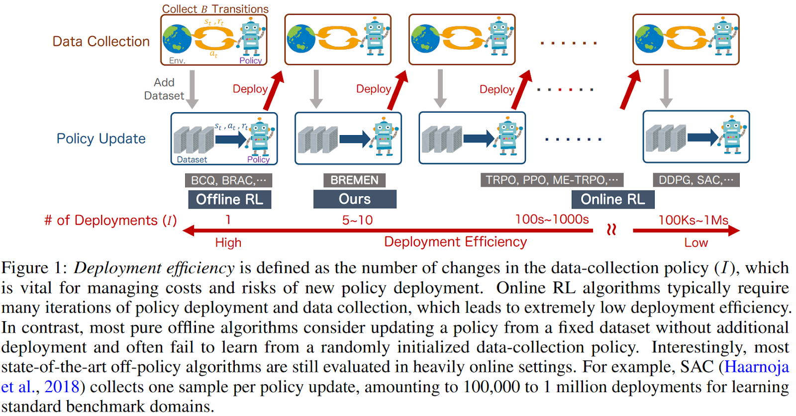

<!-- _class: lead -->

# 02/22 ML Meeting

---

# ICLR’21 - Deployment-Efficient Reinforcement Learning via Model-Based Offline Optimization

### Tatsuya Matsushima, Hiroki Furuta, Yutaka Matsuo, Ofir Nachum, Shixiang Shane Gu

### The University of Tokyo, Google Research

### Citation: 45

---

## Problem Formulation

- In real world application, it's **costly  and risky** to update the policy deployed on a cluster.
  
  - Costly: Updating the policy of the RL deployment **costs high communication cost between the clusters.**
  - Risky: The **new policy may act unexpectedly.**
  - **It's impractical to update the RL policy frequently**, so we need to reduce the times of the deployment as many as possible

---

- Formulate a new problem: Deployment-Efficient RL
- Definition of **“Deployment-Efficient”: Deployment efficiency is defined as the number of changes in the data-collection policy.**

---

## Challenges

- **Online-RL** update policy frequently -> **Low deployment efficiency**
- **Offline-RL** collect dataset only once -> **Can only get sub-optimal policy**
- Get we get the optimal policy with high deployment efficiency?

---
## Idea

- Reduce the update frequency of the data-collecting policy and only update it when it has collected a large batch of trajectories
- Use **importance sampling and trust-region optimization** to correct the distribution shift between data-collecting policy $\pi_{\theta}$ and training(target) policy $\pi_{\theta_k}$

$$
\begin{array}{c}
\theta_{k+1} = \argmax_{\theta} \mathbb{E}_{s, a \sim \theta_k} \left[ \frac{\pi_{\theta}(a | s)}{\pi_{\theta_k}(a | s)} A^{\pi_{\theta_k}}(s, a) \right] \\
\text{s.t.} \quad \mathbb{E} \left[ D_{KL}(\pi_{\theta}(\cdot | s) || \pi_{\theta_k}(\cdot | s)) \right] \leq \delta
\end{array}
$$

- Named 'BREMEN'

---

## Disadvantages:

- Importance sampling **suffers from high variance while the data-collecting policy $\pi_{\theta}$ is largely different from training(target) policy $\pi_{\theta_k}$.** It would cause low sample-efficiency.
- **Trade-off between sample efficiency and deployment efficiency**

---

## Following Works

### arXiv'22 - Deployment Constrained Reinforcement Learning with Model-based Uncertainty Regularized Batch Optimization

- Improve the sample efficiency of previous work 'BREMEN'
- Encourage the agent to explore low-data regions.
- Train a world model $f(s_t, a_t) = s_{t+1}$ If the prediction error of the next state given a state-action pair is high, then the uncertainty is high. We take this prediction error as an uncertainty quantifier.

---

## Conclusion

It seems that for a practical RL algorithm, it had better satisfy 3 requirements:
- **Sample efficient during policy optimization**
- **Deployment efficient during data collection**
- **Safe exploration during data collection**

---

<!-- # Conditional GAN + NTK -->

## Idea

- Explore the state / action which is **high expectation & high variance of the Q-value to collect diverse trajectories:** 
- high variance & high expectation > low variance & high expectation > low variance & low expectation > high variance & low expectation

$$
\argmax_{\theta} \sum^{T}_{t=0} K(\mathbb{E} [Q_{offline}(s_t, \pi_{\theta}(s_t); \mathcal{D})], var[Q_{offline}(s_t, \pi_{\theta}(s_t); \mathcal{D})])
$$

Suppose the offline Q-function $Q_{offline}(s, a; \mathcal{D})$ is trained in dataset $\mathcal{D}$ and normalized to 0 ~ 1. Function $K(a, b)$ would give higher value if the pair $(a, b)$ is in the higher order as the second bullet point

- The variance of the Q-function can be replaced by a quantifier of the diversification of the gradient of Q-function because diverse gradients can provide diverse state-action pair / trajectories.