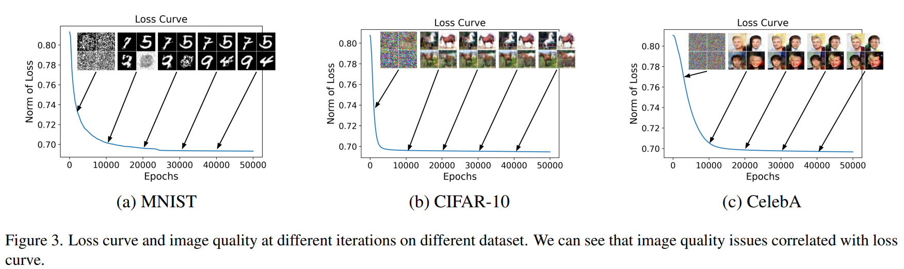
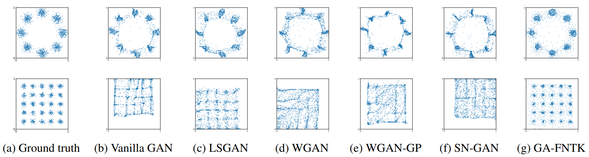
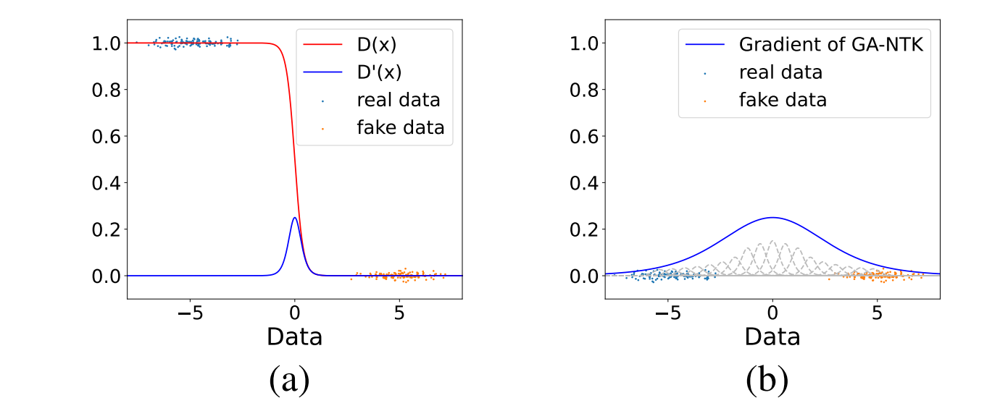
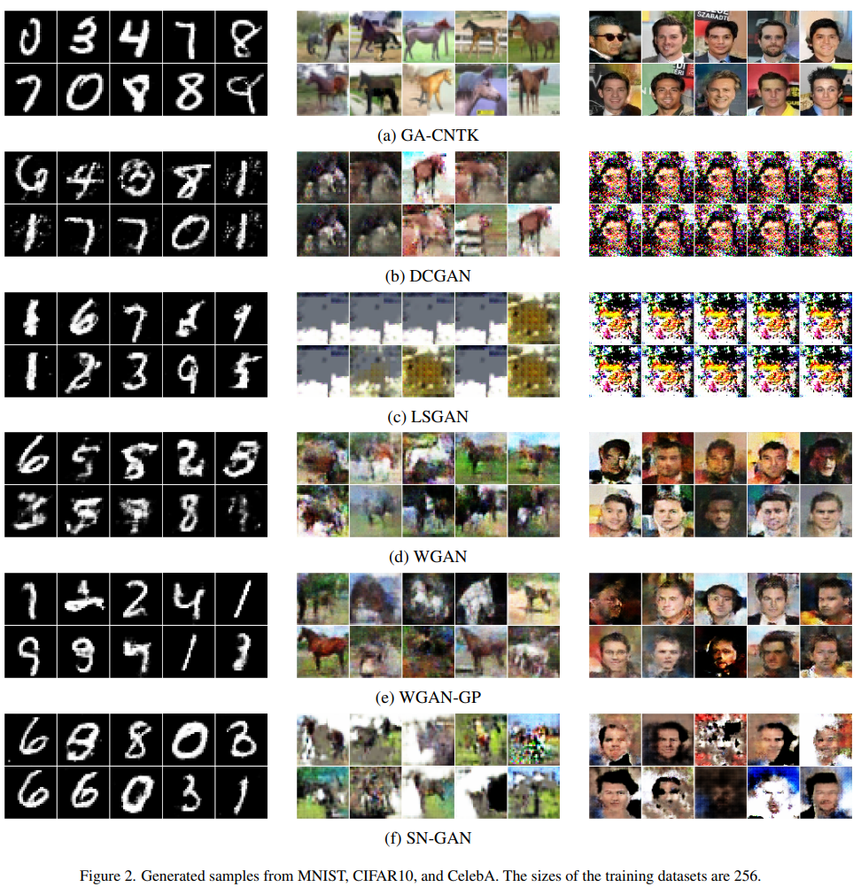

# The loss of GANs

$$
\arg \min_{\theta_{G}} \max_{\theta_{D}} \mathbb{E}_{x \sim \mathcal{P}_{data}}[\log D(x)] + 
\mathbb{E}_{z \sim \mathcal{P}_{noise}}[\log D(1 - G(x))]
\quad \quad \quad \tag{1}
$$

We denote the generator as $G$ and the discriminator as $D$ with training image $x \sim \mathcal{P}_{data}$ following the distribution of training images and random noise $z \sim \mathcal{P}_{noise}$. The generator is parametrized by $\theta_G$ and the discriminator is parametrized by $\theta_D$.

---

# Neural Tangent Kernel(NTK)

According to the paper [Neural Tangent Kernel: Convergence and Generalization in Neural Networks(by Jacot, NIPS'18)](https://arxiv.org/abs/1806.07572), the Neural Tangent Kernel(NTK) over the training dataset $\mathbf{X}$ corresponding to the architecture of the neural network $f(\cdot; \theta)$ is defined as

$$
\mathbf{K} = \nabla_{\theta}f(\mathbf{X}; \theta)^{\top}\nabla_{\theta}f(\mathbf{X}; \theta)
\quad \quad \quad \tag{2}
$$

Let $\mathbf{K}^{n,n} \in \mathbb{R}^{n×n}$ be the kernel matrix for $\mathbf{X}^{n}$, i.e.,$\mathbf{K}^{n,n}_{i,j} = k(\mathbf{X}^{n}_{i,:}, \mathbf{X}^{n}_{j,:})$. **The mean prediction of the ensemble of the neural network $f(\cdot; \theta)$ after training $t$ steps gradient descent can be approximated by the mean prediction of the NTK-GP with corresponding kernel.** The mean prediction of the NTK-GP over $\mathbf{X}^n$ evolves as

$$
(\mathbf{I}^n − e^{− \eta \mathbf{K}^{n,n} t}) \mathbf{Y}^n
\quad \quad \quad \quad \tag{3}
$$

where $\mathbf{I}^{n} \in \mathbb{R}^{n \times n}$ is an identity matrix and $\eta$ is a sufficiently small learning rate. 

---

# Our Method: GA-NTK

Let $\mathbf{K}^{2n,2n} \in \mathbb{R}^{2n \times 2n}$ be the kernel matrix for $\mathbf{X}^{n} \oplus \mathbf{Z}^{n}$, where the value each element $\mathbf{K}^{2n,2n}_{i,j} = k((\mathbf{X}^{n} \oplus \mathbf{Z}^{n})_{i,:}, (\mathbf{X}^{n} \oplus \mathbf{Z}^{n})_{j,:})$. Let $\lambda = \eta \cdot t$ The discriminator can be written as: 

$$
D(\mathbf{X}^n, \mathbf{Z}^n; k, \lambda) = \underbrace{(\mathbf{I}^{2n} - e^{-\lambda \mathbf{K}^{2n,2n}})}_{NTK-GP} (\mathbf{1}^{n} \oplus \mathbf{0}^{n}) \in \mathbb{R}^{2n}
\quad \quad \quad \tag{4}
$$

where $\mathbf{I}^{2n} \in \mathbb{R}^{2n \times 2n}$ is an identity matrix. We formulate the objective of GA-NTK as follows:

$$
\arg \min_{\mathbf{Z}^n} || \mathbf{1}^{2n} − D(\mathbf{X}^{n}
, \mathbf{Z}^{n}; k, \lambda) ||_{2}
\quad \quad \quad \tag{5}
$$

where $\mathbf{1}^{2n} \in \mathbb{R}^{2n}$ is a vector of ones. Then, we update the fake image at the last time step 

$$
\mathbf{Z}^{n+1} = \mathbf{Z}^{n} + \alpha \nabla_{\mathbf{Z}^{n}} || \mathbf{1}^{2n} − D(\mathbf{X}^{n}
, \mathbf{Z}^{n}; k, \lambda) ||_{2} 
\quad \quad \quad \tag{6}
$$

---

# Stable Convergence

The image quality is consistent with the loss. As the **loss decreases, the image quality is improved**.

---

# Mode Collapse

Our method(**GA-FNTK**) **fits to multi-modal distribution perfectly**, rather than other baseline GANs.

---

# Gradient Vanish

Decision boundary of the discriminator and the corresponding gradients for the generator $\mathbf{Z}^n$ in (a) GANs and (b) GA-NTK on 1D toy dataset. The blue points are real data points and the red ones are fake. The discriminator output 1 for the real data points and 0 for the fake ones(fig (a) red line). The **gradients(fig (a) blue line) vanishes while the the data points are far away from the decision boundary**.

The **gray dashed lines indicate the gradients for $\mathbf{Z}^n$ from different element networks of the ensemble discriminator in GA-NTK**.

<!--  -->

---

# Compare GA-CNTK & GANs

