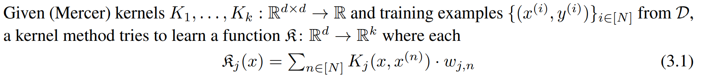
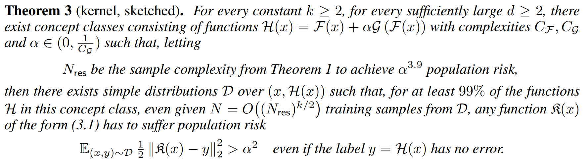
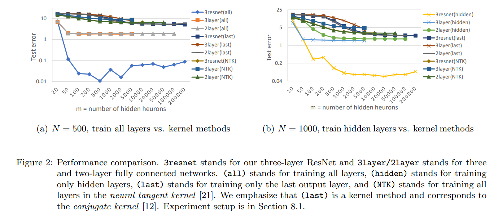
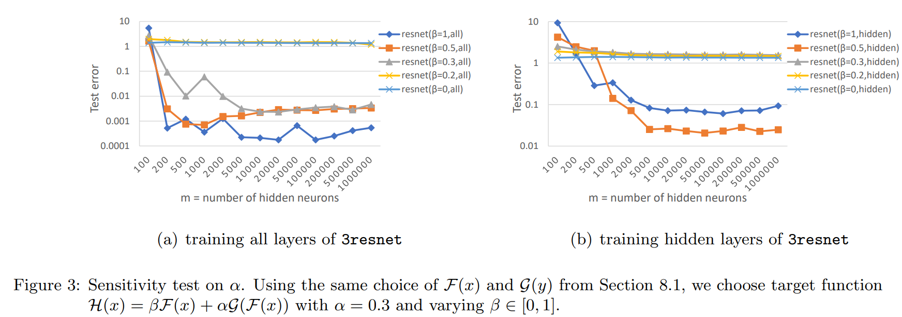

# What Can ResNet Learn Efficiently, Going Beyond Kernels?

NIPS'19, Citation: 77

Zeyuan Allen-Zhu, Yuanzhi Li

Microsoft Research AI, Carnegie Mellon University

---

# Motivation

- In many practical tasks, neural networks give much better generalization error compared to kernels, although both methods can achieve zero training error.
- For example, ResNet achieves 96% test accuracy on the CIFAR-10 data set, but NTKs achieve 77% and random feature kernels achieve 85%. This gap becomes larger on more complicated data sets.

---

# Problem Formulation

Can neural networks(like ResNet) efficiently and distribution-freely learn a concept class, with better generalization than kernel methods?

---

# Main Idea

- For neural networks with ReLU activations, we show without any distributional assumption, a **three-layer residual network (ResNet)** can (improperly) learn a **concept class that includes three-layer ResNets of smaller size and smooth activations**, and the generalization error is also small if polynomially many training examples are given while the network is trained by SGD.
- Then prove that for **some $\delta \in (0, 1)$, with $N = O(\delta^{-2})$ training samples**, neural networks can efficiently **achieve generalization error $\delta$ for this concept class over any distribution**; in contrast, there exists a simple distributions such that **any kernel method cannot have generalization error better than $\sqrt{\delta}$ for this class cannot have generalization error better than $\sqrt{\delta}$ for this class**.
- Also prove a computation complexity advantage of neural networks with respect to linear regression over arbitrary feature mappings as well.

---

# Target Function

We wish to learn a **concept class given by target functions** that can be written as

$$\mathcal{H}(x) = \mathcal{F}(x) + \alpha \mathcal{G}(\mathcal{F}(x))$$

where $\alpha \in [0, 1)$ and $\mathcal{G} : \mathbb{R}^k \to \mathbb{R}^k$, $\mathcal{F} : \mathbb{R}^d \to \mathbb{R}^k$ are two functions that can be written as two-layer networks with smooth activations.

---

# Theorem 1

Consider a single-skip three-layer ResNet with ReLU activation, defined as a function $\text{out}: \mathbb{R}^d \to \mathbb{R}^k$

$$\text{out}(x) = A (\sigma (W x + b_1) + \sigma (U \sigma (W x + b_1) + b_2))$$

Where $\sigma$ is the ReLU function, $W \in \mathbb{R}^{m \times d}$ and $U \in \mathbb{R}^{m \times m}$ are the hidden weights, $A \in \mathbb{R}^{k \times m}$ is the output weight, and $b_1, b_2 \in \mathbb{R}^m$ are two bias vectors.

For any distribution over $x$, for every $\delta \in ((\alpha C_{\mathcal{g}})^4, 1)$ with probability at least 0.99, SGD efficiently learns a network $\text{out}(x)$ satisfying

$$\mathbb{E}_{(x,y) \sim \mathcal{D}} \frac{1}{2} ||\text{out}(x) − y||_{2}^2 \leq \delta \quad \text{using} \quad N = \~{O}(\frac{C_{\mathcal{F}}^2}{\delta^2})  {samples}$$

The running time of SGD is polynomial in $\text{poly}(C_{\mathcal{G}}, C_{\mathcal{F}} , \alpha−1)$. In other words, ResNet is capable of achieving population risk $\alpha^4$

---

# Theorem 3

---

- Neural networks (trained by SGD) achieve population risk $\alpha^{3.9}$ using $N_{res}$ samples for any distribution over $x$, while kernel methods cannot achieve any population risk better than $\alpha^2$ for some simple distributions even with $N = (N_{res})^{k/2} \gg N_{res}$ samples.
- Kernel method tries to learn everything in one shot. This unavoidably requires the sample complexity to be at least $\Omega(d^k)$. Intuitively, as the kernel method tries to learn $\mathcal{G}(\mathcal{F})$ from scratch, this means that it has to take into account all $\Omega(d^k)$ many possible choices of $\mathcal{G}(\mathcal{F})$ (recall that $\mathcal{G}$ is a degree $k$ polynomial over dimension $d$).
- On the other hand, a kernel method with $N$ samples only has $N$-degrees of freedom (for each output dimension). This means, if $N \ll o(d^k)$, kernel method simply does not have enough degrees of freedom to distinguish between different $\mathcal{G}(\mathcal{F})$, so has to pay $\Omega(\alpha^2)$ in population risk

---

# Experiment

- Generate feature vectors $x \in \{−1, 1\}$ that are uniformly sampled at random, and labels are generated from a target function $\mathcal{H}(x) = \mathcal{F}(x) + \alpha \mathcal{G}(\mathcal{F}(x)) \in \mathbb{R}$ satisfying $\mathcal{F}(x) = (x_{1}x_{2},..., x_{29}x_{30})$ and $\mathcal{G}_i(y) = (−1)^i y_1 y_2 y_3 y_4$ for all $i = 1, 2,..., 15$.

- SGD optimizer of pytorch, with momentum 0.9, mini-batch size 50. We carefully run each algorithm with respect to learning rates and weight decay parameters in the set $\{10^{−k}, 2 \cdot 10^{−k}, 5 \cdot 10^{−k}: k \in \mathbb{Z} \}$, and present the best one in terms of testing accuracy. In each parameter setting, we run SGD for 800 epochs, and decrease the learning rate by 10 on epoch 400.
---

# Experiment 1

Denote $N$ as the number of training samples. Let $\alpha = 0.3$ and $k = 15$ so that test error $k \alpha^2 = 1.35$ is a threshold for detecting whether the trained model has successfully learned $\alpha \mathcal{G}(\mathcal{F}(x))$ or not

---
# Experiment 2

when $\alpha \lt \beta$, the base signal is larger than the composite signal, so indeed ResNet can perform hierachical learning; in contrast, when $\alpha \gt \beta$, learning the composite signal becomes practically impossible.
