<!-- _class: lead -->
# ML Meeting

## Idea Proposals

### 12/28
---

# Idea Proposals

## Offline Reinforcement Learning
<!-- - NTK + policy-constrained offline RL -->
- NTK + uncertainty-based offline RL
- Decision Transformer + NTK

## Imitation Learning
- GA-NTK + GAIL
- Behavior Cloning + NTK

## NLP

---

# Offline RL

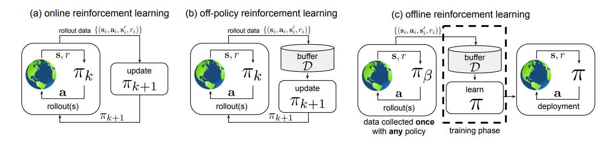

We aim to learn a policy $\pi$ from the history of trajectories $\mathcal{D} = \{ s_t, a_t, s_t', r_t \}$ generated by behavioral policy $\pi_{\beta}$ s.t. the performance $\pi \geq \pi_{\beta}$(Which means we want to train an agent's policy $\pi$ only from the history of trajectories $\mathcal{D}$)

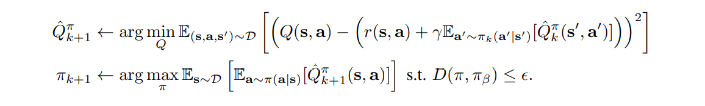

---

# Challenge 

- Extrapolation Error
  
  - Because the agent's policy isn't the same as the behavioral policy. The agent may overestimate unseen $Q^{\pi}(s, a)$.
  - In the offline setting, the policy cannot correct such over-optimistic Q-values.
---

# Extrapolation Error

- **Final Buffer**: train a DDPG agent for 1 million time steps, adding $\mathcal{N}(0, 0.5)$ Gaussian noise to actions for high exploration.
- **Concurrent**: We concurrently train the off-policy
and behavioral DDPG agents, for 1 million time steps. A standard $\mathcal{N}(0, 0.1)$ Gaussian noise is added to action
- **Imitation**: A trained DDPG agent acts as an expert, and is used to collect a dataset of 1 million transitions.

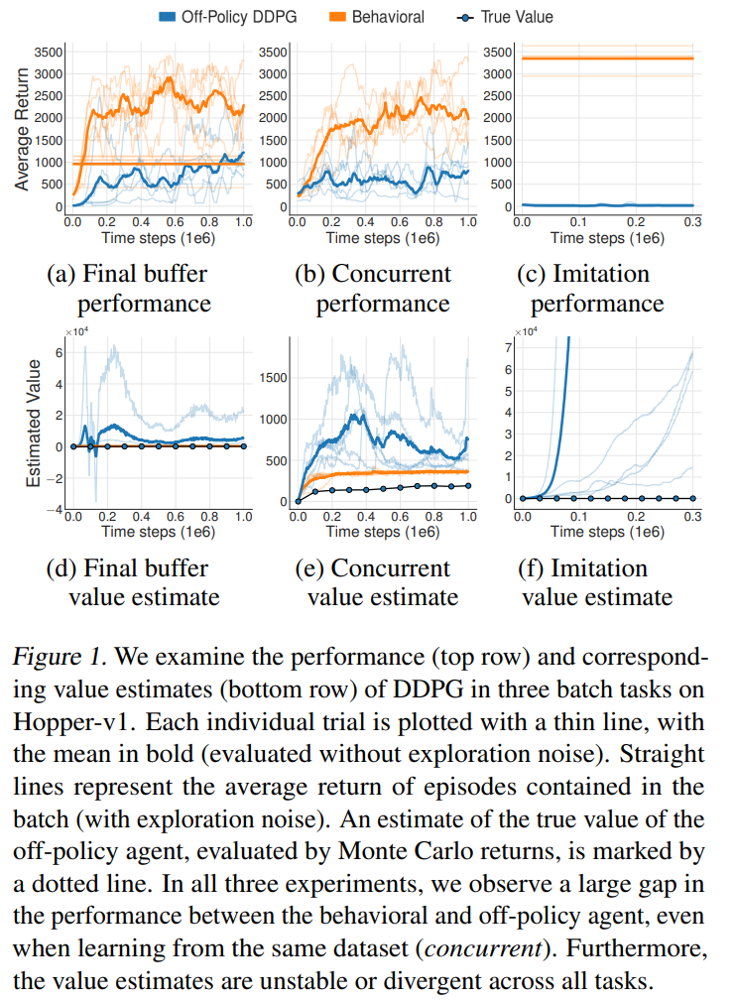

---

# Extrapolation Error

- In each task, the off-policy agent performances significantly worse than the behavioral agent, even in the concurrent experiment.

---

<!-- # Solutions for Extrapolation Error

- Support Constraints: Penalizes the total amount of probability mass on out-of-distribution actions under the $\pi$ distribution

$$
D_{support, \epsilon}(\pi(\cdot | s), \pi_{\beta}(\cdot | s)) = \sum_{a \in \mathcal{A}, \pi_{\beta}(a | s) \leq \epsilon} \pi(a | s)
$$
- MMD distance does not depend on the specific densities of the behavior distribution or the policy, and can be computed via a kernel-based distance on samples from each distribution
- However, MMD just provides sufficient enough for constraining supports when finite samples are used.
- SOTA algorithm: BEAR
---

# Policy Constraints Offline RL

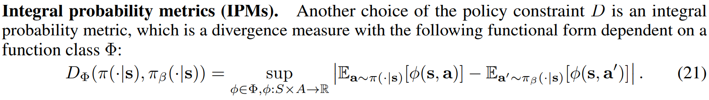

Distance measured in MMD

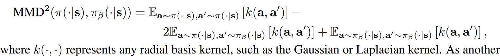

---

# IDEA 1: NTK instead of MMD

--- -->

# Uncertainty-Based Offline RL

- Uncertainty Estimation: Penalize the unseen action on $Q^{\pi}(s, a)$ 
  - Challenges: Hard to measure the uncertainty. The SOTA algorithm EDAC trains 10 ~ 500 Q-networks to estimate the uncertainty.

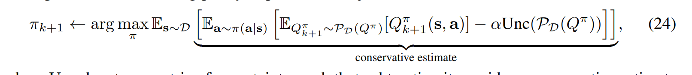

---

# IDEA 2: Use NTK to measure uncertainty

---

# However, there is another way to tackle the offline RL problem.

---

# How about we take offline RL problem as a sequence modeling problem?

---

# Decision Transformer(DT)

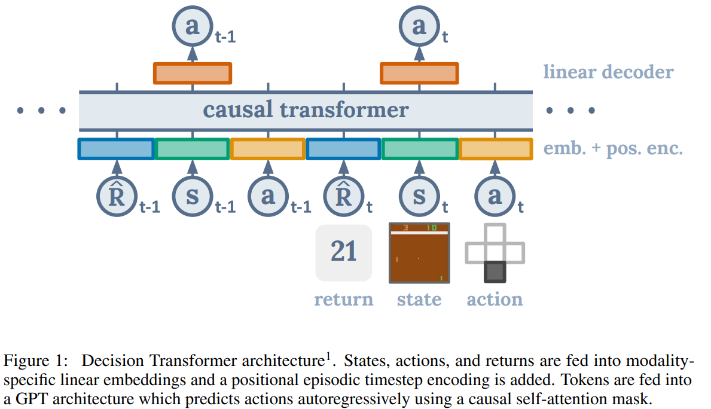

DT use GPT model. Denote $s_t$ is state, $a_t$ is action and, $r_t$ is reward at time step t.

$\hat{R}_{i}$ is the reward-to-go, which means $\hat{R}_{t-1} = \sum_{i=t}^{T} r_{i}$ for a sequence with length $T$.

---

# But Why It Work?

---

# Actually, Decision Transformer is a Conditional Policy Generator(In My Opinion).

---

# Decision Transformer As Conditional Policy Generator

- The original paper gives an explanation in the view of shortest path. But I don't think it's convincing.
- If we see the Decision Transformer as a **Conditional Policy Generator**. I think the Decision Transformer has 3 assumptions.

  - Assume the **decay of the reward $\gamma = 1$**
  - Assume the environment is **non-stochastic Hidden Markov  Chain**
  - Assume **deterministic policy**

---

# Decision Transformer As Conditional Policy Generator

- Denote the actions space as $a \in \mathcal{A}$, state space as $s \in \mathcal{S}$, value function of policy $\pi$ as $V_{\pi}(s)$, the decay factor of the reward as $\gamma$, and the reward function as $r(s, a)$.

- We consider the **assumption: deterministic policy**

$$
V_{\pi}(s_t) = \sum_{s_{t+1} \in \mathcal{S}} P(s_{t+1} | s_{t}, \pi(s_{t}))(r(s_{t}, \pi(s_{t})) + \gamma V_{\pi}(s_{t+1}))
$$

---

# Decision Transformer As Conditional Policy Generator

- While considering the **assumption: non-stochastic MDP** and denote the transition function as $t(s_t, a_t) = s_{t+1}$, the transition probability reduce to a Dirac-Delta distribution which means $\delta(s' | s, \pi(s)) = P(s' | s, \pi(s)) = 1$ if $t(s, a) = s'$, otherwise $=0$. Thus, we can derive

$$
V_{\pi}(s_{t}) = r(s_{t}, \pi(s_{t})) + \gamma V_{\pi}(s_{t+1})
$$

- Finally, consider the **assumption: decay of the reward $\gamma = 1$**

$$
V_{\pi}(s_{t}) = r(s_{t}, \pi(s_{t})) + V_{\pi}(s_{t+1})
$$

Trivially, $V_{\pi}(s_{t})$ is reward-to-go $\hat{R}_t$

---

# Decision Transformer As Conditional Policy Generator

- First, we consider to learn a policy generator $G$

$$
G(\hat{R}_0; \theta) = \pi \quad s.t. \quad \hat{R}_0 = V_{\pi}(s_0)
$$

- Next, we can expand the model $G$ as a **Conditional Policy Generator $H$**

$$
H(\hat{R}_t, s_t; \theta) = \hat{a}_t \quad s.t. \quad \hat{R}_t = V_{\pi}(s_t)
$$

$$
\argmin_{\theta} \sum_{t=0}^{T} || \hat{a}_t - a_t ||_2
$$

- Consider the transformer is an auto-regressive model, it models the environment as a **hidden markov chain** corresponding to the assumption.

---

# Disadvantages

- Cannot use the model online, since we need to produce the reward-to-go and feed it into the model.
- Poor performance in stochastic environments.
- The performance during testing time would highly depends on the given value of reward-to-go. If the first reward-to-go $\hat{R}_0$ we give is too high, DT would behave unexpectedly.

# Advantages

- Provide competitive performance compared to SOTA offline RL algorithm in most of environment.

---

# Performance

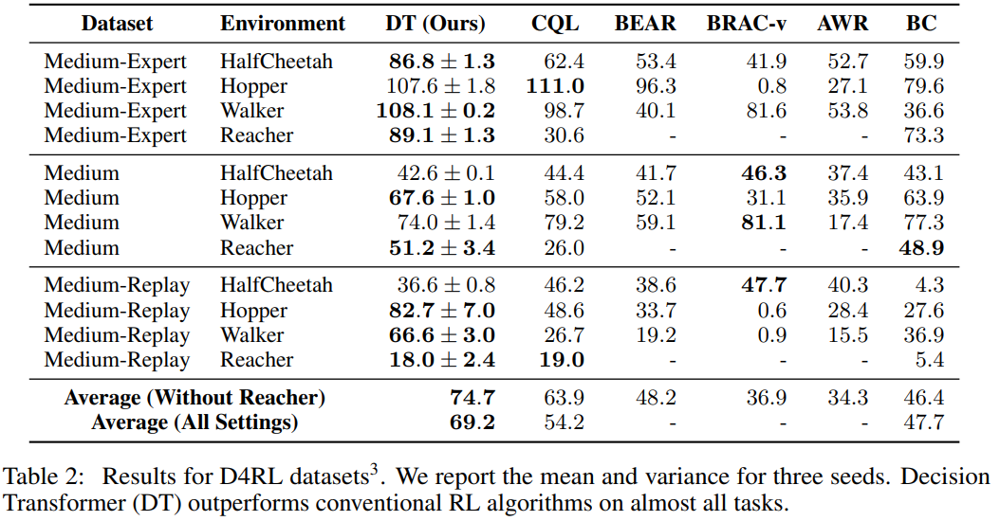

---

# Performance

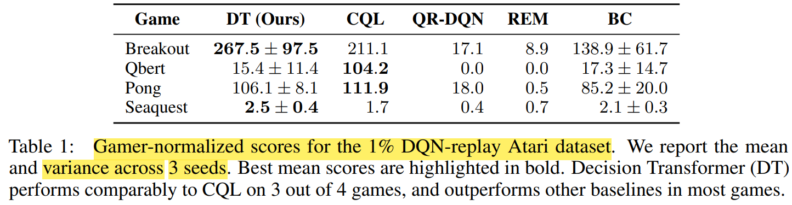

- In Qbert, DT is extremely poor, since Qbert has highly stochastic environment.

---

# Idea 3: Kernelize Conditional Policy Generator

- Predict action $a_{t-1}$ and next reward-to-go $\hat{R}_{t}$ at time step $t-1$.

$$
H(\hat{R}_t, s_t; \theta) = \hat{a}_t, \hat{R}_{t+1} \quad s.t. \quad \hat{R}_{t+1} = V_{\pi}(s_{t+1})
$$

$$
\argmin_{\theta} \sum_{t=0}^{T} || \hat{a}_t - a_t ||_2
$$

- Then kernelize it.

---

# Advantage

- Since the loss is defined as MSE. We can **use NTK-GP compute the agent without training.**
- Can be applied on **both offline RL and real-time situation**, since it **don't need to train the agent iteratively.**
- **Don't need to search the next sampling point in the high dimensional space like Bayesian optimization.**
- Safe exploration? Avoid over-fitting(Bayesian) naturally. High sample efficiency.
- The next reward-to-go is predicted and we only need to give the first reward-to-go.

# Disadvantage

- If we want to extend the Decision Transformer to stochastic MDP, we need to **work around the estimation of $\hat{R}_t$ in stochastic MDP and stochastic policy.**

---

# Imitation Learning
---

# Generative Adversarial Imitation Learning(GAIL)

Given expert trajectory $\hat{\tau}$ generated by expert policy $\hat{\pi}$ as ground truth and the generated trajectory $\tau$ by generator(agent) $\pi$.

Discriminator $D$ need to distinguish which trajectory is generated by the generator(fake).

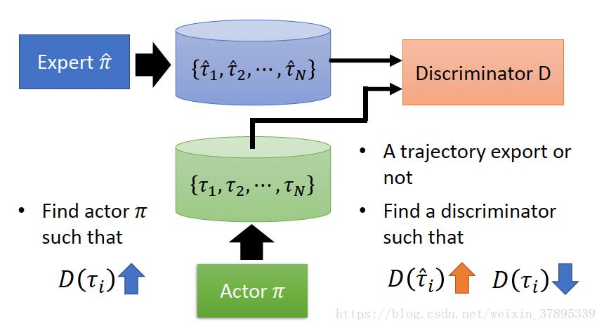

---

# Generative Adversarial Imitation Learning(GAIL)

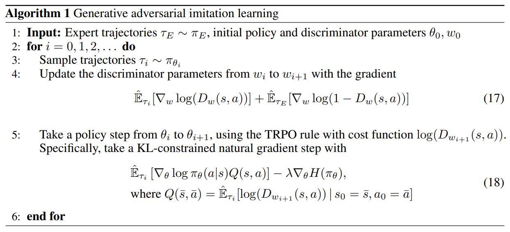

---

# Issues of GAIL

Most of them are te same as GANs

- Mode collapse, unstable training, low sample efficiency
- Recent search [What Matters for Adversarial Imitation Learning?](https://arxiv.org/abs/2106.00672) argues that
  - GAILs only synthetic demonstrations may lead to algorithms which perform poorly in the more realistic scenarios with human demonstrations, which means that GAILs doesn't generalize well on the reality.
  - But performs well on low-dimension tasks.

- Challenged by Offline RL, which usually can perform well on non-expert dataset

---

# Idea: GA-NTK + GAIL

## Advantages

- Avoid mode collapse, unstable training, low sample efficiency

- Interpolation on small training dataset, same as GAIL. But in continuous control(robotic tasks), interpolation may not be a bad thing.

---
# Another Trivial Idea: Behavior Cloning + NTK

- Directly kernelize behavior cloning with NTK-GP

$$
J(\pi) = \mathbb{E}_{s \sim d_{\pi^*}} [|| \pi^*(\cdot | s) -  \pi(\cdot | s) ||_2]
$$

## Advantages
  - Since NTK-GP is Bayesian, the action would be smoother than MLE, which is great for robotic tasks.

<!-- $$
J(\pi) = \mathbb{E}_{s \sim d_{\pi^*}} [|| \pi^*(\cdot | s) -  \pi(\cdot | s) ||] + \mathbb{E}_{}
$$ -->

---

# NLP

---

# IDEA: NLP models are so large, according to NTK theorem, it should converge within a few epochs? Actually, we don't need to train so many epochs?

<!-- ---

Notes

- Clarify MMD and support constraint
- Argue more about the advantages of DT + NTK
- Fix the notation of DT as sequence prediction -->