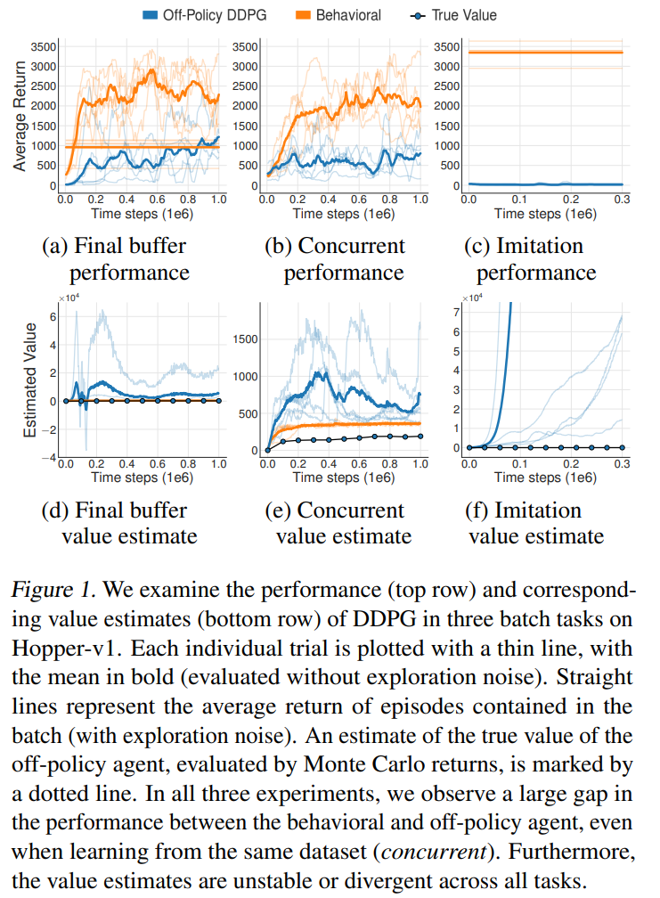
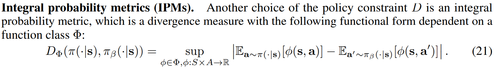
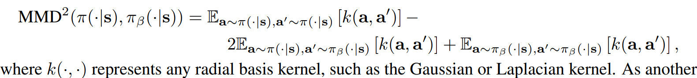
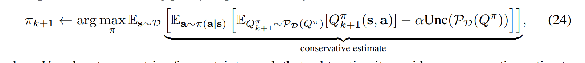

# ML Meeting

## Idea Proposals

---

# Idea Proposals

- GA-NTK + GAIL
- NTK + policy-constrained offline RL
- NTK + uncertainty-based offline RL
<!-- - Multi-agent RL considering model uncertainty + NTK -->
- Transformer RL + NTK

---

# Generative Adversarial Imitation Learning(GAIL)

Given expert trajectory $\hat{\tau}$ generated by expert policy $\hat{\pi}$ as ground truth and the generated trajectory $\tau$ by generator(agent) $\pi$.

Discriminator $D$ need to distinguish which trajectory is generated by the generator(fake).

---

# Generative Adversarial Imitation Learning(GAIL)

---

# Issues of GAIL

Most of them are te same as GANs

- Mode collapse, unstable training, low sample efficiency
- Recent search [What Matters for Adversarial Imitation Learning?](https://arxiv.org/abs/2106.00672) argues that
  - GAILs only synthetic demonstrations may lead to algorithms which perform poorly in the more realistic scenarios with human demonstrations, which means that GAILs doesn't generalize well on the reality.
  - But performs well on low-dimension tasks.

- Challenged by Offline RL, which usually can perform well on non-expert dataset

---

# Idea: GA-NTK + GAIL

Advantages

- Avoid mode collapse, unstable training, low sample efficiency

Disadvantages

- Interpolation on small training dataset, same as GAIL

---

# Offline RL

--- 

# Extrapolation Error

- **Final Buffer**: train a DDPG agent for 1 million time steps, adding $\mathcal{N}(0, 0.5)$ Gaussian noise to actions for high exploration.
- **Concurrent**: We concurrently train the off-policy
and behavioral DDPG agents, for 1 million time steps. A standard $\mathcal{N}(0, 0.1)$ Gaussian noise is added to action
- **Imitation**: A trained DDPG agent acts as an expert, and is used to collect a dataset of 1 million transitions.

---

# Extrapolation Error

- In each task, the off-policy agent performances significantly worse than the behavioral agent, even in the concurrent experiment.
- Because the agent's policy isn't the same as the behavioral policy. The agent may overestimate unseen $Q^{\pi}(s, a)$.

---

# Solutions for Extrapolation Error

- Policy Constraints: Align agent's policy $\pi(a | s)$ close to behavioral policy $\pi_{\beta}(a | s)$(the policy that generate the training dataset)
  - Challenges: Hard to measure the distance between the distribution of $\pi(a | s)$ and $\pi_{\beta}(a | s)$. Currently, the SOTA algorithm use f-divergence(ABM algorithm) and MMD(BEAR algorithm) to measure the distance. 
  
  - However, MMD just provides sufficient enough for constraining supports when finite samples are used.
- Uncertainty Estimation: Penalize the unseen action on $Q^{\pi}(s, a)$ 
  - Challenges: Hard to measure the uncertainty. The SOTA algorithm EDAC trains 10 ~ 500 Q-networks to estimate the uncertainty.
- NTK-GP may help.
---

# Offline RL

---

# Policy Constraints Offline RL

Distance measured in MMD

IDEA: NTK instead of MMD?

---

# Uncertainty-Based Offline RL

IDEA: Use NTK-GP measure uncertainty?

---

# Transformer RL

---

# Performance

---

# Issues

- Cannot use the model online, since we need to produce the reward, compute the reward-to-go and feed it into the model.

---

# Idea

- Predict action $a_{t-1}$ and next reward-to-go $\hat{R}_{t}$ at time step $t-1$.
- Then kernelize it.

# Advantage

- Since the loss is defined as MSE(in the source code). We can use NTK-GP compute the prediction deterministically.
- Can be applied on both offline RL and real-time situation, since it don't need to train it iteratively.
- The next reward-to-go is predicted and we only need to give the first reward-to-go.

But I think I need to double check the architecture. It sounds crazy.