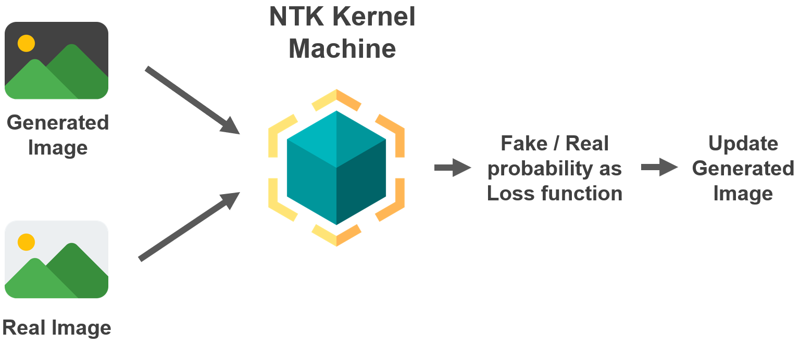

<!-- _class: lead -->
# Self-Introduction
---

# Outline

## Background
## Experiences
## Skill Set

---

# Sheng-Yen Chou (周聖諺)

- Senior student major in **CS, NTHU(國立清華大學)**
- **Graduate in 2022 with B.S.** degree(expected)
- Entrepreneur and enthusiast in **machine learning** and **large-scale distributed systems**.
- Developer of open source distributed database: **ElaSQL and VanillaDB**
- Maintain a **[blog](https://frankccccc.github.io/blog/) and [Github](https://github.com/FrankCCCCC)**, which **keep recording and sharing the knowledge.**

---

# Experience Overview

- Research assistant in NTHU Datalab
  - Join **distributed database system** research group, **optimize the transaction routing problem with ML techniques. (Java)**
  - Join **machine learning** research group, **propose a new image synthesis algorithm: GA-NTK. (Python)**

- Co-founder of student startup LEAFHOPPER IO
  - Lead a team of 7 people and **build a traceability system** for Dung-Ding Oonlong tea **in cooperation with Lu-Gu township government. (PostgreSQL, Kubernetes, Docker)**

- And many others...

---

# In Distributed Database Research Group

<!-- - Design a **data pipeline** to collect features of distributed DBMS in **open source database project: ElaSQL and VanillaDB with Java**. Optimize / estimate transaction routing destination with ML model and PID control -->
- 2 main contribute to the open source database project: **ElaSQL and VanillaDB**.
- Implement the **prototype of the "DependencyAnalyzer" component** with **Java**.
- **Reproduce experiments of the paper** "MB2: Decomposed Behavior Modeling for Self-Driving Database Management Systems"
- The paper is under writing

---

# In Machine Learning  Research Group

- Propose a **new image synthesis algorithm: GA-NTK**, which can **generate competitive images in comparison to GANs with only 64 ~ 256 images**
- Reduce **bilevel optimization problem of GANs to single-level one** and **stabilize the training progress of GANs.**
- The paper is under submission

---

# Co-Founder Of Student Startup LEAFHOPPER IO
- Lead a **team of 7 people and negotiated with the local farmer.**
- Build a **traceability system** and online selling platform for Dong-Ding Oolong tea in **cooperate with Lu-Gu government.**

---

# Skill Set

- **Machine Learning** (1 paper under submission) & **Distributed Database researches**
- **Entrepreneur & Team Player**
- Programming language
  - **Java, Python, C++, R**
- Deployment
  - **Kubernetes, Docker Swarm, Google Cloud, Linux**
- DBMS
  - **PostgreSQL, MySQL**
- Frameworks
  - **React, Node.js**

---

# Thank You For Listening