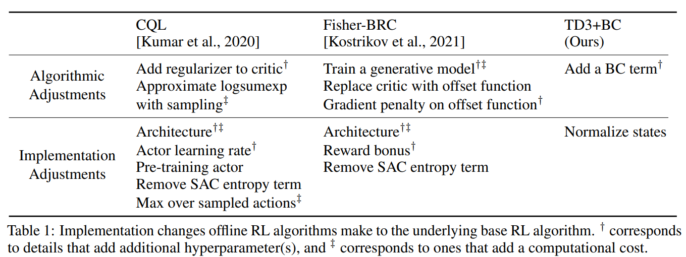
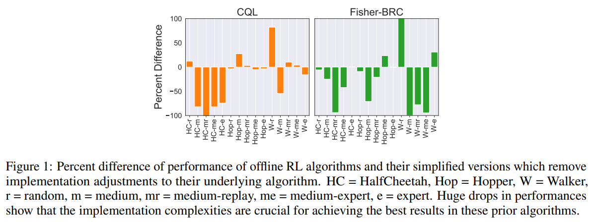

# A Minimalist Approach to Offline Reinforcement Learning

### NIP'21 Spotlight Citation: 42

### Scott Fujimoto, Shixiang Shane Gu

### Mila, McGill University, Google Research, Brain Team

---

# Motivation

- It's impossible to let RL learn from real environment due to safety consideration.

- The simulator is always different from the real world and it's costly.

- Can we train an agent only from offline dataset without interacting with the environment/simulator? 

---

# Offline RL

We aim to learn a policy $\pi$ from the history of trajectories $\mathcal{D} = \{ s_t, a_t, s_t', r_t \}$ generated by behavioral policy $\pi_{\beta}$ s.t. the performance $\pi \geq \pi_{\beta}$(Which means we want to train an agent's policy $\pi$ only from the history of trajectories $\mathcal{D}$)

On the other hand, the imitation learning only mimic the expert policy without reward.

---

# Offline RL Challenge

- The dataset doesn't cover everything in the environment
- The agent will go crazy(improper Q value) in the unseen state-action.

---

# Solution 

- Let the agent only take the best action that appears in the dataset or close to

Offline RL conquers these issues but yields other issues

- Additional computation cost
- Difficult to implement(includes many minor but matter code-level improvement)

---

# Issues of Offline RL 1: Additional computation cost

- SAC-N
  
  - Take the actions that have high Q-value surely, which means avoid action that has high variance Q-value or low Q-value
  - Train $N$ Q-network and update them with the gradient of the most pessimistic network, which is the network gives lowest Q-value.

---

- EDAC
  
  - But it need hundreds of network. Can we use less network to evaluate the the most pessimistic network.
  - According to the Royston equation, if we enlarge the variance of the $N$ Q-network, we can evaluate the most pessimistic network with less Q-network.
  - Idea: Minimize the similarity of the gradient $\nabla_{a}Q_{\phi_i}(s, a)$ between $N$ Q-networks $Q_{\phi_i}$.
  - But it still needs tens of Q-networks.

---

---

# Issues of Offline RL 2: Difficult to implement

---

Performance difference between with and without implementation changes

---

# Problem Formulation

### What's the minimalist adjustment to build an offline RL algorithm?

---

# Idea

### Actually, we only need to add a *behavior cloning* to regularize the 

---

Note:

1. High-level Fisher-BRC?
2. What's extrapolation error?
3. What's the max over sampled actions?