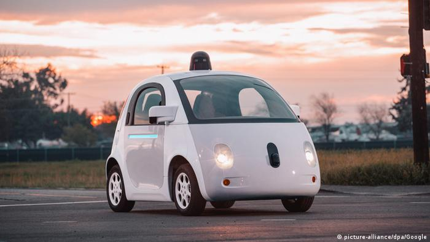
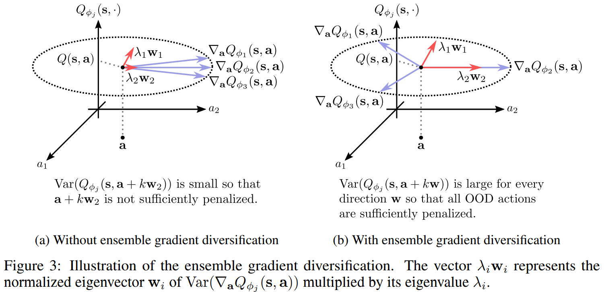
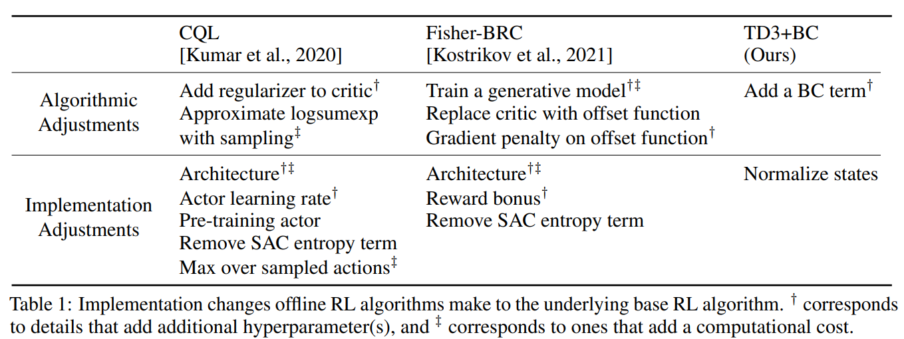
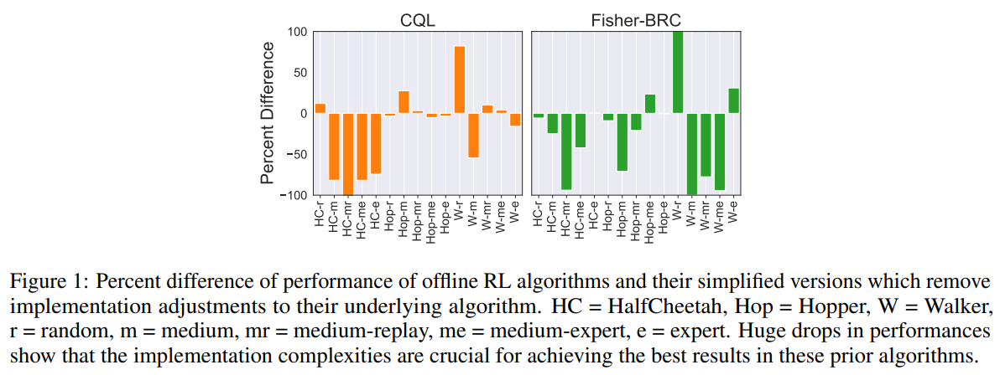
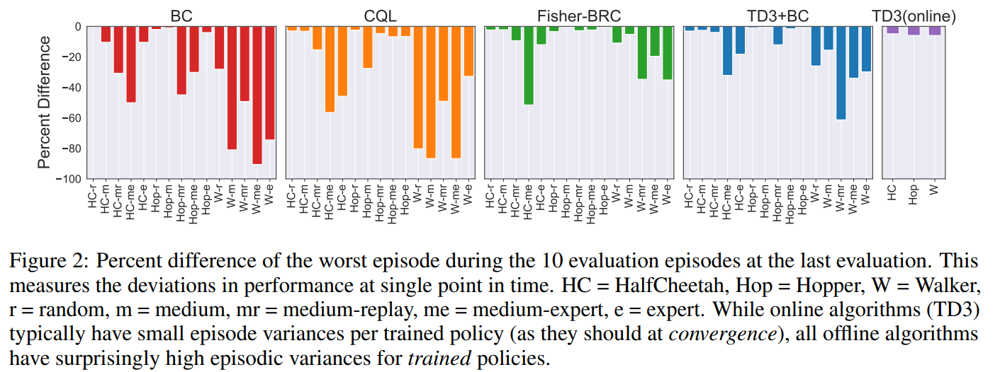
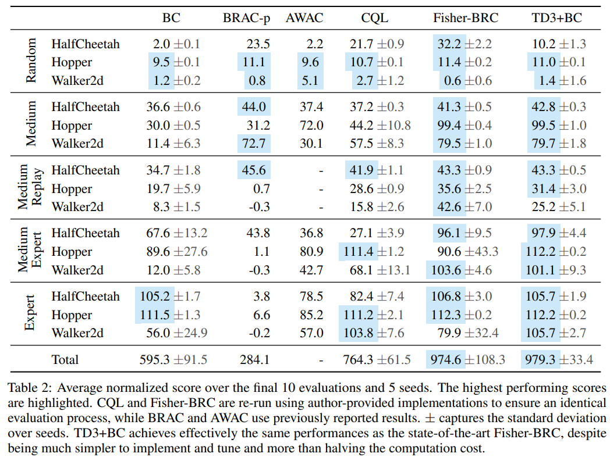
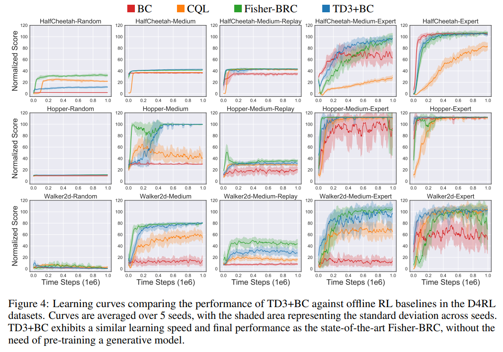
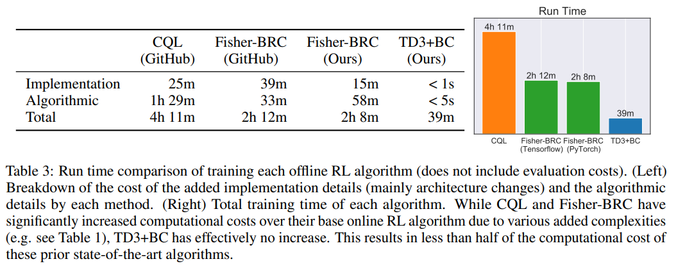
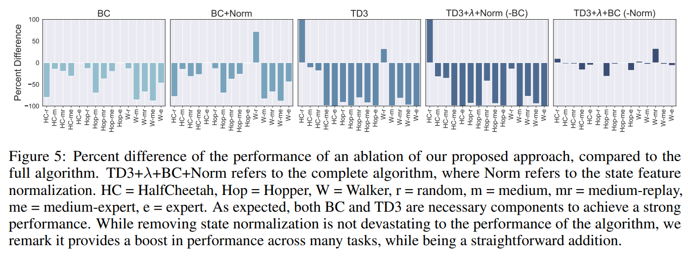

# A Minimalist Approach to Offline Reinforcement Learning

### NIP'21 Spotlight Citation: 42

### Scott Fujimoto, Shixiang Shane Gu

### Mila, McGill University, Google Research, Brain Team

---

# Motivation

- It's impossible to let RL learn from real environment due to safety consideration.

- The simulator is always different from the real world and it's costly.

- Can we train an agent only from offline dataset without interacting with the environment/simulator? 

---

# Offline RL

We aim to learn a policy $\pi$ from the history of trajectories $\mathcal{D} = \{ s_t, a_t, s_t', r_t \}$ generated by behavioral policy $\pi_{\beta}$ s.t. the performance $\pi \geq \pi_{\beta}$(Which means we want to train an agent's policy $\pi$ only from the history of trajectories $\mathcal{D}$)

On the other hand, the imitation learning only mimic the expert policy without reward.

---

# Offline RL Challenge

- The dataset doesn't cover everything in the environment
- The agent will go crazy(improper Q value) in the unseen state-action.

---

# Solution 

- Let the agent only take the best action that appears in the dataset or close to

Offline RL conquers these issues but yields other issues

- Additional computation cost
- Difficult to implement(includes many minor but matter code-level improvement)
- Instable Performance of Trained Policies

---

# Issues of Offline RL 1: Additional computation cost

- SAC-N
  
  - Take the actions that have high Q-value surely, which means avoid action that has high variance Q-value or low Q-value
  - Train $N$ Q-network and update them with the gradient of the most pessimistic network, which is the network gives lowest Q-value.

$$
\min_{\phi_{i}} \mathbb{E}_{s, a, s' \sim \mathcal{D}}\left[\left(Q_{\phi_{i}}(s, a)-\left(r(s, a)+\gamma \mathbb{E}_{a' \sim \pi_{\theta}\left(\cdot \mid s'\right)}\left[\min _{j=1, \ldots, N} Q_{\phi_{j}'}\left(s', a'\right) - \beta \log \pi_{\theta}\left(a' \mid s'\right)\right]\right)\right)^{2}\right] \\
$$

$$
\max_{\theta} \mathbb{E}_{s \sim \mathcal{D}, a \sim \pi_{\theta}(\cdot \mid s)}\left[\min _{j=1, \ldots, N} Q_{\phi_{j}}(s, a)-\beta \log \pi_{\theta}(a \mid s)\right]
$$

Where $\phi$ is the parameters of the Q-network $Q_{\phi}$,  $\theta$ is the parameters of policy network $\pi_{\theta}$. The subscript $j$ means the $j$-th network.

---

- EDAC
  
  - But it need hundreds of network. Can we use less network to evaluate the the most pessimistic network.
  - According to the Royston equation, if we enlarge the variance of the $N$ Q-network, we can evaluate the most pessimistic network with less Q-network.
  - Idea: Minimize the similarity of the gradient $\nabla_{a}Q_{\phi_i}(s, a)$ between $N$ Q-networks $Q_{\phi_i}$.
  - But it still needs tens of Q-networks.

$$
\min_{\phi} J_{ES}(Q_{\phi}) := \mathbb{E}_{s, a \sim \mathcal{D}} \left[ \frac{1}{N - 1} \sum_{1 \leq i \neq j \leq N} \langle \nabla_{a} Q_{\phi_i}(s, a), \nabla_{a} Q_{\phi_j}(s, a) \rangle  \right]
$$
---

---

- CQL: 
  
  - Make the expectation of the Q-value of the agent lower
  - Make the expectation of the Q-value of the  behavior policy higher
  
  $$
  \begin{array}{ccc}
  \hat{Q}^{k+1} \leftarrow \arg \min_{\hat{Q}^{k}} \alpha (\mathbb{E}_{s \sim \mathcal{D}, a \sim \pi({a | s})} [Q(s, a)] - \mathbb{E}_{s \sim \mathcal{D}, a \sim \pi_{\beta}({a | s})} [Q(s, a)]) \\

  + \frac{1}{2} \mathbb{E}_{s, a, s' \sim \mathcal{D}} \left[ \left( Q(s, a) - \mathcal{B} \hat{Q}^{k}(s, a) \right)^2 \right]
  \end{array}
  $$

  - The algorithm yields a term $\log \sum_{a} \exp(Q(s, a))$, which has high variance in the high dimensional action space. It takes time to approximate accurately.
---

# Issues of Offline RL 2: Difficult to implement

Architecture: 2 hidden MLP to 3

Reward Bonus: Additional survival reward

Max over sampled action: Sample 10 actions $a_1'$...$a_{10}'$, and take highest Q-value as target instead of expectation 
$$\min_{\phi} \mathbb{E}_{s, a, s' \sim \mathcal{D}}\left[ \left(Q_{\phi}(s, a)-\left(r(s, a)+\gamma \mathbb{E}_{a' \sim \pi_{\theta}\left(\cdot \mid s'\right)}\left[ Q_{\phi}\left(s', a'\right)\right]\right)\right)^{2} \right]$$

---

---

Performance difference between with and without implementation changes

---

# Issues of Offline RL 3: Instable Performance of Trained Policies

---

# Problem Formulation

### What's the minimalist adjustment to build an offline RL algorithm?

---

# Idea

Modify from [TD3](https://arxiv.org/abs/1802.09477) algorithm, which is modified from DDPG

<!-- - Double DQN: Avoid overestimate Q-value
- Delayed Update Target Network: Let the target network update later to increase stability.
- Target Policy Smoothing: Add noise to the action to get more different sample points in the action space. -->

#### 1. Add a *behavior cloning* regularizer

$$
\pi = \arg \max_{\pi} \mathbb{E}_{(s,a) \sim \mathcal{D}} \left[ \lambda Q(s, \pi(s)) − (\pi(s) − a)^2 \right] 
$$

Where $\lambda$ is a hyperparameter to trade off between optimality and conservativeness. It is determined by 

$$
\lambda = \frac{\alpha}{\frac{1}{N} \sum_{(s_i, a_i)} |Q(s_i, a_i)|}
$$

Where $\alpha = 2.5$ is a constant.

---

#### 2. Normalize the state

$$
s_{i} = \frac{s_i − \mu_i}{\sigma_i + \epsilon}
$$

Where $\epsilon$ is a small normalization constant $10^{−3}$.

---

# Experiment - D4RL Dataset

- expert: a fully trained online expert
- medium: a suboptimal policy with approximately 1/3 the performance of the expert
- medium-expert: a mixture of medium and expert policies
- medium-replay: the replay buffer of a policy trained up to the performance of the medium agent
- full-replay: the final replay buffer of the expert policy
- 1M transitions

---

## D4RL Benchmark

---

## D4RL Learning Curve

---

## D4RL 1M Training Steps Runtime

- GeForce GTX 1080 GPU and an Intel Core i7-6700K CPU at 4.00GHz.
- Train 1M steps
- CQL, TD3+BC, and Fisher-BRC (Ours) are implemented in Pytorch

---

## D4RL TD3+BC Remove State Normalization

---

# Thank You For Listening
---

Note:

1. High-level Fisher-BRC?
2. What's extrapolation error?
3. What's the max over sampled actions?
4. What's TD3?

---

# Reference

#### TD3

- [李宏毅 - Double DQN](https://hackmd.io/@shaoeChen/Bywb8YLKS/https%3A%2F%2Fhackmd.io%2F%40shaoeChen%2FHyyXreFcB)
- [【强化学习算法 21】TD3](https://zhuanlan.zhihu.com/p/47182584)
- [强化学习基础 XIII: Twin Delayed DDPG TD3原理与实现](https://zhuanlan.zhihu.com/p/145621630)
- [Addressing Function Approximation Error in Actor-Critic Methods](https://arxiv.org/abs/1802.09477)

#### Fisher-BRC

- [[Offline RL]Fisher Divergence Critic Regularization](https://zhuanlan.zhihu.com/p/425655819)
- [Offline Reinforcement Learning with Fisher Divergence Critic Regularization](https://arxiv.org/abs/2103.08050)

---

#### CQL

- [Offline RL(3): CQL](https://zhuanlan.zhihu.com/p/349771471)
- [【论文笔记 5】Conservative Q-Learning](https://zhuanlan.zhihu.com/p/266528139)
- [Conservative Q-Learning for Offline Reinforcement Learning](https://arxiv.org/abs/2006.04779)

#### A Minimalist Approach to Offline Reinforcement Learning

- [离线强化学习(Offline RL)系列3: (算法篇) TD3+BC 算法详解与实现（经验篇）](https://blog.csdn.net/gsww404/article/details/124058887)
- [A Minimalist Approach to Offline Reinforcement Learning[TD3+BC]阅读笔记](https://zhuanlan.zhihu.com/p/450152373)