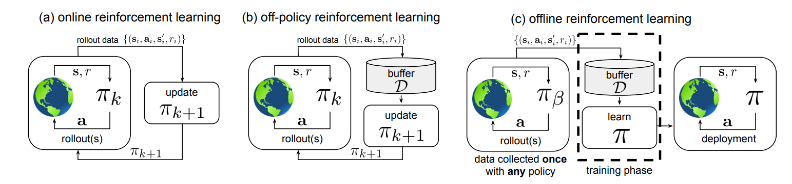

# A Minimalist Approach to Offline Reinforcement Learning

### NIP'21 Spotlight Citation: 42

### Scott Fujimoto, Shixiang Shane Gu

### Mila, McGill University, Google Research, Brain Team

---

# Motivation

- It's impossible to let RL learn from real environment due to safety consideration.

- The simulator is always different from the real world and it's costly.

- Can we train an agent only from offline dataset without interacting with the environment/simulator? 

---

# Offline RL

We aim to learn a policy $\pi$ from the history of trajectories $\mathcal{D} = \{ s_t, a_t, s_t', r_t \}$ generated by behavioral policy $\pi_{\beta}$ s.t. the performance $\pi \geq \pi_{\beta}$(Which means we want to train an agent's policy $\pi$ only from the history of trajectories $\mathcal{D}$)

---

# Offline RL Challenge

- The dataset doesn't cover everything in the environment
- The agent that collects the dataset isn't optimal/expert

Offline RL conquers these issues but yields other issues

- Additional computation cost
- Difficult to implement(includes many minor but matter code-;level improvement)

---

# Problem Formulation

What's the minimalist adjustment to build an offline RL algorithm?

---

# Idea

Actually, we only need to add a **behavior cloning** to regularize the 