# Neural Kernel Without Tangents

**ICML'20 Citation: 37**

Vaishaal Shankar, Alex Fang, Wenshuo Guo,  Sara Fridovich-Keil, Ludwig Schmidt, Jonathan Ragan-Kelley, Benjamin Recht

UC Berkeley, MIT

---

# Motivation

- NTK, CNTK... do not match the performance of neural networks on most tasks of interest.
- The NTK constructions themselves are not only hard to compute, but their mathematical formulae are difficult to even write down.

---

# Problem Formulation

- Are there computationally tractable/easier kernels that approach the expressive power of neural networks?
- Is there a correlation between neural architecture performance and the performance of the associated kernel?

---

# Outline

- Main Idea
- Experiments
- Conclusion

---

# Main Idea

- Construct CNN architecture using only **$3 \times 3$ convolutions, $2 \times 2$ average pooling, ReLU**.
- **Compositional Kernel**: Kernelize $1..., L$ layers as kernel functions $k_{1}..., k_{L}$ and **compute the kernel hierarchily $k_{L}(k_{L-1}(...k_{1}(x, y)))$** as the kernel of the corresponding CNN architecture.
- **5-layers compositional kernel**(in Myrtle5 architecture) can **significantly outperform(about 10% classification accuracy)** than **14-layers CNTK on CIFAR-10([Arora et al. 2020](https://iclr.cc/virtual_2020/poster_rkl8sJBYvH.html))** while the **training samples are less than 1000**.

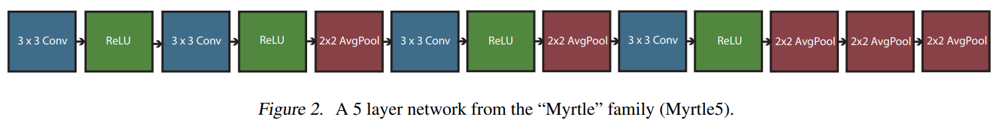

---

# Methodology

- **Bag of features** is simply a generalization of a matrix or tensor: whereas a matrix is an indexed list of vectors, a bag of features is a collection of elements in a Hilbert space $\mathcal{H}$ with a finite, structured index set $\mathcal{B}$. 
- EX: we can consider an **image** to be a bag of features where the **index set $\mathcal{B}$ is the pixel’s row and column location** and **$\mathcal{H}$ is $\mathbb{R}^3$: at every pixel location, there is a corresponding vector encoding RGB in $\mathbb{R}^3$**.
- Given two bags of features with the same $(\mathcal{B}, \mathcal{H})$, we define the kernel function

$$k(\mathbf{X}, a, \mathbf{Z}, b) = \langle \mathbf{X}_a, \mathbf{Z}_b \rangle$$

It defines a **kernel matrix between two bags of features**: we compute the kernel function for each pair of indices in $\mathcal{B} \times \mathcal{B}$ to form a **$|\mathcal{B}| \times |\mathcal{B}|$ matrix**

---

# Input Kernel

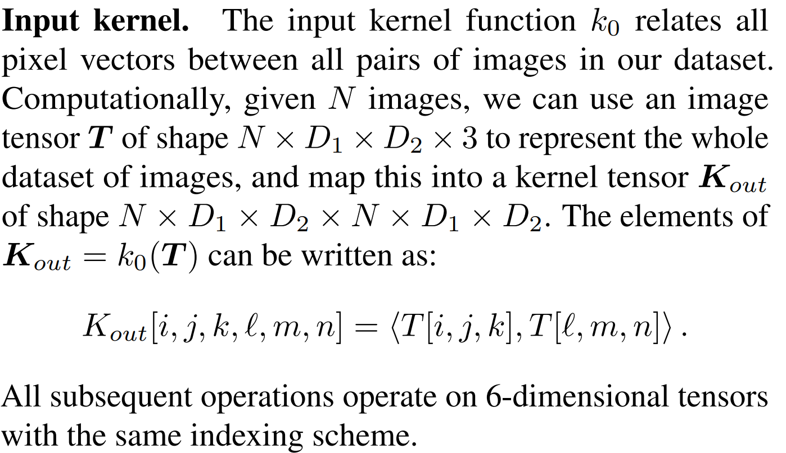

---

# Convolution Kernel

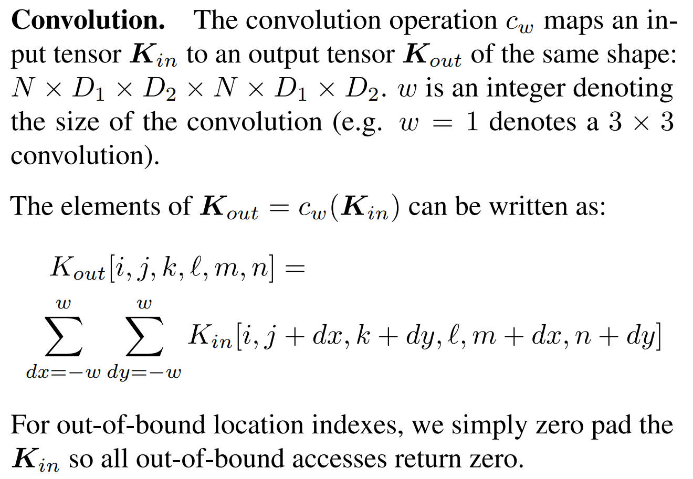

---

# Average Pooling Kernel

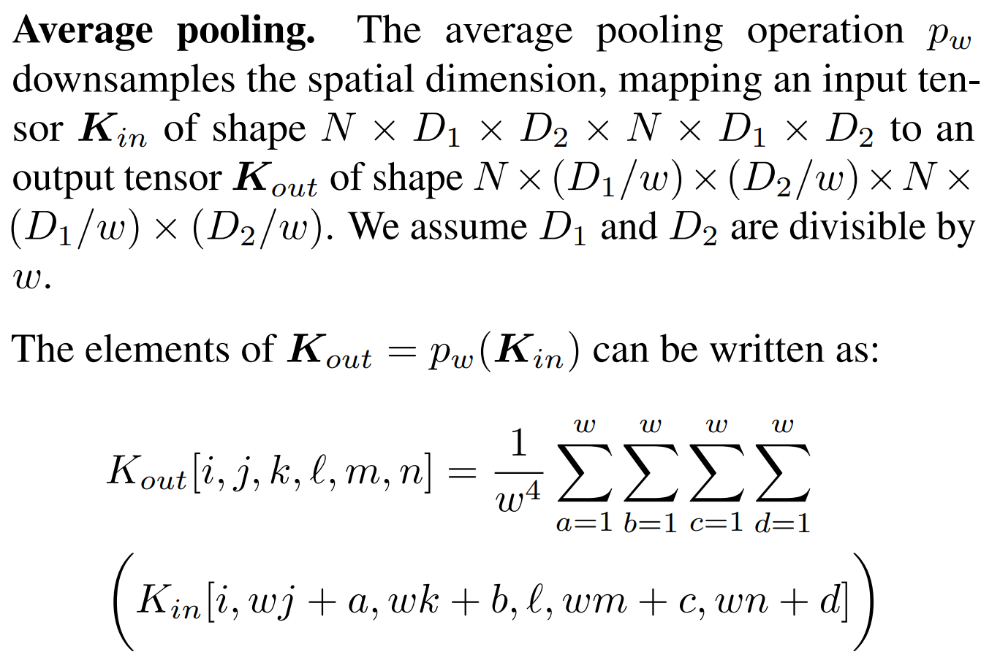

---

# ReLU Kernel

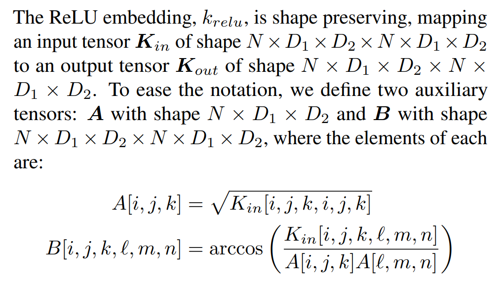

---

# ReLU Kernel

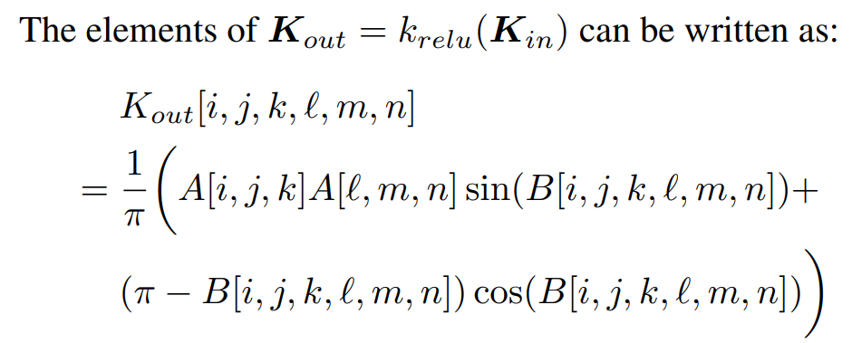

It's the same as the **arccosine kernel** used in NTK. Refers to [NIPS'09 Kernel Methods for Deep Learning](https://papers.nips.cc/paper/2009/hash/5751ec3e9a4feab575962e78e006250d-Abstract.html)

---

# Gaussian Kernel

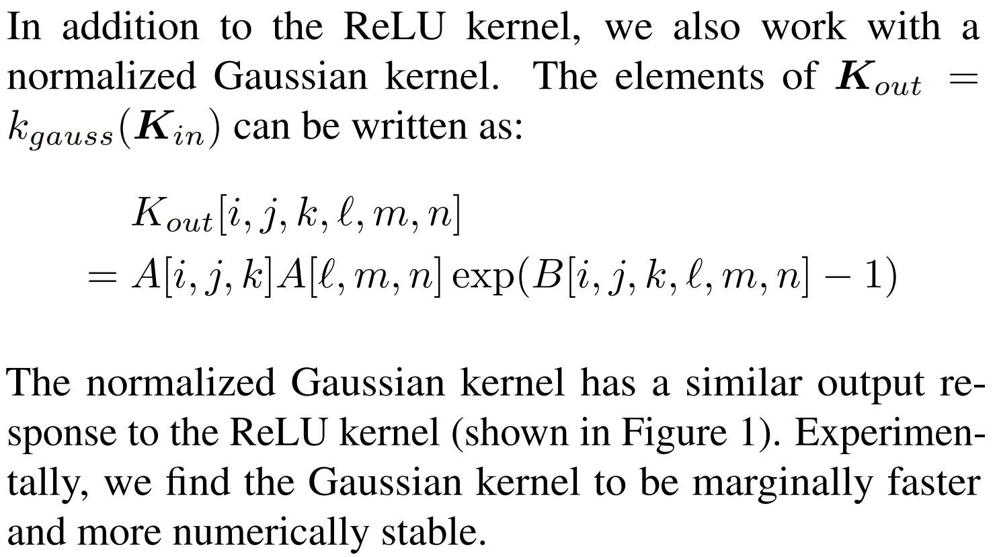

---

# Algorithm

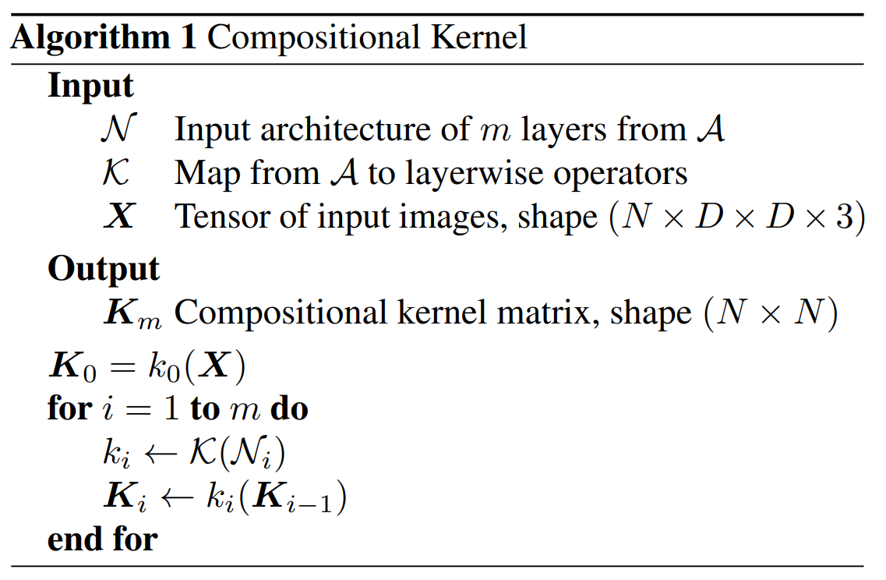

---

# Experiment Setup

## MNIST, CIFAR-10, CIFAR-10.1, CIFAR-100 Dataset

- Myrtle5, 7, 10 with ReLU kernel

- ZCA whitening preprocessing

- Flip data augmentation to our kernel method by flipping every example in the training set across the vertical axis

- Kernel ridge regression with respect to one-hot labels

---

## 90 UCI Dataset

- Myrtle5, 7, 10 with Gaussian kernel

- Hinge loss with libSVM

## Architecture

All architectures that can be represented as a list of operations from the set **{conv3, pool2, relu}** as the **"Myrtle" family**. The right one is **Myrtle7** and the left on is **Myrtle10**

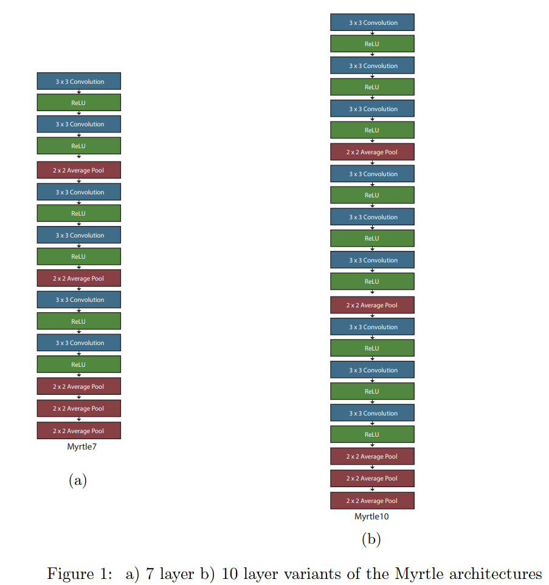

---

# MNIST

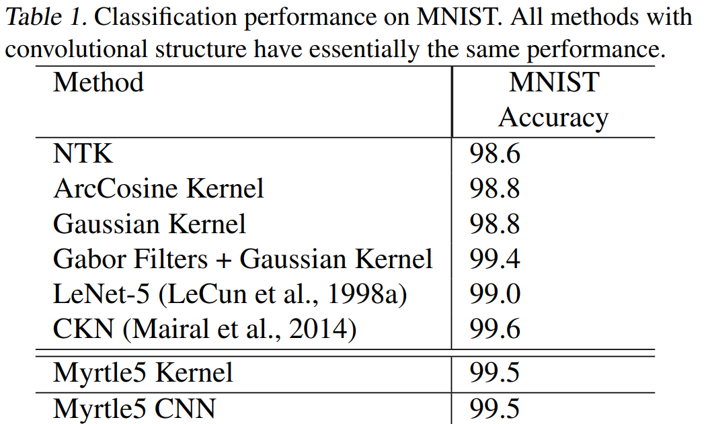

---

# CIFAR-100

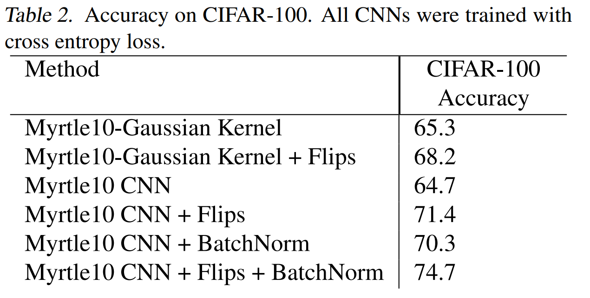

---

# 90 UCI

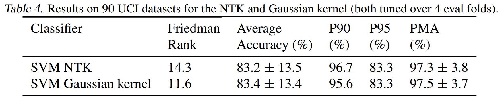

- **Friedman rank**: The ranking metric reports the average ranking of a given classifier compared to all other classifiers on datasets. The lower, the better.
- **P90/P95**: The percentage of datasets on which the classifier achieves more than 90%/95% of the maximum achievable accuracy. The higher, the better.
- **PMA**: The average percentage of the maximum accuracy of the classifier for datasets. The higher, the better.

---

# CIFAR-10

- Evaluate on 10,000 test images from CIFAR-10 and the additional 2,000 "harder" test images from CIFAR-10.1
- For all kernel results on CIFAR-10, we gained an improvement of roughly 0.5% with **Leave-One-Out tilting** and **ZCA augmentation** techniques.
- A substantial drop in accuracy for the compositional kernel without ZCA preprocessing.

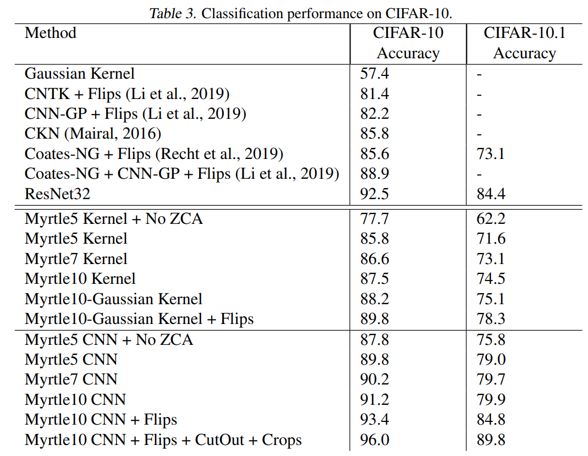

---

# Subsampled CIFAR-10

- Subsampled datasets are class balanced
- **Compositional kernel and NTK in the low data regime**
- **Network** with the same architecture as compositional kernel severely **underperforms both the compositional kernel and NTK in the low data regime**
- After adding batch normalization, the network outperforms both compositional kernel and the NTK

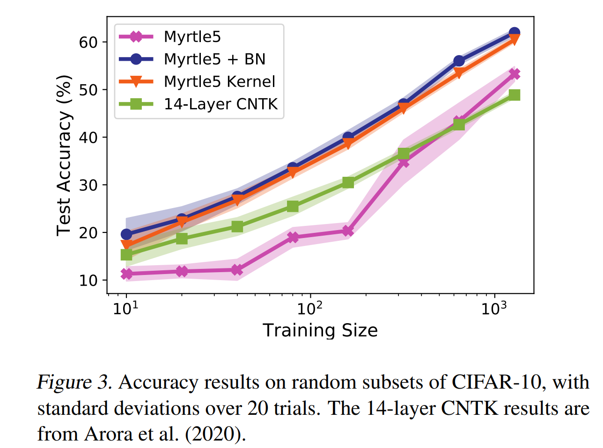

---
# Conclusion

- Provide a promising starting point for designing practical, high performance, domain specific kernel functions
- Some notion of **compositionality and hierarchy** may be necessary to build kernel predictors that match the performance of neural networks
- **NTKs** themselves may **not actually provide particularly useful guides** to the practice of kernel methods.
- We may underscores the importance of proper preprocessing for kernel methods
- There **still performance gaps between kernel methods and neural networks** and the reasons remain unknown.
