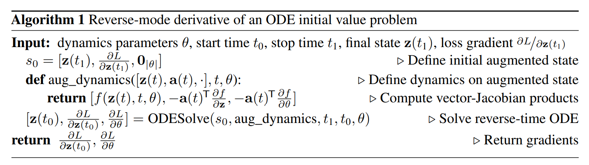

For a dataset $\mathcal{X}, \mathcal{Z}$,  a data point(image) $x_i \in \mathcal{X}$ and, the latent variables $z_i \in \mathcal{Z}$, the size of the dataset is $n = |\mathcal{X}| = |\mathcal{Z}|$. 

The latent variable follows a standard normal distribution $z_i \sim \mathcal{N}(0, I)$ and the probability of the data point is $p_X(x_i)$, where $X$ is a random variable and $x_i \in X$.

The goal of the model $f^{-1}$ is

$$
\hat{x}_i = f^{-1}(z_i; \theta)
$$

$$
\theta^* = \arg \max_{\theta} \sum_{i=1}^{n} \log p_X(f^{-1}(z_i; \theta))
$$

But how to derive the probability of $\log p_X(f^{-1}(z_i; \theta))$ ?

---

# Change of Variable Theorem

For random variables $X, Z$, the probabilities of the events $x \in X, z \in Z$ are $p_X(x)$ and $p_Z(z)$. Since the sum pf the probability of all events of is 1, then

$$
\log p_X(x) = \log p_Z(z) + \log \det(\frac{\partial z}{\partial x})
$$

where $\frac{\partial z}{\partial x}$ is Jacobian matrix.

As a result, 

$$
\hat{x}_i = f^{-1}(z_i), \quad \hat{z}_i = f(x_i)
$$

$$
\log p_X(\hat{x}_i) = \log p_Z(f(x_i; \theta)) + \log \det(\frac{\partial f(x_i; \theta)}{\partial x_i})
$$

---

Thus, the loss function of GLOW is

$$
\sum_{i=1}^{n} \log p_Z(f(x_i; \theta)) + \log \det(\frac{\partial f(x_i; \theta)}{\partial x_i})
$$

To compute the determinant of the Jacobian matrix of the whole network, we need to compute the determinant of the Jacobian matrix for every layer. However, computing determinant is expensive, it costs $\mathcal{O}(N^3)$.

---

# Instantaneous Change of Variables Theorem

Let $z(t)$ be a finite continuous random variable with probability $p(z(t))$ depends on time. Let $\frac{d z}{d t} = h(t)$ be the differential equation describing a continuous-time transformation of $z(t)$. The output of the model can be seen as $f^{-1}(z(0)) = h(T)$

$$
\frac{\partial \log p(z(t))}{\partial t} = - tr(\frac{d h(t)}{d z(t)})
$$

---

# Continuous Layers

---

# From point view of ResNet

Models such as residual networks and normalizing flows build complicated transformations by **composing a sequence of transformations to a hidden state:**

$$
h_{t+1} = h_t + f(h_t, t)
$$

where $t \in \{ 0, ..., T\}$ and $h_t \in \mathbb{R}^{D}$.These iterative updates can be seen as an **Euler discretization** of a continuous transformation.

What happens as we **add more layers and take smaller steps?** In the limit, we parameterize the continuous dynamics of hidden units using an ODE specified by a neural network

$$
\frac{d h(t)}{d t} = f(h(t), t, \theta)
$$

Define input as $h(0)$ and the output as $h(T)$

---

# Reverse-mode automatic differentiation of ODE solutions

The state $z(t_1)$ along the depth $t_1$

$$
z({t_1}) = z({t_0}) + \int_{t=t_0}^{t_1} f(z(t), t, \theta) dt
$$

The loss $L(z(t_1))$ along the depth $t_1$

$$
L(z(t_1)) = L(z({t_0}) + \int_{t=t_0}^{t_1} f(z(t), t, \theta) dt) = L(ODESolve(z(t_0), f, t_0, t_1, \theta))
$$

---

With adjoint method, we can derive the gradient along the depth $t$, called **adjoint state** $a(t) = \frac{\partial L}{\partial z(t)}$.

$$
\frac{a(t)}{dt} = -a(t)^{\top} \frac{\partial f(z(t), t, \theta)}{\partial z}
$$

$$
\frac{dL}{d\theta} = - \int_{t=t_1}^{t_0} a(t)^{\top} \frac{f(z(t), t, \theta)}{d\theta} dt
$$

---

