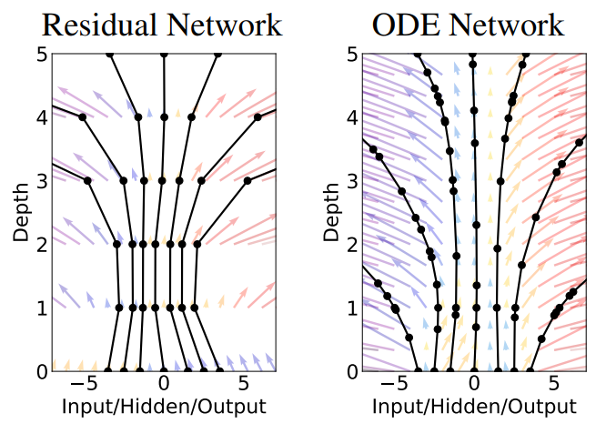
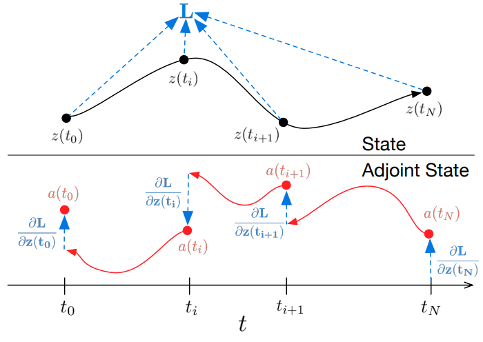
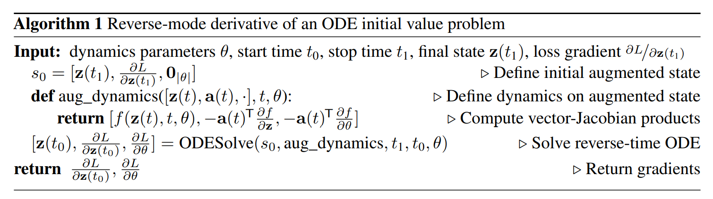
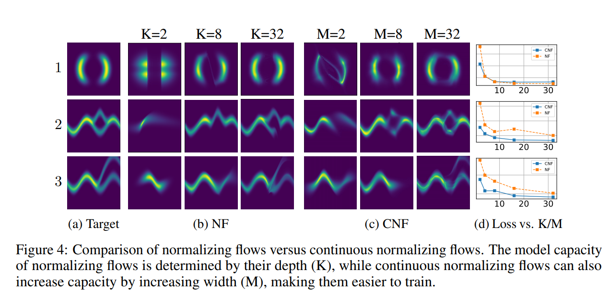
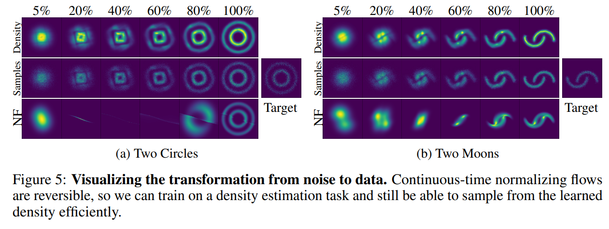

# Neural Ordinary Differential Equation

NIPS'18, Citation: 1365

Ricky T. Q. Chen, Yulia Rubanova, Jesse Bettencourt, David Duvenaud

University of Toronto, Vector Institute

---

# Flow-Based Generative Model

For a dataset $\mathcal{X}, \mathcal{Z}$,  a data point(image) $x_i \in \mathcal{X}$ and, the latent variables $z_i \in \mathcal{Z}$, the size of the dataset is $n = |\mathcal{X}| = |\mathcal{Z}|$. 

The latent variable follows a standard normal distribution $z_i \sim \mathcal{N}(0, I)$ and the probability of the data point is $p_X(x_i)$, where $X$ is a random variable and $x_i \in X$.

The goal of the model $g$ is

$$
\hat{x}_i = g(z_i; \theta)
$$

$$
\theta^* = \arg \max_{\theta} \sum_{i=1}^{n} \log p_X(g(z_i; \theta))
$$

But how to derive the probability of $\log p_X(g(z_i; \theta))$ ?

---

# Change of Variable Theorem

For random variables $X, Z$, the probabilities of the events $x \in X, z \in Z$ are $p_X(x)$ and $p_Z(z)$. Since the sum pf the probability of all events of is 1, then

$$
\log p_X(x) = \log p_Z(z) + \log \det(\frac{\partial z}{\partial x})
$$

where $\frac{\partial z}{\partial x}$ is Jacobian matrix.

As a result, 

$$
\hat{x}_i = g(z_i), \quad \hat{z}_i = g^{-1}(x_i)
$$

$$
\log p_X(\hat{x}_i) = \log p_Z(g^{-1}(x_i; \theta)) + \log \det(\frac{\partial g^{-1}(x_i; \theta)}{\partial x_i})
$$

---

Thus, the loss function of GLOW is

$$
\sum_{i=1}^{n} \log p_Z(g^{-1}(x_i; \theta)) + \log \det(\frac{\partial g^{-1}(x_i; \theta)}{\partial x_i})
$$

To compute the determinant of the Jacobian matrix of the whole network, we need to compute the determinant of the Jacobian matrix for every layer.

## Drawback: Determinant is $O(N^3)$, expensive

---

# Instantaneous Change of Variables Theorem

Let $z(t)$ be a finite continuous random variable with probability $p(z(t))$ depends on time. Let $\frac{d z}{d t} = h(t)$ be the differential equation describing a continuous-time transformation of $z(t)$. The output of the model can be seen as $g(z(0)) = h(T)$

$$
\frac{\partial \log p(z(t))}{\partial t} = - tr(\frac{d h(t)}{d z(t)})
$$

Don't need to compute **Determinant** and **Trace** only costs $\mathcal{O}(N)$

## Idea: Continuous Layers Instead of Discrete Layers!

---

# From point view of ResNet

Models such as residual networks and normalizing flows build complicated transformations by **composing a sequence of transformations to a hidden state:**

$$
h_{t+1} = h_t + f(h_t, t)
$$

where $t \in \{ 0, ..., T\}$ and $z_t \in \mathbb{R}^{D}$ is the hidden state at depth $t$.These iterative updates can be seen as an **Euler discretization** of a continuous transformation.

---

# From point view of ResNet

What happens as we **add more layers and take smaller steps?** In the limit, we parameterize the continuous dynamics of hidden units using an ODE specified by a neural network

$$
\frac{dz(t)}{dt} = f(z(t), t, \theta)
$$

Where $h_t = z(t)$ represents the hidden state at depth t, and input as $z(0)$ and the output as $z_T$. 

## The neural network $f$ learns the changing rate of the hidden state $\frac{dz(t)}{dt}$ instead of the whole process of the discrete transformations $h_0, ..., h_T$.

---

# From point view of ResNet

- Left: A Residual network defines a discrete sequence of finite transformations.
- Right: A ODE network defines a vector field, which continuously transforms the state.
- Both: Circles represent evaluation locations. The network propagate forward from the bottom to the top of the graph.

---

# Propagate Forward

The state of the transformation is $z(t_1)$ along the depth $t_1$

$$
z({t_1}) = z({t_0}) + \int_{t=t_0}^{t_1} f(z(t), t, \theta) dt
$$

Define loss function as $L()$, given the state(layer output) $z(t_1)$ at layer $t_1$

$$
L(z(t_1)) = L(z({t_0}) + \int_{t=t_0}^{t_1} f(z(t), t, \theta) dt) \\
= L(ODESolve(z(t_0), f, t_0, t_1, \theta))
$$

---

# Propagate Forward

We see the ODE solver as a black box, which can compute the result of $z(t)$ for **any given network depth $t$** when given the proper initial states and ODEs. Even though we only **have one layer of neural network which represents the dynamics of hidden state $\frac{dh(t)}{dt}$.**

---

# Solve ODE with Adjoint Method

With **adjoint sensitivity method**, we can derive the gradient along the hidden state $z(t)$, called **adjoint state** $a(t) = \frac{\partial L}{\partial z(t)}$. The dynamic of the adjoint state is

$$
\frac{a(t)}{dt} = -a(t)^{\top} \frac{\partial f(z(t), t, \theta)}{\partial z}
$$

---
# Solve ODE with Adjoint Method

With adjoint state, we can derive the gradient for the parameters $\theta$ as 

$$
\frac{dL}{d\theta} = - \int_{t=t_1}^{t_0} a(t)^{\top} \frac{f(z(t), t, \theta)}{d\theta} dt
$$

Propagate back from the end of dynamic $a(t_N)$ to the $a(t_0)$ through the depth $t$

---

# Algorithm

---

# Continuous Normalizing Flow(CNF)

Model $f$ is defined as

$$
\frac{dz(t)}{dt} = f(z(t), t, \theta) = u \sigma(w^{\top} z(t) + b)
$$

where $\sigma$ is hyperbolic tangent function

According the **Instantaneous Change of Variables Theorem**, we can derive

$$
\frac{\partial \log p(z(t))}{\partial t} = -tr(\frac{\partial f}{\partial z(t)}) = -u^{\top} \frac{\partial \sigma(w^{\top} z(t) + b)}{\partial z(t)}
$$

---

$$
\int_{t_0}^{t_1} \frac{\partial \log p(z(t))}{\partial t} dt = -\int_{t_0}^{t_1} tr(\frac{\partial f}{\partial z(t)}) dt
$$

$$
\log p(z(t_1)) - \log p(z(t_0))  = -\int_{t_0}^{t_1} tr(\frac{\partial f}{\partial z(t)}) dt
$$

We aim to maximize the log likelihood of the real image. The loss function is

$$
L(z(t_1)) = \log p_X(z(t_1))
$$

---

---

