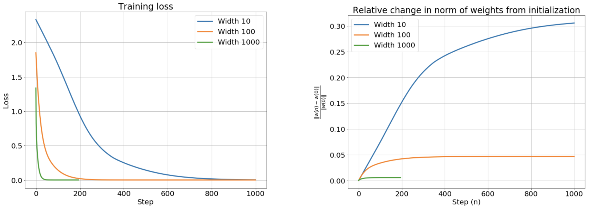

# NTK Proof

$$
f(x, \theta) = \sigma(wx + b) \quad  w, b \in \theta
$$

$$
L(f, x, y, \theta) = (f(x, \theta) - y)^2
$$

$$
\theta_{t+1} = \theta_t + \eta \nabla_{w} L(f, x, y, \theta)
$$

Denote $\theta_t$ as dynamic $\theta(t)$

$$
\frac{d\theta(t)}{dt} = \nabla_{\theta} L(f, x, y, \theta)
$$

$$
= 2(f(x, \theta) - y) \nabla_{\theta} f(x,\theta)
$$

$$
= 2(f(x, \theta) - y) \nabla_{\theta} (f(x,\theta_0) + \nabla_{\theta} f(x,\theta_0)^{\top}(\theta - \theta_0))
$$

$$
= 2(f(x, \theta) - y) \nabla_{\theta} (f(x,\theta_0) + \nabla_{\theta} f(x,\theta_0)^{\top}\theta - \nabla_{\theta} f(x,\theta_0)^{\top}\theta_0)
$$

$$
= 2(f(x, \theta) - y) \nabla_{\theta} f(x,\theta_0)
$$

---

## Abstract

To understand what is the neural tangent kernel(NTK), there are 3 important result that need to remember. 

- When the width of the neural network goes to infinity, the network will be equivalent to a Gaussian process.

- When the width of the neural network goes to infinity, the weight of the network will remain  almost unchanged during training. That is, the neural network will become a linear model.

- Since the network will become a linear model, the loss surface of the MSE of the infinite-width network will be a convex. As a result, we can optimize the infinite-width network just like optimizing a linear regression and solve it by ODE.

Combine these 3 points, NTK is a kernel that can kernelize the neural network architecture and it provides a closed-form solution of the kernel for anytime. Thus, We can compute the NTK at the end of training without actual training and compute the posterior and the prediction of the testing data with Bayesian inference.

## Infinite-Width Neural Network As Gaussian Process

### Define A Neural Network

First, given a training dataset $\mathcal{D}$ including $N = |\mathcal{D}|$ data points. We denote the data point as $d_i = (x, y) \in \mathcal{D} \ \forall i$ where the feature vector $x \in \mathbb{R}^{k}$ and the label $y \in \mathbb{R}$. The set of the feature vectors is $\mathcal{X} = \{x: (x, y) \in \mathcal{D}\}$ and similarly, the set of the label $\mathcal{Y} = \{ y: (x, y) \in \mathcal{D}\}$. 

We represent the element of the neural network $f(x, \theta), \ x \in \mathcal{X}$ as following

$$
h^{1} = x W^{1} + b^{1}
\newline
h^{l+1} = a^l W^{l+1} + b^{l+1}
\newline
a^{l+1} = \phi(h^{h+1})
\newline
\hat{y} = f(x, \theta) = a^{L+1}
$$

where $\phi$ is the activation function, $h^{l+1}$ and $a^{l+1}$ are the pre-activation and the post-activation respectively. The parameter $\theta$ includes $W^{l}, b^{l} \in \theta \ \forall l$. $W^{l+1} \in \mathbb{R}^{n_l \times n_{l+1}}$ and $b^{l+1} \in \mathbb{R}^{1 \times n_{l+1}}$ are the weight and the bias respectively. They follow the LeCun and normal distribution respectively.

$$
W_{i,j}^l = \frac{\sigma_w}{\sqrt{n_l}} w_{i,j}^l, \quad b_{j}^l = \sigma_b \beta_{j}^l 
\newline
w_{i,j}^l, \beta_{j}^l \overset{i.i.d}{\sim} \mathcal{N}(0, 1)
$$

Let $\theta^{l}$ denote as the all parameters of the layer $l$.

$$
\theta^{l} = vec({W^l, b^l}) \in \mathbb{R}^{(n_{l} + 1) \times n_{l-1}}
\newline
\theta = vec(\cup_{l=1}^{L+1} \theta^l)
$$

We also denote the empirical loss of all training dataset as $\mathcal{L}(\mathcal{X}, \mathcal{Y})$, and $l(\hat{y}, y)$ as loss function. 

$$
l(\hat{y}, y) = l(f(x, \theta), y)
\newline
\mathcal{L}_{f(\cdot, )}(\mathcal{X}, \mathcal{Y}) = \sum_{x \in \mathcal{X}, \ y \in \mathcal{Y}} l(f(x, \theta), y)
$$

## Infinite-Width Neural Network As A Linear Model

### Linear Model

As we've shown in the previous post, the parameters of the neural network change more slightly while the width of the network gets larger. In the other words, the neural network **remains almost unchanged during training.** As a result, the parameters $\theta^{(T)}$ of neural network after training $T$ steps will be very close to the initial parameters $\theta^{(0)}$.

$$
\lim_{n_{l} \to \infty} f(x, \theta^{(t)}) = \bar{f}(x, \theta^{(0)}), \quad 1 \leq l \leq L, \quad \forall t
$$

where $\bar{f}(x, \cdot)$ is the approximation function of neural network $f(x, \cdot)$.

### Taylor Expansion

Since the parameters of the infinite-width neural network only change slightly, thus, we can expand the neural network with Taylor expansion.

Taylor expansion

$$
g(x) = \sum_{n=0}^{\infty} \frac{g^{(n)}(a)}{n!} (x - a)^n
$$

First-order Taylor expansion

$$
g(x) \approx \ g(a) + \frac{d g(a)}{dx} (x - a)
$$

We denote the parameters of the neural network at training step $t$ as $\theta^{(t)}$. Then, expand the neural network $f(x, \theta^{(t)})$ at training step $t$ with data point $x$.

$$
\hat{y}^{(t)} = f(x, \theta^{(t)}) 
\newline
\approx  f_{lin}(x, \theta^{(t)})
= f(x, \theta^{(0)}) + \nabla_{\theta} f(x, \theta^{(0)})(\theta^{(t)} - \theta^{(0)}), \ \forall t
$$

where $\hat{y}^{(t)}$ is the prediction of the data point $x$ from the network at training step $t$

As for the whole dataset $\mathcal{X}$, the predictions $\hat{\mathcal{Y}}^{(t)}$

$$
\hat{\mathcal{Y}}^{(t)} 
= f(\mathcal{X}, \theta^{(t)}) 
\newline
\approx  f_{lin}(x, \theta^{(t)})
= f(\mathcal{X}, \theta^{(0)}) + \nabla_{\theta} f(\mathcal{X}, \theta^{(0)})(\theta^{(t)} - \theta^{(0)}), \ \forall t
$$

$$
f_{lin}(\mathcal{X}, \theta^{(t)}) - f(\mathcal{X}, \theta^{(0)})
= \nabla_{\theta} f(\mathcal{X}, \theta^{(0)})(\theta^{(t)} - \theta^{(0)})
$$

Because $f_{lin}(\mathcal{X}, \theta^{(0)}) = f(\mathcal{X}, \theta^{(0)}) + \nabla_{\theta} f(\mathcal{X}, \theta^{(0)})(\theta^{(0)} - \theta^{(0)}) = f(\mathcal{X}, \theta^{(0)})$, replace $f(\mathcal{X}, \theta^{(0)})$ with $f_{lin}(\mathcal{X}, \theta^{(0)})$

$$
f_{lin}(\mathcal{X}, \theta^{(t)}) -  f_{lin}(\mathcal{X}, \theta^{(0)})
= \nabla_{\theta} f_{lin}(\mathcal{X}, \theta^{(0)})(\theta^{(t)} - \theta^{(0)})
$$

**@ Need Hessian Proof**

With Lipschitz continuity, we can guarantee that $\theta^{(t + \Delta t)} - \theta^{(0)} \geq \theta^{(t + \Delta t)} - \theta^{(t)}$ and $f(\mathcal{X}, \theta^{(t + \Delta t)}) -  f(\mathcal{X}, \theta^{(0)}) \geq f(\mathcal{X}, \theta^{(t + \Delta t)}) -  f(\mathcal{X}, \theta^{(t)})$, and we can also write down the formula.

$$
\lim_{\Delta t \to 0} \frac{f_{lin}(\mathcal{X}, \theta^{(t + \Delta t)}) -  f_{lin}(\mathcal{X}, \theta^{(t)})}{\Delta t}
= \nabla_{\theta} f_{lin}(\mathcal{X}, \theta^{(0)}) \lim_{\Delta t \to 0} \frac{(\theta^{(t + \Delta t)} - \theta^{(t)})}{\Delta t}
$$

$$
\frac{\partial f_{lin}(\mathcal{X}, \theta^{(t)})}{\partial t}
= \nabla_{\theta} f_{lin}(\mathcal{X}, \theta^{(0)}) \frac{\partial \theta^{(t)}}{\partial t}
$$

In the form of dynamic

$$
\dot{f}_{lin}(\mathcal{X}, \theta^{(t)})
= \nabla_{\theta} f_{lin}(\mathcal{X}, \theta^{(0)}) \dot{\theta}(t)
$$

### Combine With Gradient Descent

Denote the loss of linearized neural network $f_{lin}(\cdot, \cdot)$ on the training dataset $(\mathcal{X}, \mathcal{Y})$ at the training step $t$ as $\mathcal{L}_{lin}^{(t)}(\mathcal{X}, \mathcal{Y}) = \sum_{x \in \mathcal{X}, \ y \in \mathcal{Y}} l(f_{lin}(x, \theta^{(t)}), y)$. The gradient descent can be represented as the following formula.

$$
\theta^{(t+1)} = \theta^{(t)} + \eta \nabla_{\theta} \mathcal{L}_{lin}^{(t)}(\mathcal{X}, \mathcal{Y}) 
= \theta^{(t)} + \eta \nabla_{\theta} f_{lin}(\mathcal{X}, \theta^{(t)}) \nabla_{f_{lin}(\mathcal{X}, \theta^{(t)})} \mathcal{L}_{lin}^{(t)}(\mathcal{X}, \mathcal{Y})
$$

$$
\theta^{(t + 1)} - \theta^{(t)} = \eta \nabla_{\theta} f_{lin}(\mathcal{X}, \theta^{(t)}) \nabla_{f_{lin}(\mathcal{X}, \theta^{(t)})} \mathcal{L}_{lin}^{(t)}(\mathcal{X}, \mathcal{Y})
$$

In the form of gradient flow dynamic

$$
\dot{\theta}(t) = \eta \nabla_{\theta} f_{lin}(\mathcal{X}, \theta^{(t)}) \nabla_{f_{lin}(\mathcal{X}, \theta^{(t)})} \mathcal{L}_{lin}^{(t)}(\mathcal{X}, \mathcal{Y})
$$

Replace $\dot{\theta}(t)$ with $\eta \nabla_{\theta} f_{lin}(\mathcal{X}, \theta^{(t)}) \nabla_{f_{lin}(\mathcal{X}, \theta^{(t)})} \mathcal{L}_{lin}^{(t)}(\mathcal{X}, \mathcal{Y})$

$$ 
\dot{f}_{lin}(\mathcal{X}, \theta^{(t)})
= \eta \nabla_{\theta} f_{lin}(\mathcal{X}, \theta^{(t)})^{\top} \nabla_{\theta} f_{lin}(\mathcal{X}, \theta^{(t)}) \nabla_{f_{lin}(\mathcal{X}, \theta^{(t)})} \mathcal{L}_{lin}^{(t)}(\mathcal{X}, \mathcal{Y})
$$

Then, we can derive $\nabla_{\theta} f_{lin}(\mathcal{X}, \theta^{(t)})$.

$$
\nabla_{\theta} f_{lin}(\mathcal{X}, \theta^{(t)}) 
\newline
= \nabla_{\theta}(f(\mathcal{X}, \theta^{(0)}) + \nabla_{\theta} f(\mathcal{X}, \theta^{(0)})(\theta^{(t)} - \theta^{(0)})) 
\newline
= \nabla_{\theta}(f(\mathcal{X}, \theta^{(0)}) + \nabla_{\theta} f(\mathcal{X}, \theta^{(0)})\theta^{(t)} - \nabla_{\theta} f(\mathcal{X}, \theta^{(0)})\theta^{(0)}) 
\newline
=\nabla_{\theta} f(\mathcal{X}, \theta^{(0)})
$$

Finally, because of the linearity, we can replace $\nabla_{\theta} f_{lin}(\mathcal{X}, \theta^{(t)})$ with $\nabla_{\theta} f(\mathcal{X}, \theta^{(0)})$

$$
\dot{f}_{lin}(\mathcal{X}, \theta^{(t)})
= \eta \nabla_{\theta} f(\mathcal{X}, \theta^{(0)})^{\top} \nabla_{\theta} f(\mathcal{X}, \theta^{(0)}) \nabla_{f_{lin}(\mathcal{X}, \theta^{(t)})} \mathcal{L}_{lin}^{(t)}(\mathcal{X}, \mathcal{Y})
$$

Let $T_{\mathcal{X} \mathcal{X}}^{(0)} = \nabla_{\theta} f(\mathcal{X}, \theta^{(0)})^{\top} \nabla_{\theta} f(\mathcal{X}, \theta^{(0)})$

$$
\dot{f}_{lin}(\mathcal{X}, \theta^{(t)})
= \eta T_{\mathcal{X} \mathcal{X}}^{(0)} \nabla_{f_{lin}(\mathcal{X}, \theta^{(t)})} \mathcal{L}_{lin}^{(t)}(\mathcal{X}, \mathcal{Y})
$$

where $T^{(0)}_{\mathcal{X} \mathcal{X}} \in \mathbb{R}^{|\mathcal{D}| \times |\mathcal{D}|}$ is the **Neural Tangent Kernel(NTK)**

## Gradient Flow Of MSE As A Linear Regression

### Mean Square Error(MSE)

In the previous section, we've derive the relation between the prediction of the neural network and the gradient descent at time step $t$. In this section, we'll dive into the point of view of gradient flow. Now, we've known that the linear approximation of the neural network regression.

$$
\dot{f}_{lin}(\mathcal{X}, \theta^{(t)})
= \eta T_{\mathcal{X} \mathcal{X}}^{(0)} \nabla_{f_{lin}(\mathcal{X}, \theta^{(t)})} \mathcal{L}_{lin}^{(t)}(\mathcal{X}, \mathcal{Y})
$$

Usually, in regression tasks, we use **Mean Square Error(MSE)** as error function.

$$
l(f_{lin}(x, \theta), y) = \frac{1}{2} || f_{lin}(x, \theta) - y||_{2}^{2}
$$

Plugin the MSE into the neural network regression

$$
\dot{f}_{lin}(\mathcal{X}, \theta^{(t)})
= \eta T_{\mathcal{X} \mathcal{X}}^{(0)} \nabla_{f_{lin}(\mathcal{X}, \theta^{(t)})} \mathcal{L}_{lin}^{(t)}(\mathcal{X}, \mathcal{Y})
$$

$$
= \eta T_{\mathcal{X} \mathcal{X}}^{(0)} \nabla_{f_{lin}(\mathcal{X}, \theta^{(t)})} \sum_{x \in \mathcal{X}, \ y \in \mathcal{Y}} \frac{1}{2} || f_{lin}(x, \theta^{(t)}) - y||_{2}^{2}
$$

$$
= \eta T_{\mathcal{X} \mathcal{X}}^{(0)}  \sum_{x \in \mathcal{X}, \ y \in \mathcal{Y}}  || f_{lin}(x, \theta^{(t)}) - y||_{2}
$$

$$
= \eta T_{\mathcal{X} \mathcal{X}}^{(0)} (f_{lin}(\mathcal{X}, \theta^{(t)}) - \mathcal{Y})
$$

### The Dynamic

In the previous post, we've shown that we can continue the discrete step and take the discrete trajectory as a continuous trajectory as if the step is small enough. For instance, Malthus' population growth model says that "the population growth rate is proportional to the total population".

$$
\left\{
    \begin{matrix}
        \frac{d P(t)}{dt} = \lambda P(t), \ \lambda > 0 \\
        P(t_0) =  P_0
    \end{matrix}
\right.
$$

where the dynamic $P(t)$ is the population at time $t$ and the $P_0$ is the initial population. Usually, we also denote $\frac{d P(t)}{dt} = \dot{P}(t)$.

Now, we can solve the dynamic $P(t)$.

$$
\int_{t_0}^{t_1} \frac{d P(t)}{dt} \frac{1}{P(t)} dt = \int_{t_0}^{t_1} \lambda dt
$$

$$
\int_{t_0}^{t_1} \frac{d \ ln(P(t))}{dt} dt = \lambda (t_1 - t_0)
$$

$$
ln(P(t_1)) - ln(P(t_0)) = \lambda (t_1 - t_0)
$$

$$
ln(\frac{P(t_1)}{P(t_0)}) = \lambda (t_1 - t_0)
$$

$$
P(t_1)) = P(t_0) e^{\lambda (t_1 - t_0)}
$$

The solution is

$$
P(t) = P_0 e^{\lambda (t - t_0)}
$$

### Prediction Dynamic

$$
\dot{f}_{lin}(\mathcal{X}, \theta^{(t)}) 
= \eta T_{\mathcal{X} \mathcal{X}}^{(0)} (f_{lin}(\mathcal{X}, \theta^{(t)}) - \mathcal{Y})
$$

**@ Need Proof**

Thus, we can write down the ODE.

$$
\dot{f}_{lin}(\mathcal{X}, \theta^{(t)}) 
= \eta T_{\mathcal{X} \mathcal{X}}^{(0)} f_{lin}(\mathcal{X}, \theta^{(t)})
$$

It's trivial that since the term's derivation is itself, thus the solution of the term must contain natural exponential $e$. Usually, we guess the solution in the form of $Ae^{\lambda t}$

$$
f_{lin}(\mathcal{X}, \theta^{(t)}) = Ae^{\eta T_{\mathcal{X} \mathcal{X}}^{(0)} t}
$$

Consider the training time step $t = 0$.

$$
f_{lin}(\mathcal{X}, \theta^{(0)}) = Ae^{\eta T_{\mathcal{X} \mathcal{X}}^{(0)} 0} = A
$$

Plug into the $Ae^{\eta T_{\mathcal{X} \mathcal{X}}^{(0)} t}$

$$
f_{lin}(\mathcal{X}, \theta^{(t)}) = f_{lin}(\mathcal{X}, \theta^{(0)}) e^{\eta T_{\mathcal{X} \mathcal{X}}^{(0)} t}
$$

### Weight Dynamic

$$
\theta^{(t + 1)} - \theta^{(t)} = \eta \nabla_{\theta} f(\mathcal{X}, \theta^{(t)}) \nabla_{f(\mathcal{X}, \theta^{(t)})} \mathcal{L}^{(t)}(\mathcal{X}, \mathcal{Y})
$$

We can write down the ODE of the dynamic $\dot{\theta}(t)$

$$
\lim_{\Delta t \to 0} \frac{\theta^{(t + \Delta t)} - \theta^{(t)}}{\Delta t} 
= \frac{\partial \theta^{(t)}}{\partial t}
= \dot{\theta}(t)
= \eta \nabla_{\theta} f(\mathcal{X}, \theta^{(t)}) \nabla_{f(\mathcal{X}, \theta^{(t)})} \mathcal{L}^{(t)}(\mathcal{X}, \mathcal{Y})
$$

Now, since the ODE $\dot{\theta}(t)$ is linear, it has cloesd form solution

$$
\dot{\theta}(t)
= \eta \nabla_{\theta} f(\mathcal{X}, \theta^{(t)}) \nabla_{f(\mathcal{X}, \theta^{(t)})} \sum_{x \in \mathcal{X}, \ y \in \mathcal{Y}} \frac{1}{2} || f(x, \theta^{(t)}) - y||_{2}^{2}
$$

$$
= \eta \nabla_{\theta} f(\mathcal{X}, \theta^{(t)}) \sum_{x \in \mathcal{X}, \ y \in \mathcal{Y}} || f(x, \theta^{(t)}) - y||_{2}
$$

$$
= \eta \nabla_{\theta} f(\mathcal{X}, \theta^{(t)}) (\hat{\mathcal{Y}}^{(t)} - \mathcal{Y})
$$

---

$$
\bar{f}(\mathcal{X}, \theta^{(t + 1)}) 
$$