<!-- _class: lead -->

# Uncertainty-Based Offline Reinforcement Learning with Diversified Q-Ensemble

## ICML'21

## Citation Count: 1

### Gaon An, Seungyong Moon, Jang-Hyun Kim, Hyun Oh Song

### Seoul National University, Neural Processing Research Center, DeepMetrics

---

# Offline RL

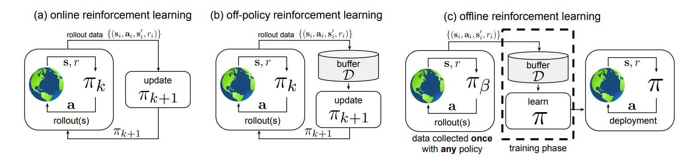

We aim to learn a policy $\pi$ from the history of trajectories $\mathcal{D} = \{ s_t, a_t, s_t', r_t \}$ generated by behavioral policy $\pi_{\beta}$ s.t. the performance $\pi \geq \pi_{\beta}$(Which means we want to train an agent's policy $\pi$ only from the history of trajectories $\mathcal{D}$)

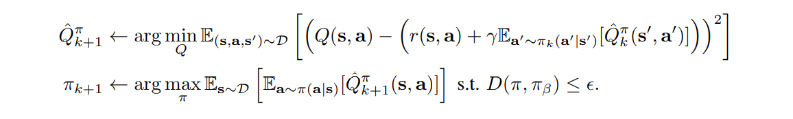

---

# Challenge 

- Extrapolation Error
  
  - Because the agent's policy isn't the same as the behavioral policy. The agent may overestimate unseen $Q^{\pi}(s, a)$, which gives a higher $Q^{\pi}(s, a)$ value than the ground-truth $Q^{\pi}(s, a)$ value .
  - In the offline setting, the policy cannot correct such over-optimistic Q-values.
  
- Solution

    - If we add a regularizer to the equation in order to make the agent (1) underestimate the $Q^{\pi}(s, a)$ value of unseen state-action pair $(s, a)$ or (2) choose the state-action pair that closes to the state-action pair already in the history trajectory $\mathcal{D}$, we can avoid the crazy actions that the agent may do.
    - But a trade-off between Optimality and Conservativeness.

---

# Idea

- Penalize the Q-function with the most pessimistic Q-network of the ensemble Q-network.

Modify the following SAC objective

$$
\min_{\phi_{i}} \mathbb{E}_{\left(\mathbf{s}, \mathbf{a}, \mathbf{s}^{\prime}\right) \sim \mathcal{D}}\left[\left(Q_{\phi}(\mathbf{s}, \mathbf{a})-\left(r(\mathbf{s}, \mathbf{a})+\gamma \mathbb{E}_{\mathbf{a}^{\prime} \sim \pi_{\theta}\left(\cdot \mid \mathbf{s}^{\prime}\right)}\left[Q_{\phi^{\prime}}\left(\mathbf{s}^{\prime}, \mathbf{a}^{\prime}\right)\right]  - \beta \log \pi_{\theta}\left(\mathbf{a}^{\prime} \mid \mathbf{s}^{\prime}\right) \right)\right)^{2}\right]
$$

$$
\max_{\theta} \mathbb{E}_{\mathbf{s} \sim \mathcal{D}, \mathbf{a} \sim \pi_{\theta}(\cdot \mid \mathbf{s})}\left[Q_{\phi}(\mathbf{s}, \mathbf{a})-\beta \log \pi_{\theta}(\mathbf{a} \mid \mathbf{s})\right]
$$

<!-- 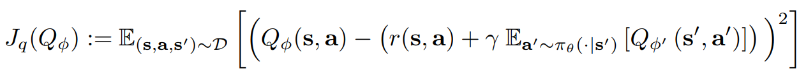 -->

To SAC-N

$$
\min_{\phi_{i}} \mathbb{E}_{s, a, s^{\prime} \sim \mathcal{D}}\left[\left(Q_{\phi_{i}}(s, a)-\left(r(s, a)+\gamma \mathbb{E}_{a^{\prime} \sim \pi_{\theta}\left(\cdot \mid s^{\prime}\right)}\left[\min _{j=1, \ldots, N} Q_{\phi_{j}^{\prime}}\left(s^{\prime}, a^{\prime}\right) - \beta \log \pi_{\theta}\left(a^{\prime} \mid s^{\prime}\right)\right]\right)\right)^{2}\right] \\
$$

$$
\max_{\theta} \mathbb{E}_{s \sim \mathcal{D}, a \sim \pi_{\theta}(\cdot \mid s)}\left[\min _{j=1, \ldots, N} Q_{\phi_{j}}(s, a)-\beta \log \pi_{\theta}(a \mid s)\right]
$$

<!-- 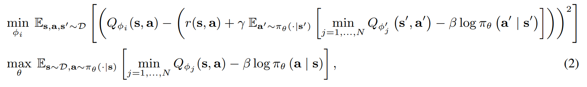 -->

---

# Idea

And the authors surprisingly found that **SAC-N will outperform than the SOTA offline-RL algorithm "CQL" when the number of ensemble is large enough.**

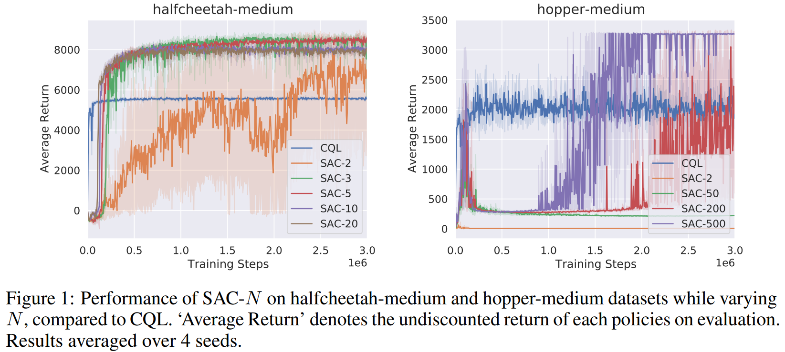

---

# Idea

- Obviously, **the redundant Q-networks of SAC-N cost lots of computation**. The authors aim to **reduce the size of the ensemble Q-network while achieving the same performance.**
- The authors found that the **performance of SAC-N is negatively correlated with the degree to which the input gradients of Q-functions $\nabla_a Q_{\phi_j} (s, a)$ are aligned, which increases with $N$.**

---

# Evidence 1

**The Q-value predictions for the OOD actions have a higher variance.**

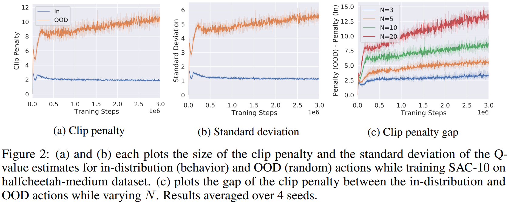

---

- Here we define the **penalty from the clipping as**

$$
\mathbb{E}_{s \sim D,a \sim \pi(·|s)} \left[ \frac{1}{N} \sum_{j=1}^{N}Q_{\phi_j}(s, a) − \min_{j=1,...,N} Q_{\phi_j}(s, a) \right]
$$

- We also **approximate the expected minimum of the realizations** following the work of Royston

$$
\mathbb{E} \left[ \min_{j=1,...,N} Q_j(s, a) \right] \approx m(s, a) − \Phi^{−1} \left( \frac{N − \frac{\pi}{8}}{N − \frac{\pi}{4} + 1} \right) \sigma(s, a)
$$

Where we suppose $Q(s, a) \sim \mathcal{N}(m(s, a), \sigma(s, a))$ and $\Phi$ is the CDF of the standard Gaussian distribution.

The Q-value predictions for the **OOD actions have a higher variance** and the **size of the penalty and the standard deviation are highly correlated**.

---

# Evidence 2

**The performance of the learned policy degrades significantly when the Q-functions share a similar local structure.**

The minimum cosine similarity between the gradients of the Q-functions is

$$
\min_{i \neq j} \langle \nabla_a Q_{\phi_i} (s, a), \nabla_a Q_{\phi_j}(s, a) \rangle
$$

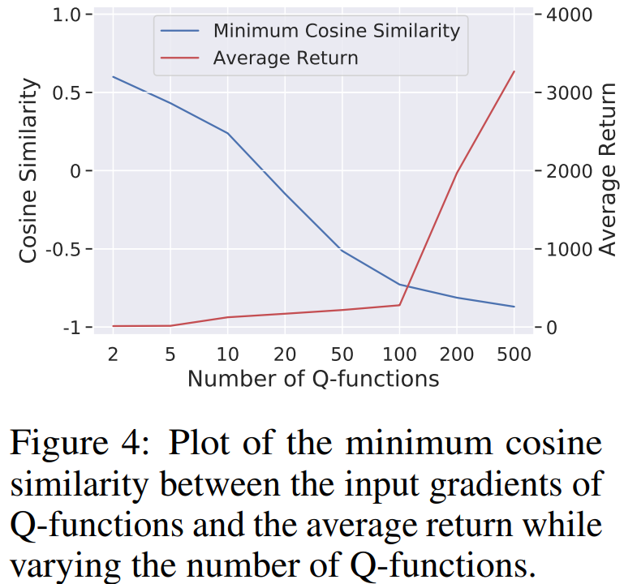

---

We can take $\text{Var}(Q_{\phi_j}(s, a + k w_2))$ as the variance of the Q value when we take an action which out of the behavioral policy action $a$ in the direction of $w_2$(OOD action). In terms out, the gradients of the Q-network ensemble $\nabla_a Q_{\phi_i}(s, a)$ align when the variance $\text{Var}(Q_{\phi_j}(s, a + k w_2))$ is small. Thus, the penalty of the OOD action would be small.

---

If $\text{Var}(Q_{\phi_j}(s, a + k w_2))$ is small, according to the approximation of the minimum Q-network ensemble is $\mathbb{E} \left[ \min_{j=1,...,N} Q_j(s, a) \right] \approx m(s, a) − \Phi^{−1} \left( \frac{N − \frac{\pi}{8}}{N − \frac{\pi}{4} + 1} \right) \sigma(s, a)$, the action $a + k w_2$ is not sufficiently penalized. 

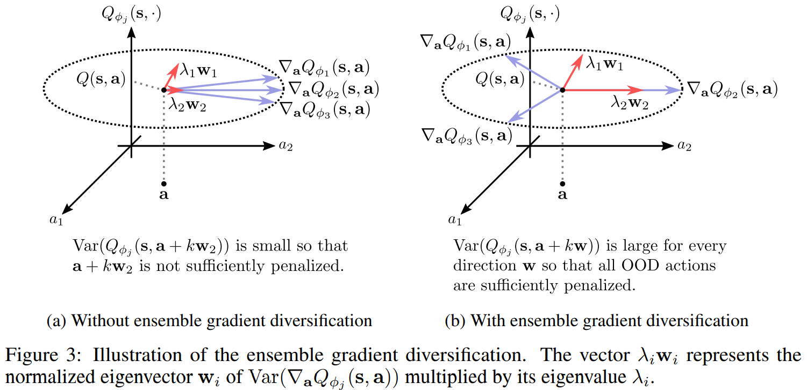

As a result, we now connect the inner product of the gradients of the Q-network(alignment) and the variance of the OOD action $\text{Var}(Q_{\phi_j}(s, a + k w_2))$.

---

Thus, we aim to enlarge the penalty of OOD action. As a result, we aim to diversify the gradients of the Q-network ensemble $\nabla_{a} Q_{\phi_i}(s, a)$

$$
\min_{\phi} J_{ES}(Q_{\phi}) := \mathbb{E}_{s, a \sim \mathcal{D}} \left[ \langle \frac{1}{N} \sum_{i=1}^{N} \nabla_{a} Q_{\phi_i}(s, a), \frac{1}{N} \sum_{j=1}^{N} \nabla_{a} Q_{\phi_j}(s, a) \rangle  \right]
$$

Then, we can reformulate the equation

$$
\min_{\phi} J_{ES}(Q_{\phi}) := \mathbb{E}_{s, a \sim \mathcal{D}} \left[ \frac{1}{N - 1} \sum_{1 \leq i \neq j \leq N} \langle \nabla_{a} Q_{\phi_i}(s, a), \nabla_{a} Q_{\phi_j}(s, a) \rangle  \right]
$$

---

# Algorithm 

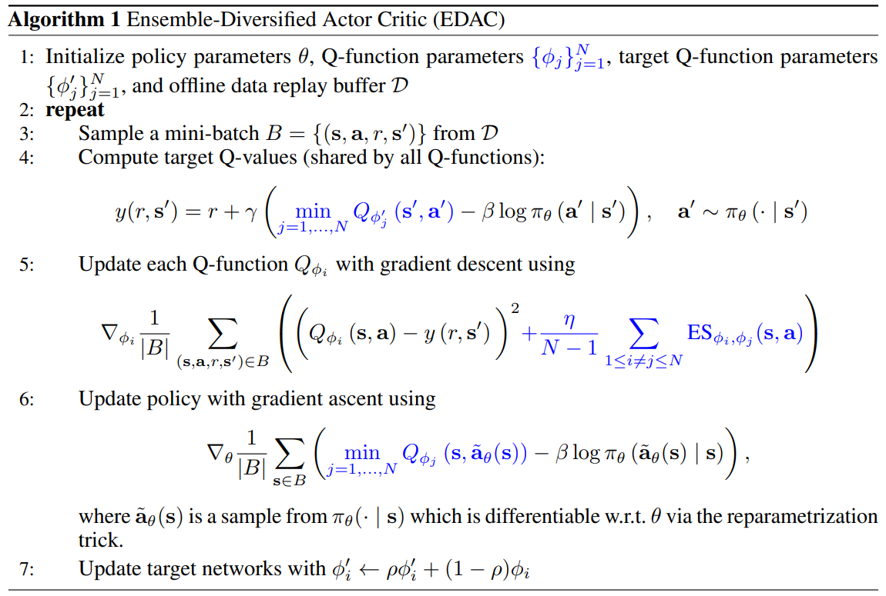

---

# Proof Sketch

We use Taylor expansion to expand the Q function $Q_{\phi_j}(s, a + kw)$

$$
\text{Var}(Q_{\phi_j}(s, a + kw)) \approx \text{Var}(Q_{\phi_j}(s, a) + k \langle w, \nabla_a Q_{\phi_j}(s, a) \rangle)
$$

$$
= \text{Var}(Q(s, a) + k \langle w, \nabla_a Q_{\phi_j}(s, a) \rangle)
$$

$$
= k^2 \text{Var}(\langle w, \nabla_a Q_{\phi_j}(s, a) \rangle)
$$

$$
= k^2 w^{T} \text{Var}(\nabla_a Q_{\phi_j}(s, a)) w
$$

$$
\geq k^2 w_{\text{min}}^{T} \text{Var}(\nabla_a Q_{\phi_j}(s, a)) w_{\text{min}}
$$

$$
= k^2 \lambda_{min}
$$

---

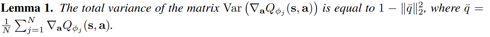

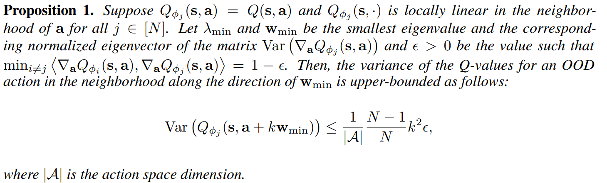

---

Then, since the smallest eigenvalue is hard to compute, we compute the sum of the all eigenvalues of the covariance matrix $\text{Var}(\nabla_a Q_{\phi_j}(s, a))$ 

$$
\lambda_{\text{min}} \leq \frac{1}{|\mathcal{A}|} \sum_{j=1}^{|\mathcal{A}|} \lambda_j
$$

Since the total variance is the sum of all eigenvalues, we can derive

$$
= \frac{1}{|\mathcal{A}|} tr(\text{Var}(\nabla_a Q_{\phi_j}(s, a)))
$$

$$
= \frac{1}{|\mathcal{A}|} (1 - ||\bar{q}||_2^2)
$$

$$
= \frac{1}{|\mathcal{A}|} (1 - (\frac{1}{N^2} (\sum_{j=1}^{N} \langle q_j, q_j \rangle + \sum_{1 \leq i \neq j \leq N} \langle q_i, q_j \rangle)))
$$

---

$$
= \frac{1}{|\mathcal{A}|} (1 - (\frac{1}{N^2} (\sum_{j=1}^{N} \langle q_j, q_j \rangle + \sum_{1 \leq i \neq j \leq N} \langle q_i, q_j \rangle)))
$$

Let $\min_{i \neq j} \langle \nabla_a Q_{\phi_j}(s, a) , \nabla_a Q_{\phi_j}(s, a) \rangle = 1 - \epsilon$

$$
\leq \frac{1}{|\mathcal{A}|}(1 - (N + N (N - 1) (1 - \epsilon)))
$$

$$
= \frac{1}{|\mathcal{A}|} \frac{N - 1}{N} \epsilon
$$

---

Thus, 

$$
\text{Var}(\nabla_a Q_{\phi_j}(s, a + k w_{\text{min}}))
$$

$$
= k^2 w_{\text{min}}^{T} \text{Var}(\nabla_a Q_{\phi_j}(s, a)) w_{\text{min}}
$$

$$
= k^2 \lambda_{\text{min}}
$$

$$
\leq \frac{1}{|\mathcal{A}|} \frac{N - 1}{N} k^2 \epsilon
$$

$$
= \frac{1}{|\mathcal{A}|} \frac{N - 1}{N} k^2 (1 - \min_{i \neq j} \langle \nabla_a Q_{\phi_j}(s, a), \nabla_a Q_{\phi_j}(s, a) \rangle)
$$

Thus, instead of maximize the smallest eigenvalue $\max_{\phi} k^2 \lambda_{\text{min}}$, minimizing the cosine similarity of the gradients of the Q-networks is cheaper

$$
\min_{\phi} \mathbb{E}_{s, a \sim \mathcal{D}} \left[ \frac{1}{N - 1} \sum_{1 \leq i \neq j \leq N} \langle \nabla_a Q_{\phi_j}(s, a), \nabla_a Q_{\phi_j}(s, a) \rangle \right]
$$

---

