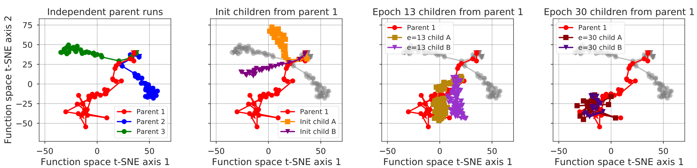
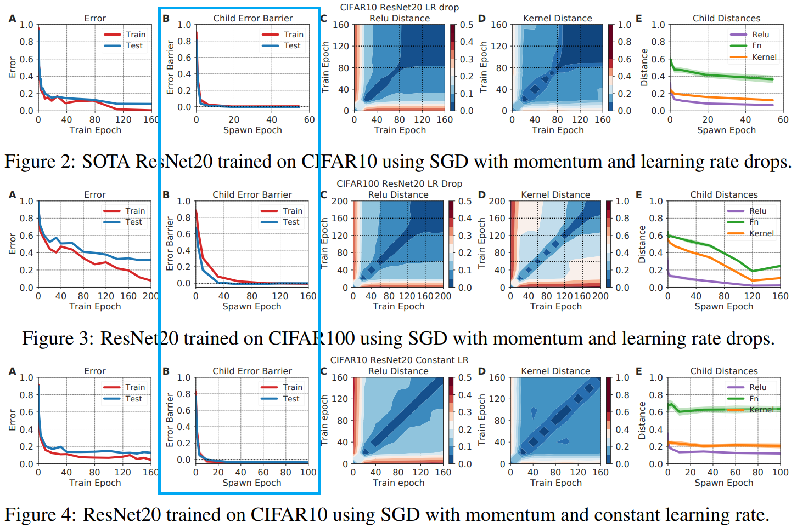
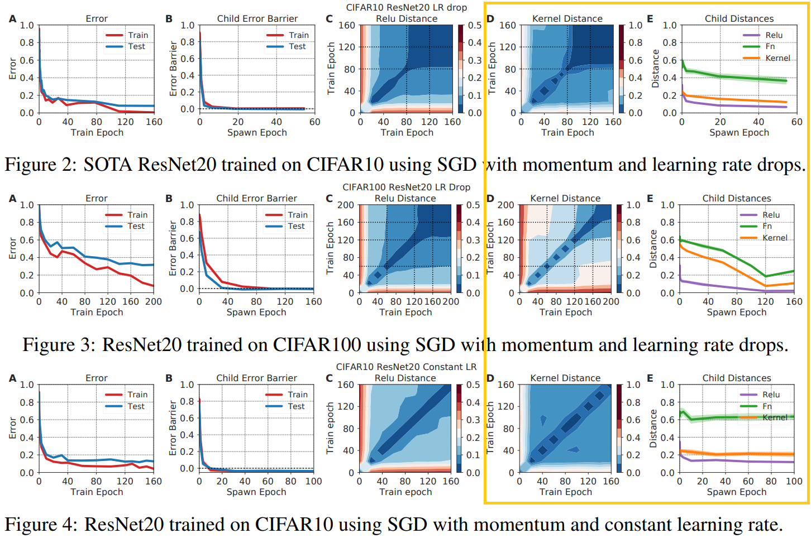

# Student-T Process Instead of Gaussian Process for NTK

資工21 周聖諺

---

## Motivation

According to the paper **"Deep learning versus kernel learning: an empirical study of loss landscape geometry and the time evolution of the Neural Tangent Kernel"**(presented by 袁哥), 

- Problem: Infinite-width NTK gives a **poor prediction** on the loss of the **finite-width neural network during training** 

- Reason: **Final basin(of the loss surface)** chosen by a child highly **sensitive to SGD noise** and the NTK **involves very rapidly**.

Solution: Model the **noise** of the NTK with **Student-T process**

---

Recall 

- Hierarchical Exploration of Loss Landscape through Parents and Children
- Error Barrier Between Spawned Children During Training
- Visualization of The Function Space Motion During Training
- Kernel Distance During Training

---

## Hierarchical Exploration of Loss Landscape through Parents and Children

- In this process, a parent network is trained from initialization to a spawning time $t_{s}$, yielding a parent weight trajectory $\{ w_{t} \}_{t=0}^{t_{s}}$.

- At the spawn time $t_{s}$, several copies of the parent network are made, and these so-called children are then training with independent minibatch stochasticity, yielding different child weight trajectories $\{ w_{t}^{t_{s}, a} \}_{t=t_{s}}^{T}$, where $a$ indexes the children, and $T$ is the final training time.

---

## Visualization of The Function Space Motion During Training

### Function Distance

- To compute the distance between the two functions $f_{w}$ and $f_{w_{0}}$, parameterized by weights $w$ and $w_{0}$, we would ideally like to calculate the **degree of disagreement between their outputs averaged over the whole input space $x$**.

- Let $S$ test denote the test set. Then,

$$
||f_{w}(x) - f_{w'}(x)||_{S^{test}} = \frac{1}{Z |S_{x}^{test}|} \sum_{x \in S_{x}^{test}} (f_{w}(x) \neq f_{w'}(x))1
$$

Where $S_{x}^{test}$ are test inputs and $Z$ is normalizing constant.

---

- T-SNE visualization of parent and children evolution in the function space with different spawn epoch.
- The trajectories of the children are highly **sensitive to SGD noise**

---

## Error Barrier Between Spawned Children During Training

-  Compute the error barrier between children along a linear path interpolating between them in weight space.
- Let $w_{t}^{\alpha} = \alpha w_{t} + (1 - \alpha) w_{t}'$, where $w_{t}$ and $w_{t}'$ are the weight of 2 children networks, spawn from some iteration $t_{s}$, and $\alpha \in [0, 1]$. 
- At various $t_s$ we compute $\max_{\alpha \in [0, 1]} \hat{R}_{S}(w_{t}^{\alpha}) - \frac{1}{2}(\hat{R}_{S}(w_{t}) + \hat{R}_{S}(w_{t}'))$, which we call the **error barrier**.

---

the error barrier drops rapidly within a few epochs in panel B,

---

## Kernel Distance During Training

For finite width networks, the kernel $\kappa_{t}(S) = \kappa_{w_{t}}(S)$ changes with training time $t$. Define the kernel distance as

$$
S(w, w') = 1 - \frac{Tr(\kappa_{w}(S) \kappa_{w'}^{T}(S))}{\sqrt{Tr(\kappa_{w}(S) \kappa_{w}^{T}(S))} \sqrt{Tr(\kappa_{w'}(S) \kappa_{w'}^{T}(S))}}
$$

---

Panel E shows that function, kernel and ReLU distances between children at the end of training also drop as a function of spawn time.

---

# Main Idea
### Why not just add some random noise to the NTK, to simulate the unstable NTK?

With **inverse Wishart distribution** $\Sigma \sim \mathcal{IW}(\nu, K)$ where the degree of freedom $\nu > 2$ and $K$ is positive definite, we can generate a random matrix $\Sigma$ with expectation $\mathbb{E}[\Sigma] = \frac{K}{\nu - 2}$. 

---

## Inverse Normal-Wishart Distribution

Consider the **randomness of the kernel matrix**, with Bayesian rule, we can model the kernel matrix with **Inverse Wishart distribution**.

$$
p(y | \phi, \nu, K) = \int p(y | \phi, \Sigma) p(\Sigma | \nu, K) d \Sigma = \mathcal{TP}(\phi, K, \nu)
$$

Denote Inverse Wishart distribution as $\Sigma | \nu, K \sim \mathcal{IW}(\nu, K) = p(\Sigma | \nu, K)$ and the Gaussian process as $y | \phi, \Sigma \sim \mathcal{GP}(\phi, \Sigma) = p(y | \phi, \Sigma)$. Note that the random matrix $\Sigma \in \mathbb{R}^{N \times N}$ is generated by Inverse Wishart. The hyperparameters are $K \in \mathbb{R}^{N \times N}$, $\nu \in \mathbb{R}$, $\phi \in \mathbb{R}^N$.

Finally, $\mathcal{TP}(\phi, K, \nu)$ is the **Student-T process**.

---

## Student-T Process 

The Student-T process can be written as

$$
y \sim \mathcal{TP}(\phi, K, \nu)
$$

The hyperparameter $\nu$ is called **degrees of freedom**, it can control the covariance of the output $cov(y) = \frac{\nu}{\nu - 2} K$. Thus, when $\nu \to \infty$, $\mathcal{TP}$ will converge to $\mathcal{GP}$ in distribution.

$$
P(X) = \lim_{\nu \to \infty} P(Y)
$$

$$
X \sim \mathcal{GP}(\phi, K), \quad Y \sim \mathcal{TP}(\phi, K, \nu), \quad 
$$

---

## Student-T Process 

Degrees of freedom is the number of values in the final calculation of a statistic that are free to vary.

---

## Student-T Process Posterior

Given a training dataset $\{ X_1, Y_1 \}$ with $n_1$ samples and a testing dataset $\{ X_2, Y_2 \}$ with $n_2$ samples  where $X_1 \in \mathbb{R}^{n_1 \times d}$,  $Y_1 \in \mathbb{R}^{n_1}$, and $X_2 \in \mathbb{R}^{n_2 \times d}$,  $Y_2 \in \mathbb{R}^{n_2}$. 

Denote the mean function as $z$ and the kernel function as $k$. Thus, $\phi_i = z(X_i)$ and $K_{ij} = k(X_i, X_j)$

$$
\begin{pmatrix}
Y_1\\
Y_2
\end{pmatrix}
\sim 
\mathcal{TP}(
    \begin{pmatrix}
    \phi_1\\
    \phi_2
    \end{pmatrix},
    \begin{pmatrix}
    K_{11} & K_{12}\\
    K_{21} & K_{22}
    \end{pmatrix}
, \nu)
$$

---

## Student-T Process Posterior

The posterior is 

$$
y_2 | y_1 \sim \mathcal{TP}(\hat{\phi}, \frac{\nu + \beta + - 2}{\nu + n_1 - 2} \hat{K}_{22}, \nu + n_1)
$$

Where 

$\hat{\phi} = K_{21} K_{11}^{-1} (Y_1 - \phi_1) + \phi_2$

$\beta = (Y_1 - \phi_1)^{\top} K_{11}^{-1} (Y_1 - \phi_1)$

$\hat{K}_{22} = K_{22} - K_{21} K_{11}^{-1} K_{12}$

---

## Experiment

We've already known, if $\nu = \infty$, the student-T process will converge to Gaussian process. In the above figure, we compare the result of **fitting a $\sin()$ function with $\mathcal{TP}$(blue) and $\mathcal{GP}$(yellow) respectively**. The **left** part of above figure shows the **training/testing progress of fitting**. The right part is the value of $\nu$ during training progress.

As the **blue line** shows above(left part), as the **training progress goes**, **the $\nu$ gets lower**. It shows that we can **control $\nu$ of $\mathcal{TP}$ to achieve a better fitting(closer to black line, real NN training)**.

---

## Conclusion

- During **training progress**, the **$\nu$ gets lower**.
- By controlling the value of $\nu$ of $\mathcal{TP}$, we can get a **more accurate prediction on the training loss** rather than $\mathcal{GP}$ 
- If the NTK follows the $\mathcal{TP}$,  the **bigger training dataset**, the **larger degree of freedom of the posterior**.