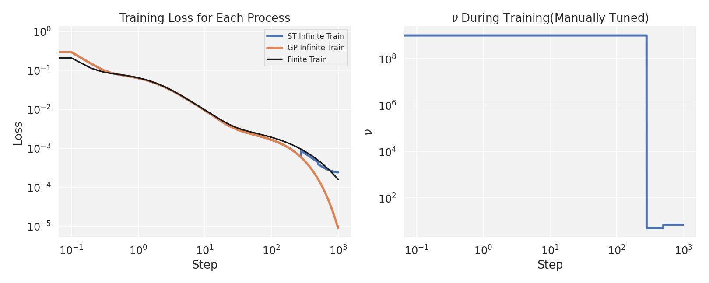

# Student-T Process Instead of Gaussian Process for Empirical Kernel

---

## Empirical Kernel

---

## Normal-Wishart Distribution

Consider the randomness of the kernel matrix, with Bayesian rule, we can model the kernel matrix with **Inverse Wishart distribution**.

$$
p(y | \phi, \nu, K) = \int p(y | \phi, \Sigma) p(\Sigma | \nu, K) d \Sigma = \mathcal{TP}(\phi, K, \nu)
$$

Denote Inverse Wishart distribution as $\Sigma \sim \mathcal{IW}(\nu, K) = p(\Sigma | \nu, K)$ and the Gaussian process as $y | \phi, \Sigma \sim \mathcal{GP}(\phi, \Sigma) = p(y | \phi, \Sigma)$. Note that the random matrix $\Sigma \in \mathbb{R}^{N \times N}$ is generated by Inverse Wishart. The hyperparameters are $K \in \mathbb{R}^{N \times N}$, $\nu \in \mathbb{R}$, $\phi \in \mathbb{R}^N$.

Finally, $\mathcal{TP}(\phi, K, \nu)$ is the **Student-T process**.

---

## Student-T Process 

The Student-T process can be written as

$$
y \sim \mathcal{TP}(\phi, K, \nu)
$$

<!-- $$
\mathbin{E}[y] = \phi
$$

$$
\mathbin{COV}[y] = \frac{\nu}{\nu - 2} K
$$ -->

The hyperparameter $\nu$ is called **degrees of freedom**, it can control the covariance of the output $cov(y) = \frac{\nu}{\nu - 2} K$. Thus, the relation between $\mathcal{TP}$ and $\mathcal{GP}$ is 

$$
\mathcal{GP}(\phi, K) = \lim_{\nu \to \infty} \mathcal{TP}(\phi, K, \nu)
$$

---

## Student-T Process 

Given a training dataset $\{ X_1, Y_1 \}$ with $n_1$ samples and a testing dataset $\{ X_2, Y_2 \}$ with $n_2$ samples  where $X_1 \in \mathbb{R}^{n_1 \times d}$,  $Y_1 \in \mathbb{R}^{n_1}$, and $X_2 \in \mathbb{R}^{n_2 \times d}$,  $Y_1 \in \mathbb{R}^{n_2}$. 

Denote the mean function as $z$ and the kernel function as $k$. Thus, $\phi_i = z(X_i)$ and $K_{ij} = k(X_i, X_j)$

$$
\begin{pmatrix}
Y_1\\
Y_2
\end{pmatrix}
\sim 
\mathcal{TP}(
    \begin{pmatrix}
    \phi_1\\
    \phi_2
    \end{pmatrix},
    \begin{pmatrix}
    K_{11} & K_{12}\\
    K_{21} & K_{22}
    \end{pmatrix}
)
$$

---

## Student-T Process 

The posterior is 

$$
y_2 | y_1 \sim \mathcal{TP}(\hat{\phi}, \frac{\nu + \beta + - 2}{\nu + n_1 - 2} \hat{K}_{22}, \nu + n_1)
$$

Where 

$\hat{\phi} = K_{21} K_{11}^{-1} (Y_1 - \phi_1) + \phi_2$

$\beta = (Y_1 - \phi_1)^{\top} K_{11}^{-1} (Y_1 - \phi_1)$

$\hat{K}_{22} = K_{22} - K_{21} K_{11}^{-1} K_{12}$

---

## Experiment

We've already known, if $\nu = \infty$, the student-T process will converge to Gaussian process. In the above figure, we compare the result of **fitting a $\sin()$ function with $\mathcal{TP}$ and $\mathcal{GP}$ respectively**. The **left** part of above figure shows the **training/testing progress of fitting**. The right part shows the fitting result of NTK.

As the **blue line** shows above, as the **training process goes**, **the $\nu$ gets lower**. It shows that we can **control $\nu$ of $\mathcal{TP}$ to achieve a better fitting**.