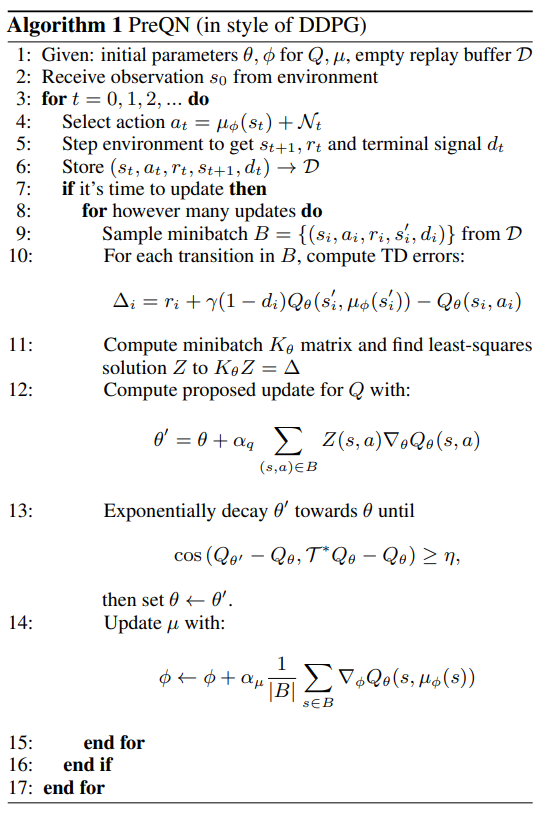
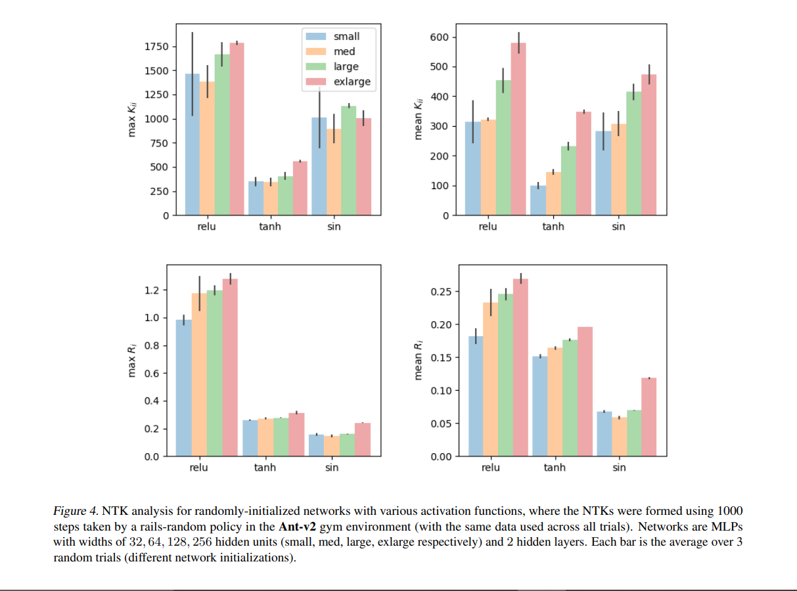
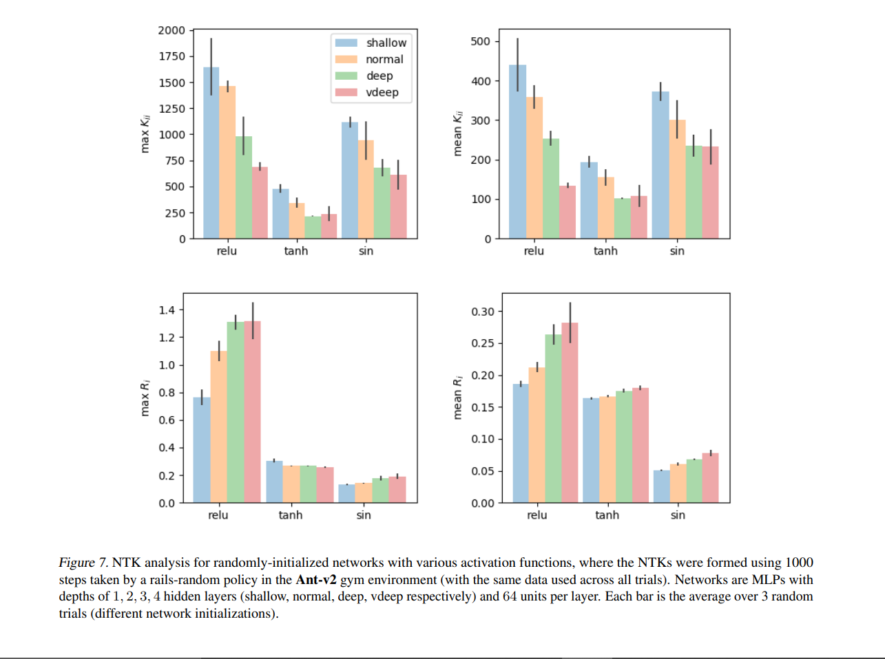
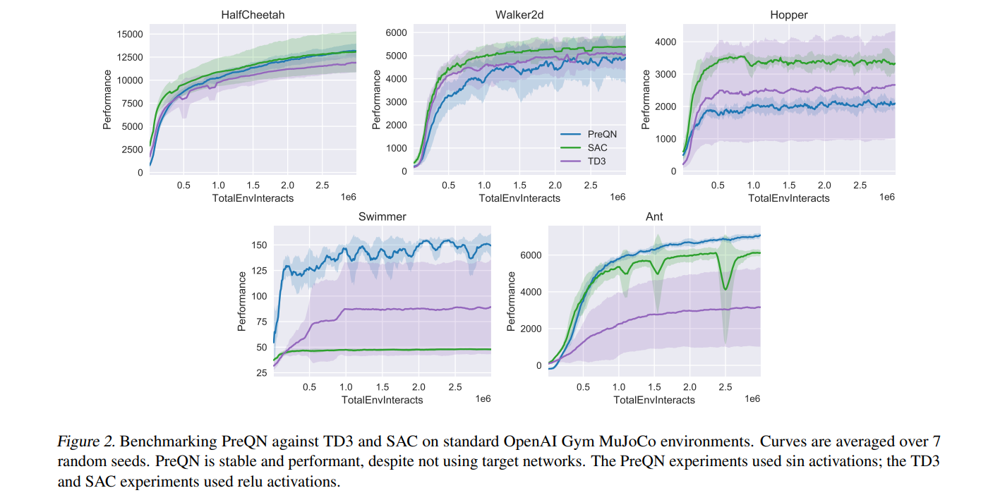
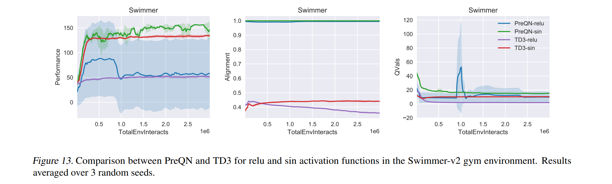

# Towards Characterizing Divergence in Deep Q-Learning

arXiv 2019

Citation: 40

OpenAI, UCB

*Joshua Achiam, Ethan Knight, Pieter Abbeel*

---
# Motivation
The **Deadly Triad** of DQN:

Once we put **"bootstrapping"**, **"off-policy learning"**, **"function approximation"** together, they will lead to **divergence** in DQN.

However, **the conditions under which divergence occurs are not well-understood.**

---

# Main Ideas
Why dose DQN diverge under deadly triad?
How about analyzing DQN with NTK?

---
# The Result of Analysis

- The main reason why DQN diverge is **Over-generalization** and **improper(too large or too small) learning rate**.
- The **network architecture seems to affect the convergence of DQN**

---
# Outline

- Motivation
- Main Ideas 
- The Result of Analysis
- Analysis Setup
- NTK of DQN
- Building Intuition for Divergen with NTK
- PreQN
- Experiments

---

# Analysis Setup

## Contraction Map
Let $X$ be a vector space with norm $k \cdot k$, and $f$ a function from $X$ to $X$. If $\forall x, y \in X$, $f$ satisfies

$$||f(x) − f(y)|| \leq \beta ||x − y|| \ \ \ $$

with $\beta \in [0, 1)$, then $f$ is called a contraction map with modulus $\beta$

---

## Banach Fixed-Point Theorem
Let $f$ be a contraction map, $\exist x_u \ \ st \ \ f(x_u) = x_u$. 

### Properties

- $x_u$ is an unique fixed-point. 

- Because $f$ is a contraction map, $x_u$ can be obtained by the repeated application of $f$: for any point $x_0 \in X$, if we define a sequence of points $\{ x_n \}$ such that $x_n = f(x_n − 1)$, $\lim_{n \to \infty} x_n = x$.

---

## Q-Function
The optimal Q-function $Q^*$, which is known to satisfy the optimal Bellman equation:

$$
Q^*(s, a) = E_{s \sim P}[ R(s, a, s') + \gamma \mathop{\max}_{a'} \ Q^*(s', a')]
$$

The value iteration of Q-learning is

$$
Q_{k+1}(s, a) = E_{s, a \sim P}[Q_k(s, a) + \alpha_k (r + \gamma \mathop{\max}_{a'} Q_k(s', a') − Q_k(s, a))]
$$

---

## Bellman Operator
Define an optimal Bellman operator $\tau^*: Q \to Q$ be the operator on Q-functions

$$
Q^* = \tau^* Q^*
$$

The operator $\tau^*$ is  a contraction map

Thus, the value iteration of Q-learning can be represented as

$$Q_{k+1}(s, a) = E_{s, a \sim P}[Q_k(s, a) + \alpha_k (\hat{\tau}^* Q_k(s, a) − Q_k(s, a))]$$

$$\hat{\tau}^{*} Q_k(s, a) = r + \gamma \ max_{a'} Q_k(s', a')$$

The optimal policy $π^*$ can be obtained with $π^*(s) = \mathop{\arg\max}_{a} Q^*(s, a)$ after the value iteration $Q_{k+1}= \tau^* Q_k$ converges

---
# NTK of DQN

The Bellman equation of DQN with the **experience distribution $\rho$ in replay buffer**

$$Q_{k+1}(s, a) = E_{s, a \sim \rho}[Q_k(s, a) + \alpha_k (\hat{\tau}^* Q_k(s, a) − Q_k(s, a))]$$

$$\hat{\tau}^{*} Q_k(s, a) = r + \gamma \ max_{a'} Q_k(s', a')$$

The TD error $\delta_t$ with minibatch sampled from replay buffer $\rho$

$$
\delta_t = E_{s, a \sim \rho}[\tau^* Q(s_t, a_t) − Q(s_t, a_t)]
$$
$$
= E_{s, a \sim \rho}[r_t + \gamma \ \mathop{\max}_{a'} \ Q(s_{t+1}, a') − Q(s_t, a_t)]
$$

Update the weights

$$
\theta' = \theta + \alpha \nabla_{\theta} \delta_{t} 
$$

$$
= \theta + \alpha E_{s, a \sim \rho}[(\tau^* Q_{\theta}(s, a) − Q_{\theta}(s, a)) \ \nabla_{\theta} Q_{\theta}(s, a)] \qquad \qquad \tag{5}
$$

---
# NTK of DQN

The **Taylor Expansion** of $Q$ around $\theta$ at a state-action pair $(\bar{s}, \bar{a})$. 

$$Q_{\theta'} (\bar{s}, \bar{a}) = Q_{\theta}(\bar{s}, \bar{a})+\nabla_{\theta}Q_{\theta}(\bar{s}, \bar{a})^{\top}(\theta'−\theta)$$

Combine with Eq. 5

$$\theta' - \theta = \alpha E_{s, a \sim \rho}[(\tau^* Q_{\theta}(s, a) − Q_{\theta}(s, a)) \ \nabla_{\theta} Q_{\theta}(s, a)]$$

Thus, the Q-values before and after an update are related by:

$$Q_{\theta'} (\bar{s}, \bar{a}) = Q_{\theta}(\bar{s}, \bar{a}) + \alpha E_{s, a \sim \rho}[k_{\theta}(\bar{s}, \bar{a}, s, a) (\tau^*Q_{\theta}(s, a) − Q_{\theta}(s, a))]$$

$$k_{\theta}(\bar{s}, \bar{a}, s, a) = \nabla_{\theta}Q_{\theta}(\bar{s}, \bar{a})^{\top} \nabla_{\theta} Q_{\theta}(s, a) \qquad \qquad \tag{9}$$

Where $k_{\theta}(\bar{s}, \bar{a}, s, a)$ is **NTK** 

---
# Building Intuition for Divergen with NTK

## Theorem 1
The Q function is represented as a vector in $\mathbb{R}^{|S||A|}$, and the Q-values before and after an update are related by:

$$Q_{\theta'} = Q_{\theta} + \alpha K_{\theta} D_{\rho}(\tau^* Q_{\theta} − Q_{\theta}) \qquad \qquad \tag{10}$$

where $K_{\theta} \in \mathbb{R}^{|S||A| × |S||A|}$ is the matrix of entries given by the NTK $k_{\theta}(\bar{s}, \bar{a}, s, a)$, and $D_{\rho}$ is a  matrix with entries given by $\rho(s, a)$, the distribution from the replay buffer.

---
Consider the operator $\mathcal{U}_3$ given by

$$\mathcal{U}_3 Q = Q + \alpha K D_{\rho} (\tau^* Q − Q) \qquad \qquad \tag{14}$$

## Lemma 3

Under the same conditions as Theorem 1, the Q-values before and after an update are related by 

$$Q_{\theta} = \mathcal{U}_3 Q_{\theta} \qquad \qquad \tag{15}$$

---
## Theorem 2
Let indices $i, j$ refer to state-action pairs. **Suppose** that $K$ and $\rho$ satisfy the conditions:

$$\forall i, \ \alpha K_{ii}\rho_{i} < 1 \qquad \qquad \tag{16}$$

$$\forall i, \ (1 + \gamma)\sum_{j \not ={i}} |K_{ij}|\rho_{j} \leq (1 − \gamma)K_{ii} \rho_{i} \qquad \qquad \tag{17}$$

Then $\mathcal{U}_3$ is a contraction on $Q$ in the sup norm, with fixedpoint $Q^*$.

---
### Proof of Theorem 2
$$
[\mathcal{U}_3 Q_1 − \mathcal{U}_3 Q_2]_i = [(Q_1 + \alpha K D_{\rho} (\tau^* Q_1 − Q_1)) - (Q_2 + \alpha K D_{\rho} (\tau^* Q_2 − Q_2))]_{i}
$$

$$
= [(Q_1 − Q_2) + \alpha K D_{\rho}((\tau^* Q_1 − Q_1) - (\tau^* Q_2 − Q_2))]_i
$$

$$ 
= \sum_j \delta_{ij} [Q_1 − Q_2]_j + \alpha \sum_j K_{ij} \rho_j [(\tau^* Q_1 − Q_1) − (\tau^* Q_2 − Q_2)]_j
$$

$$
= \sum_j \ (\delta_{ij} − \alpha K_{ij} \rho_j ) [Q_1 − Q_2]_j + \alpha \sum_j K_{ij} \rho_j [\tau^* Q_1 − \tau^* Q_2]_j
$$

$$
\leq
\sum_j (|\delta_{ij} − \alpha K_{ij} \rho_j| + \alpha \gamma |K_{ij}| \rho_j) ||Q_1 − Q_2||_{\infty}
$$

Thus we can obtain a modulus as $\beta(K) = \mathop{max}_i \ \sum_j (|\delta_{ij} − \alpha K_{ij} \rho_j| + \alpha \gamma |K_{ij}| \rho_j)$

---

We’ll break it up into on-diagonal and off-diagonal parts, and assume that $\alpha K_{ii} \rho_{i} \le 1$:

$$
\beta(K) = \mathop{max}_i \ \sum_j (|\delta_{ij} − \alpha K_{ij} \rho_j| + \alpha \gamma |K_{ij}| \rho_j)
$$

$$
= \mathop{max}_i \ ((|1 − \alpha K_{ii} \rho_{i}| + \alpha \gamma K_{ii} \rho_i) + (1 + \gamma) \alpha \sum_{j \not ={i}} |K_{ij}| \rho_j)
$$

$$
= \mathop{max}_i \ ((1 − \alpha K_{ii} \rho_{i} + \alpha \gamma K_{ii} \rho_i) + (1 + \gamma) \alpha \sum_{j \not ={i}} |K_{ij}| \rho_j)
$$

$$
= \mathop{max}_i \ (1 − (1 - \gamma) \alpha K_{ii} \rho_{i} + (1 + \gamma) \alpha \sum_{j \not ={i}} |K_{ij}| \rho_j)
$$

According to Banach Fixed-Point Theorem, if $\beta(K) < 1$, $[\mathcal{U}_3 Q_1 − \mathcal{U}_3 Q_2]_i$ would converge

---

Thus,

$$
\forall i, \ \beta(K) < 1
$$

$$
\forall i, \ \mathop{max}_i \ (1 − (1 - \gamma) \alpha K_{ii} \rho_{i} + (1 + \gamma) \alpha \sum_{j \not ={i}}
|K_{ij}| \rho_j) < 1
$$

$$
\forall i, \ 1 − (1 - \gamma) \alpha K_{ii} \rho_{i} + (1 + \gamma) \alpha \sum_{j \not ={i}} |K_{ij}| \rho_j < 1
$$

$$
\forall i, \ (1 + \gamma) \sum_{j \not ={i}} |K_{ij}| \rho_j < (1 - \gamma) K_{ii} \rho_{i}
$$

$$
\forall i, \ \frac{(1 + \gamma)}{(1 - \gamma)} \sum_{j \not ={i}} |K_{ij}| \rho_j < K_{ii} \rho_{i}
$$

Note that this is a quite restrictive condition, since for $\gamma$ high (EX: 0.99), 
$(1 + \gamma)/(1 − \gamma)$ will be quite large, and the left hand side has a sum over all off-diagonal terms in a row.

---
## Intuitions
- The stability and convergence of Q-learning is **tied to the generalization properties of DQN**. 
- DQNs with **more aggressive generalization (larger off-diagonal terms in $K_{\theta}$)** are **less likely to demonstrate stable learning**.
- The **architecture of network will affect to the stability and convergence of Q-learning**.
- Q-values for missing (or under-represented) state-action pairs are adjusted by **generalization with errors**. **Bootstrapping then propagates those errors** through the Q-values for all other state-action pairs.

---
## Theorem 3
Consider a **sequence of updates $\{ \mathcal{U}_0, \mathcal{U}_1, ... \}$**, with each $\mathcal{U}_i: Q \to Q$ Lipschitz continuous, with Lipschitz constant $\beta_i$ , with respect to a norm $||\cdot||$. Furthermore, **suppose all $\mathcal{U}_i$ share a common fixed-point**, $\tilde{Q}$. Then for any initial point $Q_0$, the sequence of iterates produced by $Q_{i + 1} = \mathcal{U}_i Q_i$ satisfies:

$$ ||\widetilde{Q} − Q_{i}|| \leq (\prod_{k=0}^{i−1} \beta_k) ||\widetilde{Q} − Q_0||
$$

Furthermore, if there is an iterate $j$ such that $\forall k \leq j, \beta_k \in [0, 1)$, the sequence $\{ \mathcal{U}_0, \mathcal{U}_1, ... \}$ converges to $\widetilde{Q}$.

Roughly speaking, this theorem says that **if you sequentially apply different contraction maps with the same fixed-point, you will attain that fixed-point which is also optimal point $Q^*$ in DQL.**

---

# Preconditioned Q-Networks(PreQN)

---

# Algorithm
We form $K_{\theta}$ for the minibatch, find the least-squares solution $Z$ to

$$
K_{\theta} Z = \tau^* Q_{\theta} − Q_{\theta}
$$

For the minibatch, compute the update
$$
\theta' = \theta + \alpha \sum_{(s,a) \in B} Z(s, a) \nabla_{\theta} Q_{\theta}(s, a)
$$

To make the 

$$
\operatorname{cos}(Q_{\theta'} − Q_{\theta}, \tau^* Q_{\theta} − Q_{\theta}) \leq \eta
$$

---

# Experiments

## Metrics

We consider the ratio of the average off-diagonal row entry to the on-diagonal entry, $R_i$ as **'row ratio'**:
$$
R_i(K) = \frac{1}{N} \frac{\sum_{j \not ={i}} |K_{ij}|}{K_{ii}}
$$

where $N$ is the size of the square matrix $K$.

The larger off-diagonal entries, the higher row ratio.

**The higher row ratio, the greater generalization, but less stability and convergence**

---

---

- **Relu** nets commonly have the **largest on-diagonal elements and row ratio (so they should learn quickly and generalize aggressively)**
- **Sin** networks have **low off-diagonal elements and lowest row ratio.**
- Diagonal elements tend to increase with width and decrease with depth, across activation functions.
- Row ratios tend to increase with depth across activation functions, and do not clearly correlate with width.

---

In some of experiments, PreQN outperform than TD3 and SAC. But PreQN is more stable trivially.

---

---
# Reference

- [Washington University - Line Search Methods](https://sites.math.washington.edu/~burke/crs/408/notes/nlp/line.pdf)