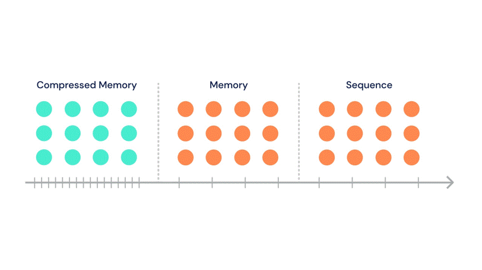
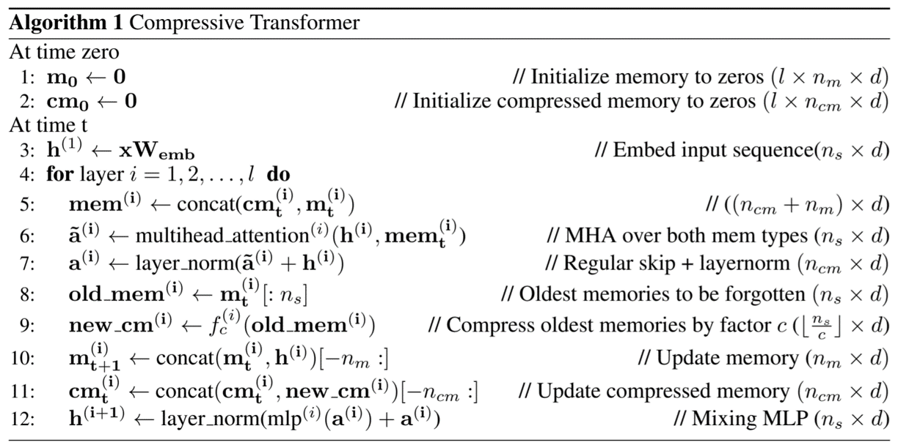
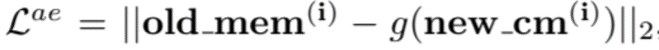
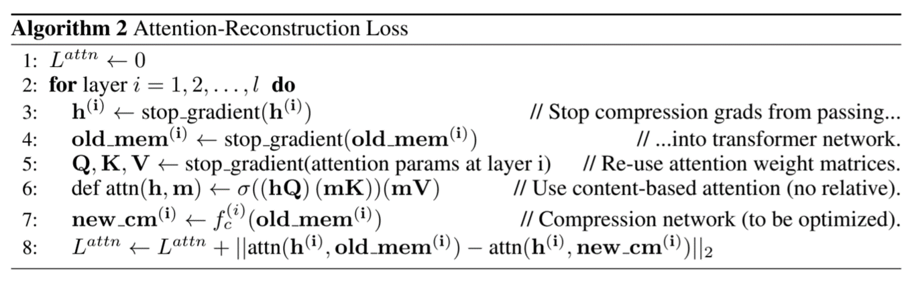
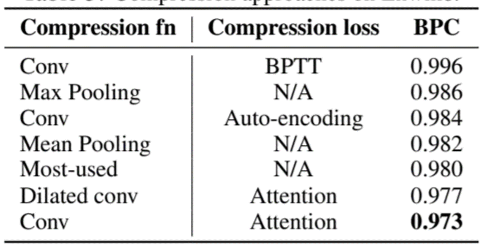
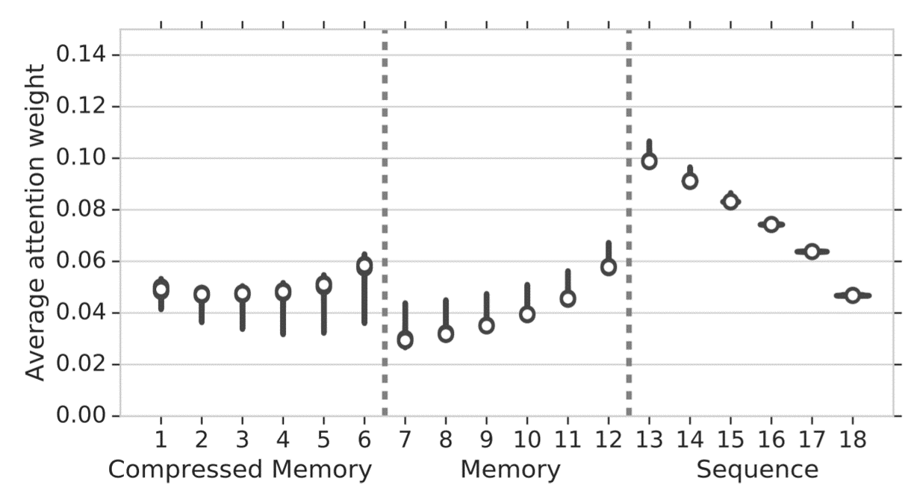
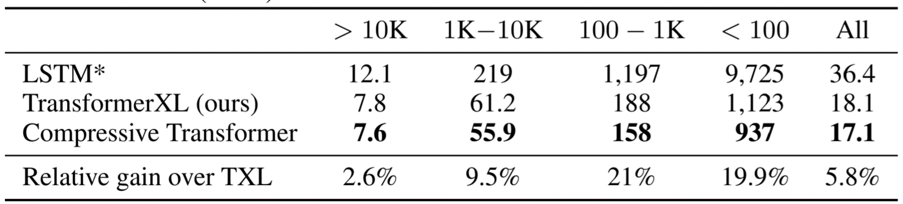
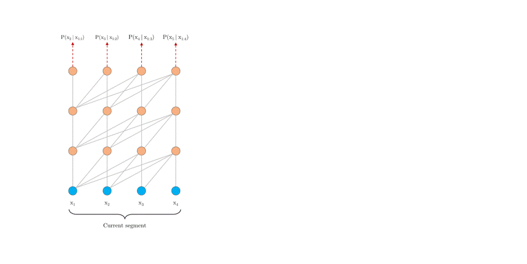
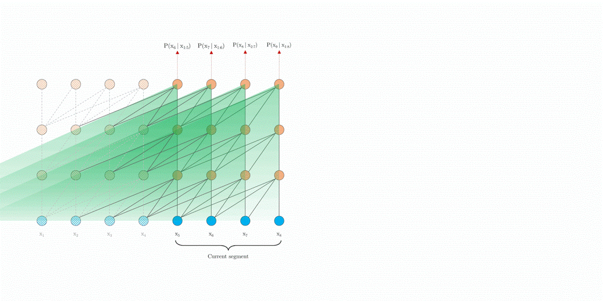
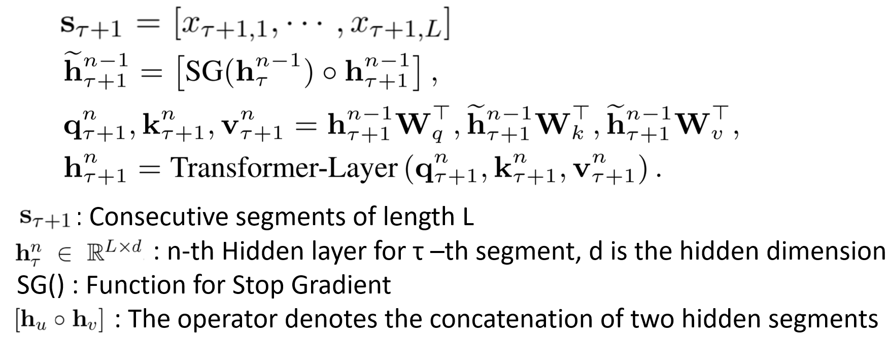

# Transformer

## Inspired by convolutional networks

---

## Compressive Transformers For Long-Range Sequence Modelling

[PDF Highlight](./Compressive%20Transformers%20For%20Long-Range%20Sequence%20Model.pdf)
  
### Motivation

- Transformers need **large memory** to store previous experience and compute the longer attention.
- Hard to approach long and sparse attention
- How about we **compress the old memory and only retain the most important information**?

**Is there a cheaper way to increase the attention size?**

### Compressive Memory

Based on transformer XL, Compress old memories, and store them in an additional compressed memory. In this example compression ratio C = 3

*compressive memory*

### Algorithm
cm: Compressive Memory

𝑓𝑐: Compression Function

In the following article, we will show several choices of the Compression Loss and the Compression Function.

*algorithm*

### Choices of Compression Functions fc

1. **Max/Mean Pooling**: where the kernel and stride is set to the compression rate c
   
2. **1D convolution**: With kernel & stride set to c, need to be optimized
   
3. **Dilated Convolutions**: need to be optimized
   
4. **Most-Used**: where the memories are sorted by their average attention (usage) and the most-used are preserved.

### Choices of Compression Loss
1. **BPTT**: 
   
Backpropagating through time over unroll, but cost time

2. **Auto-Encoding Loss**: 

Reconstruct old memory from compressed memory, attempt to retain all information

1. **Attention Reconstruction**: 
   
It reconstructs the attentions of the compressed old memory and the the original old memory. Compare the difference of the attention between them. The larger difference, the larger loss.

   
*Attention Reconstruction*

### ENWIK8 Experiment
Sweep over compression rate of 2, 3, 4

**Attention Reconstruction** works best

*ENWIK8 Experiment*

### Attention Experiment
It average the attention weight over a sample of 20, 000 sequences from a trained model on Enwik8 and separate the attention into eighteen buckets

It shows an **increase in the activations stored in compressed memory**.

*Attention Experiment*

### WIKITEXT-103 Experiment

During Training, the memory size is set to 500, compressive memory 1500 and, C = 4 for Compressive Transformer.

Obtains a **much larger improvement of ≈ 20% for infrequent words**

*WIKITEXT-103 Experiment*

### Conclusion
**Compression is a simpler approach to dynamic or sparse attention** — which often requires custom kernels to make efficient.

---

## Transformer-XL: Attentive Language Models Beyond a Fixed-Length Context

[PDF Highlight](./Transformer-XL%20Attentive%20Language%20Models%20Beyond%20a%20Fixed-Length%20Context.pdf)

### Segment-Level Recurrence

Every hidden layer caches the previous state of itself and concatenate to the previous segment.

*Segment-Level Recurrence*

Algorithm

*algorithm*